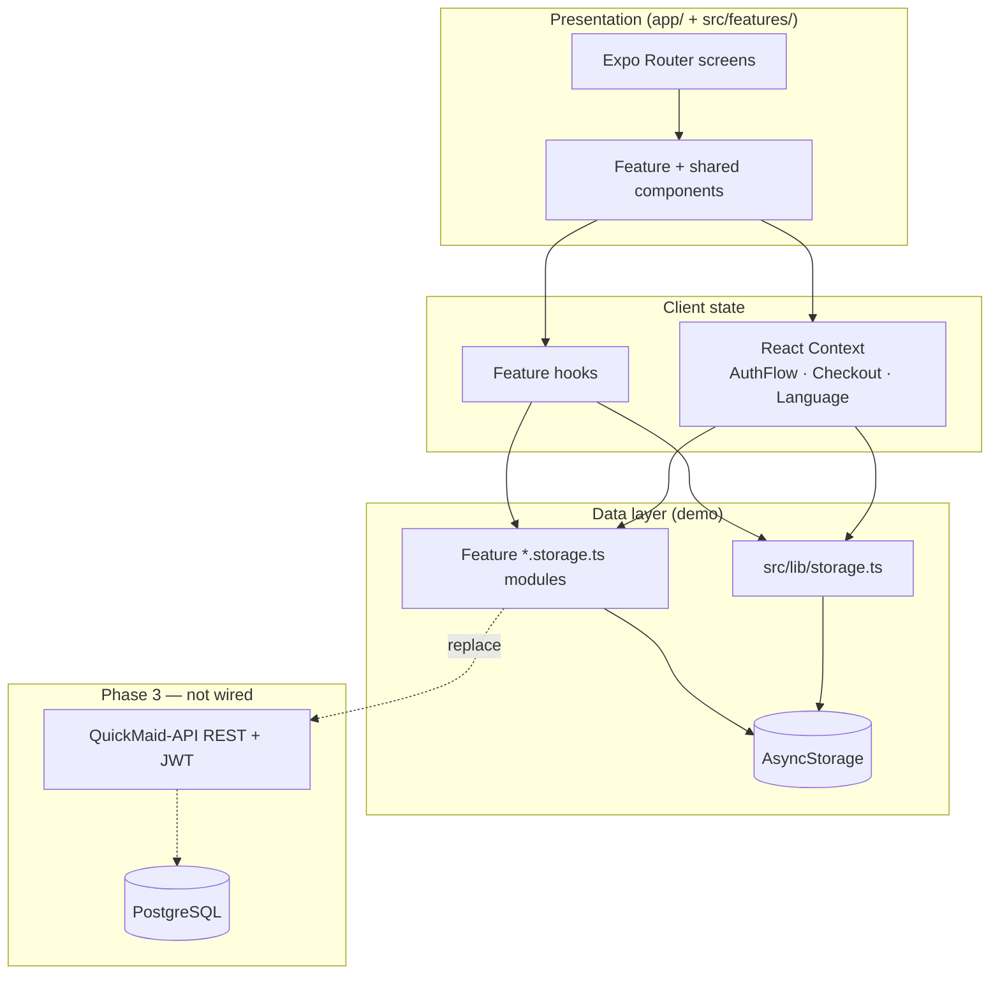
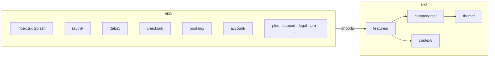
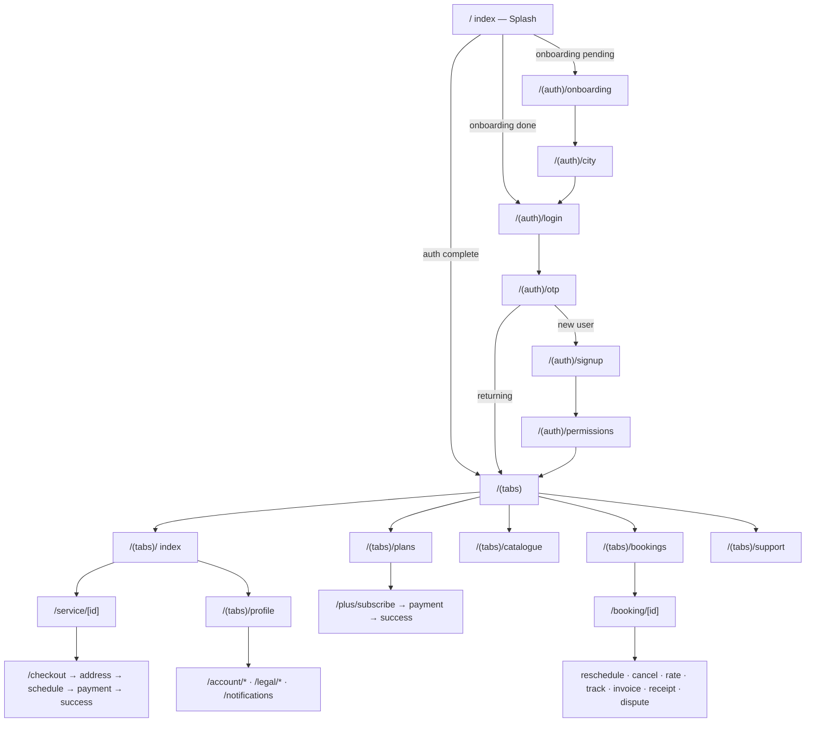
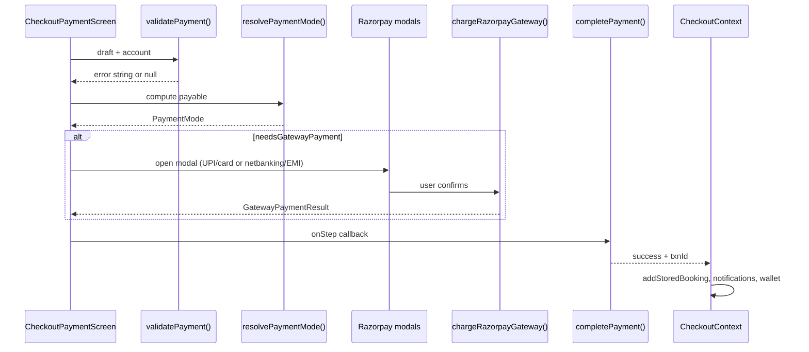
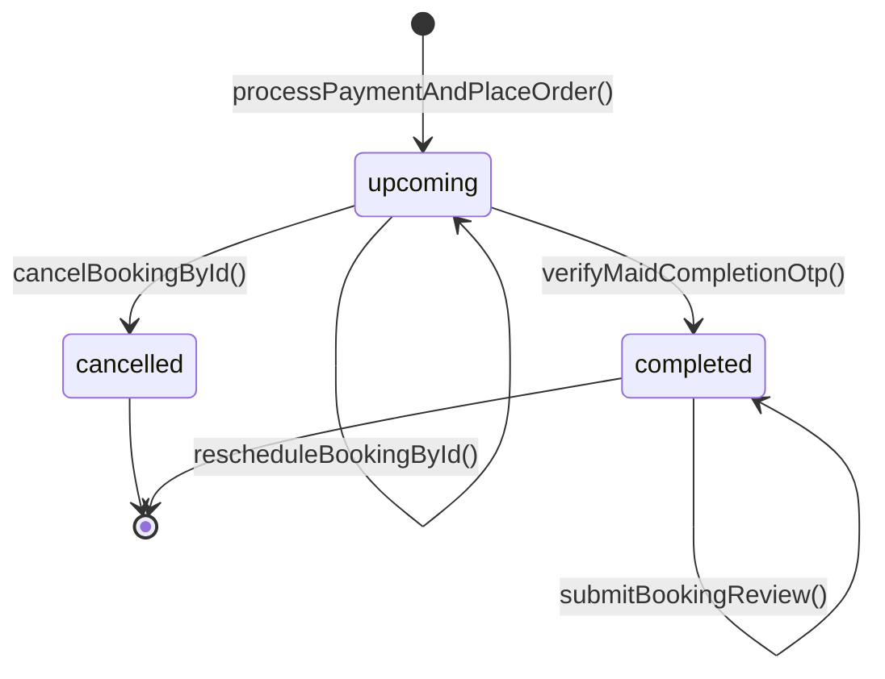
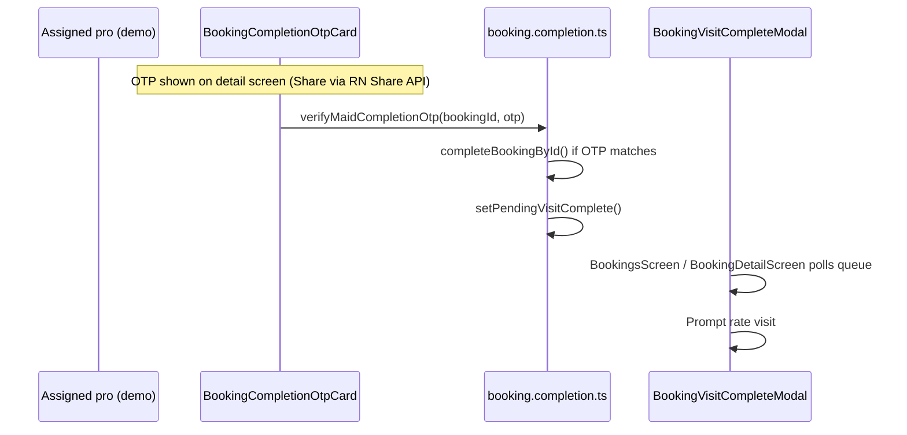
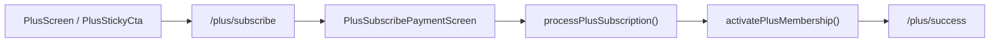
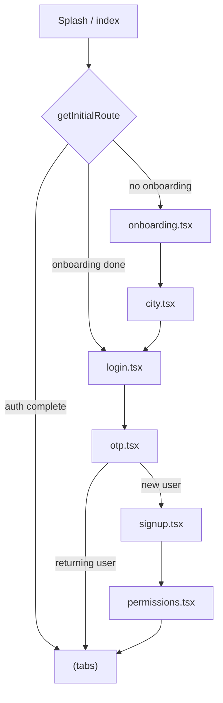

# QuickMaid Customer App

<p align="center">
  <strong>Native customer mobile app for QuickMaid</strong><br>
  Book verified home-cleaning pros in Raipur · React Native · Expo SDK 56 · TypeScript
</p>

| | |
|---|---|
| **Package** | `customer` v1.0.0 |
| **Bundle ID** | `in.quickmaid.customer` |
| **Deep link scheme** | `quickmaid://` |
| **Runtime** | UI-only demo — **no HTTP backend** (AsyncStorage) |
| **Planned backend** | [QuickMaid-API](https://github.com/Deepesh2104/QuickMaid) Phase 3 |

---

## Table of contents

1. [Project overview](#1-project-overview)
2. [Architecture](#2-architecture)
3. [Setup instructions](#3-setup-instructions)
4. [Environment variables](#4-environment-variables)
5. [Folder & file structure](#5-folder--file-structure)
6. [Routing](#6-routing)
7. [State management](#7-state-management)
8. [API & data layer](#8-api--data-layer)
9. [UI components](#9-ui-components)
10. [Feature screens](#10-feature-screens)
11. [Styling](#11-styling)
12. [Error handling & logging](#12-error-handling--logging)
13. [Build & deployment](#13-build--deployment)
14. [Testing](#14-testing)
15. [Conventions & best practices](#15-conventions--best-practices)
16. [Cross-reference index](#16-cross-reference-index)
17. [Payment gateway deep dive](#17-payment-gateway-deep-dive)
18. [Booking lifecycle & state machine](#18-booking-lifecycle--state-machine)
19. [Plus membership engine](#19-plus-membership-engine)
20. [Profile system](#20-profile-system)
21. [Navigation hooks (`useOpen*`)](#21-navigation-hooks-useopen)
22. [Native modules reference](#22-native-modules-reference)
23. [Demo & seed data catalog](#23-demo--seed-data-catalog)
24. [i18n reference & coverage](#24-i18n-reference--coverage)
25. [Auth flow specification](#25-auth-flow-specification)
26. [Config & build files](#26-config--build-files)
27. [Appendix: feature file index](#27-appendix-feature-file-index)

---

## 1. Project overview

### Purpose

The QuickMaid **Customer App** is the mobile client for homeowners in Raipur to discover cleaning services, book visits, manage subscriptions (QuickMaid Plus), track pros, pay via UPI/card/wallet, and manage account settings. It mirrors the web booking flow and admin CRM data shapes so a future REST API can drop in without UI rewrites.

### Key features

| Domain | Capabilities |
|--------|-------------|
| **Onboarding & auth** | Splash, 3-slide onboarding, city picker, phone OTP (demo `123456`), signup, permissions |
| **Home & catalogue** | Service discovery, search, bundles, top pros, deliver-to address sheet |
| **Booking** | Service detail → checkout (cart, address, schedule, payment) → auto pro assignment |
| **Bookings hub** | List/filter, detail, track, reschedule, cancel, rate, invoice/receipt PDF, disputes |
| **QuickMaid Plus** | Plan picker, subscribe, payment, manage membership, billing history |
| **Profile** | Identity, addresses (map picker), payments, wallet, prefs, membership, referrals |
| **Support** | Help centre, live chat UI, ticket list, booking disputes |
| **Security** | App lock (PIN + biometrics via `expo-local-authentication`) |
| **i18n** | English + Hindi (`LanguageProvider`) |
| **Notifications** | Inbox with deep-link actions |

### Tech stack

| Layer | Choice |
|-------|--------|
| Framework | React Native 0.85 + Expo ~56 |
| Navigation | Expo Router 56 (file-based, typed routes) |
| Language | TypeScript 6 (strict) |
| Forms | react-hook-form + zod (home search only); inline validation elsewhere |
| Persistence | `@react-native-async-storage/async-storage` |
| Animation | react-native-reanimated 4 |
| Fonts | Plus Jakarta Sans (`@expo-google-fonts/plus-jakarta-sans`) |
| Icons | `@expo/vector-icons` (Ionicons) |

### Demo credentials

| Flow | Value |
|------|-------|
| Phone | Any valid 10-digit Indian number |
| OTP | `123456` (`DEMO_OTP` in `src/constants/app.ts`) |
| City | Raipur (only live city) |

---

## 2. Architecture

### High-level diagram



### Layer responsibilities

| Layer | Location | Responsibility |
|-------|----------|----------------|
| **Routes** | `app/` | Thin route files; import screen components from `src/features/` |
| **Features** | `src/features/<domain>/` | Screens, sub-components, hooks, types, `lib/` business logic |
| **Shared UI** | `src/components/` | Reusable buttons, inputs, headers, navigation chrome |
| **Context** | `src/context/` | Cross-screen ephemeral state (checkout draft, auth wizard) |
| **Persistence** | `src/lib/` + `src/features/*/lib/*.storage.ts` | AsyncStorage read/write, demo seeds |
| **Theme** | `src/theme/` | Colors, typography, spacing tokens |
| **i18n** | `src/i18n/` | `en.ts`, `hi.ts`, `LanguageProvider` |

### Provider tree

Root layout (`app/_layout.tsx`) wraps the app in this order:

```
SafeAreaProvider
└── AuthFlowProvider
    └── LanguageProvider
        └── CheckoutProvider
            └── AppLockGate
                └── Stack (Expo Router)
```

---

## 3. Setup instructions

### Prerequisites

- **Node.js** 18+ or 20+ LTS
- **npm** 9+
- **Expo Go** on a physical device (recommended) or Android/iOS simulator
- **Git** (optional)

### Install

```bash
cd QuickMaid-App/apps/customer
npm install
```

### Run (development)

```bash
# Start Metro + QR code
npm start
# or
npx expo start

# Platform shortcuts
npm run android    # Expo Go / emulator
npm run ios        # Simulator (macOS only)
npm run web        # Web preview (limited — some native modules unavailable)
```

### Tunnel (remote device testing)

```bash
npx expo start --tunnel
```

Requires `@expo/ngrok` (already in `devDependencies`).

### TypeScript path alias

`@/*` maps to `src/*` (see `tsconfig.json`). Example:

```ts
import { colors } from '@/theme/colors';
import { useCheckout } from '@/context/CheckoutContext';
```

---

## 4. Environment variables

### Current state

**No `.env` file is used.** The app runs entirely offline with seeded demo data. Configuration is hard-coded in:

| Source | Contents |
|--------|----------|
| `src/constants/app.ts` | `DEMO_OTP`, `STORAGE_KEYS` |
| `src/constants/demo.ts` | Demo booking seeds |
| `src/constants/services.ts` | Service catalogue |
| `src/constants/customer.zones.ts` | Raipur zones, slots |
| `app.json` | Bundle IDs, splash, EAS project ID |

### Recommended env vars (Phase 3)

When integrating QuickMaid-API, add `expo-constants` + `app.config.ts`:

| Variable | Example | Used by |
|----------|---------|---------|
| `EXPO_PUBLIC_API_BASE_URL` | `https://api.quickmaid.in` | Future `src/lib/api/client.ts` |
| `EXPO_PUBLIC_RAZORPAY_KEY` | `rzp_live_xxx` | Payment gateway |
| `EXPO_PUBLIC_ENV` | `development` \| `staging` \| `production` | Feature flags |
| `EXPO_PUBLIC_SENTRY_DSN` | `https://...` | Error reporting |

Access pattern:

```ts
import Constants from 'expo-constants';
const apiUrl = Constants.expoConfig?.extra?.apiBaseUrl;
```

---

## 5. Folder & file structure

### Repository layout

```
apps/customer/
├── app/                    # Expo Router — 49 screens + 14 layout files (63 total)
├── assets/                 # App icon, splash, favicon
├── docs/
│   └── CUSTOMER_DATA.md    # API data contract (identity, addresses, prefs)
├── src/
│   ├── components/         # Shared UI + navigation
│   ├── constants/          # App-wide constants & demo seeds
│   ├── context/            # React Context providers
│   ├── features/           # Domain modules (screens + logic)
│   ├── hooks/              # App-level hooks
│   ├── i18n/               # Translations
│   ├── lib/                # Core storage helpers
│   └── theme/              # Design tokens
├── app.json                # Expo config
├── package.json
├── tsconfig.json
├── babel.config.js
└── README.md               # This file
```

### Structure diagram



### `app/` — route files

| Path | File | Screen component |
|------|------|------------------|
| `/` | `index.tsx` | `AppSplashScreen` + `getInitialRoute()` |
| `/(auth)/onboarding` | `(auth)/onboarding.tsx` | Inline `OnboardingScreen` |
| `/(auth)/city` | `(auth)/city.tsx` | Inline `CityScreen` |
| `/(auth)/login` | `(auth)/login.tsx` | Inline `LoginScreen` |
| `/(auth)/otp` | `(auth)/otp.tsx` | Inline `OtpScreen` |
| `/(auth)/signup` | `(auth)/signup.tsx` | Inline `SignupScreen` |
| `/(auth)/permissions` | `(auth)/permissions.tsx` | Inline `PermissionsScreen` |
| `/(tabs)/` | `(tabs)/index.tsx` | `HomeScreen` |
| `/(tabs)/catalogue` | `(tabs)/catalogue.tsx` | `CatalogueScreen` |
| `/(tabs)/bookings` | `(tabs)/bookings.tsx` | `BookingsScreen` |
| `/(tabs)/plans` | `(tabs)/plans.tsx` | `PlusScreen` |
| `/(tabs)/support` | `(tabs)/support.tsx` | `HelpScreen` |
| `/(tabs)/profile` | `(tabs)/profile.tsx` | `ProfileScreen` (hidden tab — `href: null`) |
| `/checkout/*` | `checkout/*.tsx` | Checkout flow screens |
| `/service/[id]` | `service/[id].tsx` | `ServiceDetailScreen` |
| `/booking/*` | `booking/**/*.tsx` | Booking management screens |
| `/notifications/*` | `notifications/*.tsx` | `NotificationsScreen`, `NotificationDetailScreen` |
| `/payments/[id]` | `payments/[id].tsx` | `PaymentTransactionDetailScreen` |
| `/plus/*` | `plus/*.tsx` | Plus subscription flow |
| `/account/*` | `account/*.tsx` | Account sub-screens |
| `/legal/*` | `legal/*.tsx` | `LegalHubScreen`, `LegalDocumentScreen` |
| `/support/*` | `support/*.tsx` | `SupportChatScreen`, `SupportTicketsScreen` |
| `/pro/*` | `pro/*.tsx` | `ProsDirectoryScreen`, `ProProfileScreen` |
| `/catalogue` | `catalogue/index.tsx` | `CatalogueScreen` (stack entry) |

### `src/features/` — domain modules

| Feature | Key paths | Responsibility |
|---------|-----------|----------------|
| `home/` | `components/HomeScreen.tsx`, `hooks/` | Dashboard, search, rails, deliver-to |
| `checkout/` | `components/Checkout*Screen.tsx`, `lib/checkout.*` | Cart → payment → place order |
| `bookings/` | `components/Booking*Screen.tsx`, `lib/bookings.storage.ts` | List, detail, lifecycle actions |
| `service/` | `ServiceDetailScreen.tsx` | Single service PDP |
| `plus/` | `Plus*Screen.tsx`, `lib/plus.*` | Membership plans & billing |
| `profile/` | `ProfileScreen.tsx`, `lib/profile.storage.ts` | Account CRUD, addresses, prefs |
| `payment/` | `Payment*`, `lib/payment.storage.ts` | Razorpay modals, txn history |
| `wallet/` | `WalletTransactionsScreen.tsx` | Wallet ledger |
| `coupons/` | `CouponWalletScreen.tsx` | Coupon wallet & checkout apply |
| `referral/` | `ReferralRewardsScreen.tsx` | Referral code & rewards |
| `notifications/` | `Notifications*`, `lib/notifications.storage.ts` | Inbox |
| `support/` | `Support*`, `BookingDisputeScreen.tsx` | Chat, tickets, disputes |
| `help/` | `HelpScreen.tsx` | Help tab content |
| `legal/` | `Legal*`, `constants/legal.content.ts` | Terms, privacy, refund policy |
| `pro/` | `Pro*Screen.tsx` | Pro directory & profile |
| `security/` | `AppLock*`, `lib/appLock.storage.ts` | PIN / biometric gate |
| `saved-services/` | `SavedServicesScreen.tsx` | Favourites |

### `src/components/` — shared UI

| Folder | Files | Purpose |
|--------|-------|---------|
| `ui/` | `QmButton`, `QmInput`, `OtpInput`, `ScreenHeader`, … | Design-system primitives |
| `navigation/` | `TabBarButton`, `CatalogueTabButton` | Custom tab bar |
| `splash/` | `AppSplashScreen.tsx` | Branded splash animation |
| `home/` | `HomeHero`, `ServiceListCard`, … | Legacy/shared home blocks |

### `src/theme/`

| File | Exports |
|------|---------|
| `colors.ts` | Brand palette (`primary: #0B6E67`, ink, surfaces, semantic) |
| `typography.ts` | `type` scale (display, title, body, caption) |
| `spacing.ts` | `spacing`, `radius`, `shadow` tokens |
| `fonts.ts` | Plus Jakarta Sans family names |
| `layout.metrics.ts` | Tab bar height, safe-area helpers |

### `src/constants/`

| File | Purpose |
|------|---------|
| `app.ts` | `STORAGE_KEYS`, `UserProfile`, `DEMO_OTP` |
| `services.ts` | `ServiceItem[]` catalogue |
| `customer.zones.ts` | Raipur zones, `PREFERRED_SLOTS` |
| `cities.ts` | City list (Raipur live) |
| `onboarding.ts` | Onboarding slide content |
| `demo.ts` | Seeded demo bookings |
| `pagination.ts` | Default page sizes |

---

## 6. Routing

### Navigation model

- **Expo Router** file-based routing with typed routes (`experiments.typedRoutes: true`)
- **Stack** at root for modals and pushed flows
- **Tabs** for main shell (5 visible tabs + hidden profile)
- **Initial route** always `index` (splash) — never bypassed on cold start

### Routing diagram



### Full route table

| Route | Component | Entry points |
|-------|-----------|--------------|
| `/` | Splash | App cold start |
| `/(auth)/onboarding` | Onboarding | First launch |
| `/(auth)/city` | City picker | After onboarding |
| `/(auth)/login` | Phone login | Returning pre-auth users |
| `/(auth)/otp` | OTP verify | After login |
| `/(auth)/signup` | Profile signup | New users post-OTP |
| `/(auth)/permissions` | Location + notifications | Post-signup |
| `/(tabs)/` | `HomeScreen` | Main tab |
| `/(tabs)/catalogue` | `CatalogueScreen` | Centre FAB tab |
| `/(tabs)/bookings` | `BookingsScreen` | Main tab |
| `/(tabs)/plans` | `PlusScreen` | Main tab |
| `/(tabs)/support` | `HelpScreen` | Main tab |
| `/(tabs)/profile` | `ProfileScreen` | Home header avatar |
| `/catalogue` | `CatalogueScreen` | Deep link / home launcher |
| `/service/[id]` | `ServiceDetailScreen` | Home, catalogue, search |
| `/checkout` | `CheckoutCartScreen` | `useCheckout().startCheckout()` |
| `/checkout/address` | `CheckoutAddressScreen` | Checkout stack |
| `/checkout/schedule` | `CheckoutScheduleScreen` | Checkout stack |
| `/checkout/payment` | `CheckoutPaymentScreen` | Checkout stack |
| `/checkout/success` | `CheckoutSuccessScreen` | Post-payment |
| `/booking/[id]` | `BookingDetailScreen` | Bookings list, notifications |
| `/booking/reschedule/[id]` | `BookingRescheduleScreen` | Booking detail |
| `/booking/cancel/[id]` | `BookingCancelScreen` | Booking detail |
| `/booking/rate/[id]` | `BookingRateScreen` | Completion prompt |
| `/booking/track/[id]` | `BookingTrackScreen` | Booking detail |
| `/booking/invoice/[id]` | `BookingDocumentScreen` | Booking detail |
| `/booking/receipt/[id]` | `BookingDocumentScreen` | Booking detail |
| `/booking/dispute/[id]` | `BookingDisputeScreen` | Booking detail |
| `/notifications` | `NotificationsScreen` | Home bell |
| `/notifications/[id]` | `NotificationDetailScreen` | Inbox |
| `/payments/[id]` | `PaymentTransactionDetailScreen` | Profile payment history |
| `/plus/subscribe` | `PlusSubscribeScreen` | Plus tab CTA |
| `/plus/payment` | `PlusSubscribePaymentScreen` | Subscribe flow |
| `/plus/success` | `PlusSubscribeSuccessScreen` | Post-subscribe |
| `/plus/manage` | `PlusManageScreen` | Active members |
| `/plus/billing` | `PlusBillingHistoryScreen` | Manage screen |
| `/account/delete` | `DeleteAccountScreen` | Profile security |
| `/account/referrals` | `ReferralRewardsScreen` | Profile referral card |
| `/account/address-picker` | `AddressMapPickerScreen` | Profile / checkout |
| `/account/saved-services` | `SavedServicesScreen` | Profile |
| `/account/wallet-transactions` | `WalletTransactionsScreen` | Profile wallet |
| `/account/coupon-wallet` | `CouponWalletScreen` | Profile / checkout |
| `/account/app-lock` | `AppLockSettingsScreen` | Profile security |
| `/legal` | `LegalHubScreen` | Help / profile |
| `/legal/[doc]` | `LegalDocumentScreen` | Hub links |
| `/support/chat` | `SupportChatScreen` | Help centre |
| `/support/tickets` | `SupportTicketsScreen` | Help / profile |
| `/pro` | `ProsDirectoryScreen` | Home top pros |
| `/pro/[id]` | `ProProfileScreen` | Directory, booking maid sheet |

### Splash boot logic

`app/index.tsx` enforces minimum **1.5s** splash (`SPLASH_DELAY_MS`), then calls `getInitialRoute()` from `src/lib/storage.ts`:

| Condition | Route |
|-----------|-------|
| `authComplete === true` | `/(tabs)` |
| `onboardingDone === true` | `/(auth)/login` |
| else | `/(auth)/onboarding` |

---

## 7. State management

### No Redux / Zustand

State is managed through **React Context** (ephemeral UI flows) and **AsyncStorage** (persistent demo data). Feature modules expose `*.storage.ts` helpers — these become the API client boundary in Phase 3.

### React Context providers

#### `AuthFlowContext` (`src/context/AuthFlowContext.tsx`)

| Field / method | Type | Purpose |
|----------------|------|---------|
| `city`, `phone`, `name`, `email`, `gender`, `homeType`, `locality` | `string` | Wizard state across auth screens |
| `setCity`, `setPhone`, … | setter fns | Updated per auth step |
| **Hook** | `useAuthFlow()` | Used in `(auth)/*` routes |

**Consumers:** `login.tsx`, `otp.tsx`, `signup.tsx`, `city.tsx`

#### `CheckoutContext` (`src/context/CheckoutContext.tsx`)

| Field / method | Type | Purpose |
|----------------|------|---------|
| `draft` | `CheckoutDraft` | Cart, address, slot, payment, coupon |
| `account` | `ProfileAccountData \| null` | Cached profile for checkout |
| `lastOrder` | `PlacedOrder \| null` | Success screen data |
| `loading` | `boolean` | Payment in progress |
| `startCheckout(service)` | fn | Seeds draft, navigates to `/checkout` |
| `updateDraft(patch)` | fn | Partial draft updates |
| `processPaymentAndPlaceOrder(onStep, gateway?)` | fn | Payment simulation + booking creation |
| `refreshAccount()` | fn | Reload profile from storage |
| `clearCheckout()` | fn | Reset draft |
| **Hook** | `useCheckout()` | Checkout + service detail screens |

**Side effects on order placement:** `bookings.storage`, `payment.storage`, `wallet.storage`, `coupon.storage`, `notifications.storage`, `profile.storage`

#### `LanguageProvider` (`src/i18n/LanguageProvider.tsx`)

| Export | Purpose |
|--------|---------|
| `locale` | `'en' \| 'hi'` from profile prefs |
| `t(key, vars?)` | Dot-path translation lookup |
| `greeting(firstName?)` | Time-based greeting string |
| **Hook** | `useTranslation()` |

Subscribes to `subscribeProfileAccount()` for live locale switches.

### AsyncStorage keys

Defined in `src/constants/app.ts` → `STORAGE_KEYS`:

| Key | Storage module | Data |
|-----|----------------|------|
| `@qm/onboarding_done` | `src/lib/storage.ts` | Boolean flag |
| `@qm/auth_complete` | `src/lib/storage.ts` | Session flag |
| `@qm/user_profile` | `src/lib/storage.ts` | `UserProfile` |
| `@qm/registered_users` | `src/lib/storage.ts` | Phone → profile map |
| `@qm/profile_account` | `profile.storage.ts` | Addresses, payments, prefs, membership |
| `@qm/user_bookings` | `bookings.storage.ts` | Placed orders |
| `@qm/booking_overrides` | `bookings.storage.ts` | Reschedule/cancel/review patches |
| `@qm/payment_history` | `payment.storage.ts` | Gateway transactions |
| `@qm/notifications_inbox` | `notifications.storage.ts` | Notification feed |
| `@qm/notifications_read` | `notifications.storage.ts` | Read IDs |
| `@qm/plus_last_subscription` | `plus.subscribe.ts` | Last Plus purchase |
| `@qm/referral_ledger` | `referral.storage.ts` | Referral events |
| `@qm/support_tickets` | `support.storage.ts` | Support tickets + messages |
| `@qm/booking_disputes` | `support.storage.ts` | Dispute records |
| `@qm/wallet_transactions` | `wallet.storage.ts` | Wallet ledger |
| `@qm/coupon_wallet` | `coupon.storage.ts` | Saved coupons |
| `@qm/pending_coupon` | `coupon.storage.ts` | Checkout coupon bridge |
| `@qm/pending_visit_complete` | `booking.completion.ts` | Post-visit OTP prompt |
| `@qm/app_lock_settings` | `appLock.storage.ts` | PIN hash, biometric flag |
| `@qm/checkout_draft` | — | **Unused** — checkout draft lives in `CheckoutContext` state only |

### Pub/sub pattern

`profile.storage.ts` and `appLock.storage.ts` expose `subscribe*()` listeners so UI re-renders when storage changes without a global store.

---

## 8. API & data layer

### Current implementation: **no HTTP calls**

A codebase-wide search shows **zero** `fetch`, `axios`, or `/api/` usage. All data flows through AsyncStorage modules listed above. Payment uses **simulated** Razorpay modals (`RazorpayGatewayModal.tsx`) — no live gateway SDK.

### Data contract

See [`docs/CUSTOMER_DATA.md`](./docs/CUSTOMER_DATA.md) for field-level shapes aligned with future `GET/PATCH /api/v1/customers/:id`.

### Planned REST API (Phase 3)

Mapped from [QuickMaid PHASE3_BACKEND.md](../../../QuickMaid/docs/PHASE3_BACKEND.md). Replace the **Storage module** column when wiring the API.

#### Authentication

| Endpoint | Method | Request | Response | Replaces (today) | Future caller |
|----------|--------|---------|----------|------------------|---------------|
| `/api/v1/auth/otp/send` | POST | `{ phone: string }` | `{ sessionId, expiresIn }` | Demo skip in `login.tsx` | `(auth)/login.tsx` |
| `/api/v1/auth/otp/verify` | POST | `{ phone, otp, sessionId }` | `{ accessToken, refreshToken, user }` | `otp.tsx` + `DEMO_OTP` | `(auth)/otp.tsx` |
| `/api/v1/auth/refresh` | POST | `{ refreshToken }` | `{ accessToken }` | — | `src/lib/api/client.ts` |
| `/api/v1/auth/me` | GET | Bearer token | `UserProfile` | `getUserProfile()` | Splash / app resume |
| `/api/v1/auth/logout` | POST | — | `204` | `clearSession()` | Profile logout |

#### Customers & profile

| Endpoint | Method | Request | Response | Replaces | Caller |
|----------|--------|---------|----------|----------|--------|
| `/api/v1/customers/me` | GET | — | `ProfileAccountData` | `getProfileAccount()` | `ProfileScreen`, `CheckoutContext` |
| `/api/v1/customers/me` | PATCH | Partial profile | `ProfileAccountData` | `patchProfileAccount()` | Profile modals |
| `/api/v1/customers/me/addresses` | POST/PATCH/DELETE | Address CRUD | `Address[]` | `profile.storage` addresses | `AddressMapPickerScreen` |
| `/api/v1/customers/me/avatar` | POST | multipart | `{ avatarUrl }` | `profile.photo.ts` local URI | `ProfileEditProfileModal` |

#### Bookings

| Endpoint | Method | Request | Response | Replaces | Caller |
|----------|--------|---------|----------|----------|--------|
| `/api/v1/bookings` | GET | `?status=&page=` | `PlacedOrder[]` | `getAllBookings()` | `BookingsScreen` |
| `/api/v1/bookings` | POST | Checkout payload | `PlacedOrder` | `addStoredBooking()` | `CheckoutContext.processPaymentAndPlaceOrder` |
| `/api/v1/bookings/:id` | GET | — | `DemoBooking` | `getBookingById()` | `BookingDetailScreen` |
| `/api/v1/bookings/:id/reschedule` | POST | `{ date, slotId }` | `DemoBooking` | `rescheduleBookingById()` | `BookingRescheduleScreen` |
| `/api/v1/bookings/:id/cancel` | POST | `{ reason }` | `{ refundStatus }` | `cancelBookingById()` | `BookingCancelScreen` |
| `/api/v1/bookings/:id/review` | POST | `{ rating, comment }` | `Review` | `submitBookingReview()` | `BookingRateScreen` |
| `/api/v1/bookings/:id/complete` | POST | `{ otp }` | `DemoBooking` | `completeBookingById()` | `BookingCompletionOtpCard` |
| `/api/v1/dispatch/track/:id` | GET | — | `{ lat, lng, eta, status }` | Demo track data | `BookingTrackScreen` |

#### Payments & wallet

| Endpoint | Method | Request | Response | Replaces | Caller |
|----------|--------|---------|----------|----------|--------|
| `/api/v1/payments` | GET | — | `PaymentRecord[]` | `getPaymentHistory()` | `ProfilePaymentHistorySection` |
| `/api/v1/payments/:id` | GET | — | `PaymentRecord` | `getPaymentById()` | `PaymentTransactionDetailScreen` |
| `/api/v1/payments/intent` | POST | `{ amount, mode }` | Razorpay order | `completePayment()` sim | `CheckoutPaymentScreen` |
| `/api/v1/wallet/transactions` | GET | — | `WalletTransaction[]` | `listWalletTransactions()` | `WalletTransactionsScreen` |

#### Plus / subscriptions

| Endpoint | Method | Request | Response | Replaces | Caller |
|----------|--------|---------|----------|----------|--------|
| `/api/v1/plans` | GET | — | `PlusPlan[]` | `plus.plans.ts` constants | `PlusSubscribeScreen` |
| `/api/v1/subscriptions` | POST | `{ planId }` | `Subscription` | `plus.subscribe.ts` | `PlusSubscribePaymentScreen` |
| `/api/v1/subscriptions/me` | GET/PATCH | — | `Membership` | `profile.membership` | `PlusManageScreen` |

#### Support & notifications

| Endpoint | Method | Request | Response | Replaces | Caller |
|----------|--------|---------|----------|----------|--------|
| `/api/v1/tickets` | GET/POST | Ticket body | `SupportTicket` | `support.storage.ts` | `SupportTicketsScreen`, `SupportChatScreen` |
| `/api/v1/tickets/:id/messages` | POST | `{ body }` | `Message` | `appendTicketMessage()` | `SupportChatScreen` |
| `/api/v1/bookings/:id/disputes` | POST | Dispute form | `BookingDispute` | `submitBookingDispute()` | `BookingDisputeScreen` |
| `/api/v1/notifications` | GET | — | `AppNotification[]` | `getNotifications()` | `NotificationsScreen` |
| `/api/v1/notifications/:id/read` | POST | — | `204` | `markNotificationRead()` | `NotificationDetailScreen` |

#### Growth

| Endpoint | Method | Replaces | Caller |
|----------|--------|----------|--------|
| `/api/v1/coupons/redeem` | POST | `redeemCouponCode()` | `CouponWalletScreen` |
| `/api/v1/referrals/me` | GET | `getReferralEvents()` | `ReferralRewardsScreen` |

### Storage → screen cross-reference

| Storage module | Primary screens |
|----------------|-----------------|
| `src/lib/storage.ts` | Splash, auth flow, profile logout |
| `profile.storage.ts` | `ProfileScreen`, all checkout screens, `LanguageProvider` |
| `bookings.storage.ts` | `BookingsScreen`, all `/booking/*` screens |
| `checkout.payment.ts` | `CheckoutPaymentScreen` |
| `payment.storage.ts` | `PaymentTransactionDetailScreen`, profile history |
| `wallet.storage.ts` | `WalletTransactionsScreen`, checkout wallet deduction |
| `coupon.storage.ts` | `CouponWalletScreen`, `CheckoutPaymentScreen` |
| `notifications.storage.ts` | `NotificationsScreen`, `HomeHeader` badge |
| `support.storage.ts` | `SupportChatScreen`, `SupportTicketsScreen`, `BookingDisputeScreen` |
| `referral.storage.ts` | `ReferralRewardsScreen` |
| `plus.subscribe.ts` | All `/plus/*` screens |
| `appLock.storage.ts` | `AppLockGate`, `AppLockSettingsScreen` |
| `booking.completion.ts` | `BookingsScreen`, `BookingDetailScreen` (visit complete modal) |

---

## 9. UI components

### Design-system primitives (`src/components/ui/`)

| Component | Props (summary) | State | Dependencies | Typical usage |
|-----------|-----------------|-------|--------------|---------------|
| `QmButton` | `label`, `onPress`, `variant`, `disabled`, `loading`, `icon`, `size` | — | `expo-haptics`, theme | CTAs across app |
| `QmInput` | extends `TextInputProps` + `label`, `hint`, `error`, `prefix` | `focused`, internal `text` | theme | Forms, profile modals |
| `OtpInput` | `value`, `onChange`, `length`, `error`, `autoFocus` | per-cell focus | — | `(auth)/otp.tsx` |
| `PhoneInput` | `onChangeText`, `error` | — | `QmInput` pattern | `(auth)/login.tsx` |
| `ScreenHeader` | `title`, `subtitle`, `onBack`, `right`, `light` | — | `Ionicons` | Stack screens |
| `AuthScreenLayout` | `children`, `hero`, `footer`, `scroll` | — | `SafeAreaView` | Auth wizard screens |
| `AuthHeader` | `title`, `subtitle`, `onBack`, `step`, `totalSteps` | — | — | Auth steps |
| `QmLogo` | `size`, `showText`, `light` | — | SVG/text | Splash, auth |
| `SectionHeader` | `title`, `subtitle`, `action`, `onAction` | — | — | Home sections |
| `SearchBar` | `value`, `onChangeText`, `placeholder`, `onSubmit` | — | — | Catalogue |
| `CategoryChip` | `label`, `icon`, `active`, `onPress` | — | — | Filters |
| `ChoiceChips` | `options`, `value`, `onChange`, `columns` | — | — | Signup, profile |
| `ServiceCard` | `name`, `price`, `rating`, `duration`, `icon`, `onPress` | — | — | Catalogue grids |
| `FeaturedCard` | image, title, meta, `onPress` | — | `expo-image` | Home rails |
| `PromoCard` | title, subtitle, cta, `onPress` | — | — | Offers |
| `QuickAction` | `icon`, `label`, `tint`, `onPress` | — | — | Home quick grid |
| `IconBadge` | `icon`, `size`, `tone`, `ink` | — | — | List rows |
| `ListPagination` | `page`, `totalPages`, `onPageChange` | — | `usePagination` | Long lists |
| `LocationHeader` | `city`, `address`, `onPress` | — | — | Home header |
| `SplitHeroLayout` | `top`, `bottom`, `footer` | — | — | Auth split layouts |
| `WaveShape` | `color`, `height`, `flip` | — | `react-native-svg` | Decorative |
| `BecomePartnerBanner` | `compact?` | — | `openPartnerAppStore` | Login screen + home footer — opens Partner app store listing |

### Feature sub-components (not in `src/components/`)

Beyond the 30 shared primitives above, **200+ feature-scoped components** live under `src/features/*/components/`. Major composers:

| Screen | # parts | Key children |
|--------|---------|--------------|
| `HomeScreen` | 25+ | `HomeHeader`, `HomeQuickGrid`, `HomeFeaturedRail`, `HomeTopPros`, `HomePlusCard`, `HomeDeliverToSheet`, … |
| `BookingsScreen` | 20+ | See [§18 Booking UI composition](#booking-ui-composition-sub-components) |
| `ProfileScreen` | 18+ | See [§20 Profile sections](#profile-sections-render-order-in-profilebody) |
| `PlusScreen` | 12+ | `PlusBody`, `PlusPlanPicker`, `PlusCompareSection`, `PlusFaqSection`, … |
| `CheckoutPaymentScreen` | 8+ | `CheckoutShell`, `CheckoutStepBar`, `RazorpayGatewayModal`, `PaymentProcessingModal`, … |
| `HelpScreen` | 11 | `HelpBody`, `HelpReachSection`, `HelpPolicyBento`, `HelpSelfHelpRail`, … |

Full per-file index: [§27 Appendix](#27-appendix-feature-file-index).

### Navigation (`src/components/navigation/`)

| Component | Purpose |
|-----------|---------|
| `TabBarButton` | Ripple-safe tab press wrapper |
| `CatalogueTabButton` | Elevated centre FAB for catalogue tab |

### Shared hooks (`src/hooks/`)

| Hook | Returns | Used by |
|------|---------|---------|
| `useAppFonts()` | `{ loaded }` | Root layout — blocks render until fonts load |
| `usePagination({ total, pageSize })` | page state + slice helpers | Bookings, notifications lists |
| `useLayoutMetrics()` | tab bar inset calculations | Screens with bottom padding |

---

## 10. Feature screens

### Screen inventory (47 feature-level screens)

| Screen | File | Primary data source |
|--------|------|---------------------|
| `HomeScreen` | `features/home/components/HomeScreen.tsx` | `services.ts`, `profile.storage`, `notifications.storage` |
| `CatalogueScreen` | `features/home/components/CatalogueScreen.tsx` | `services.ts` |
| `ServiceDetailScreen` | `features/service/components/ServiceDetailScreen.tsx` | `services.ts`, `CheckoutContext` |
| `CheckoutCartScreen` | `features/checkout/components/CheckoutCartScreen.tsx` | `CheckoutContext` |
| `CheckoutAddressScreen` | `features/checkout/components/CheckoutAddressScreen.tsx` | `CheckoutContext` |
| `CheckoutScheduleScreen` | `features/checkout/components/CheckoutScheduleScreen.tsx` | `CheckoutContext`, `customer.zones` |
| `CheckoutPaymentScreen` | `features/checkout/components/CheckoutPaymentScreen.tsx` | `CheckoutContext`, `coupon.storage` |
| `CheckoutSuccessScreen` | `features/checkout/components/CheckoutSuccessScreen.tsx` | `CheckoutContext.lastOrder` |
| `BookingsScreen` | `features/bookings/components/BookingsScreen.tsx` | `bookings.storage`, `booking.completion` |
| `BookingDetailScreen` | `features/bookings/components/BookingDetailScreen.tsx` | `bookings.storage` |
| `BookingRescheduleScreen` | `features/bookings/components/BookingRescheduleScreen.tsx` | `bookings.storage` |
| `BookingCancelScreen` | `features/bookings/components/BookingCancelScreen.tsx` | `bookings.storage` |
| `BookingRateScreen` | `features/bookings/components/BookingRateScreen.tsx` | `bookings.storage` |
| `BookingTrackScreen` | `features/bookings/components/BookingTrackScreen.tsx` | Demo track constants |
| `BookingDocumentScreen` | `features/bookings/components/BookingDocumentScreen.tsx` | `booking.document.ts`, `expo-print` |
| `PlusScreen` | `features/plus/components/PlusScreen.tsx` | `profile.storage` membership |
| `PlusSubscribeScreen` | `features/plus/components/PlusSubscribeScreen.tsx` | `plus.plans.ts` |
| `PlusSubscribePaymentScreen` | `features/plus/components/PlusSubscribePaymentScreen.tsx` | `plus.subscribe.ts` |
| `PlusSubscribeSuccessScreen` | `features/plus/components/PlusSubscribeSuccessScreen.tsx` | `plus.subscribe.ts` |
| `PlusManageScreen` | `features/plus/components/PlusManageScreen.tsx` | `profile.storage` |
| `PlusBillingHistoryScreen` | `features/plus/components/PlusBillingHistoryScreen.tsx` | `payment.storage` |
| `ProfileScreen` | `features/profile/components/ProfileScreen.tsx` | `profile.storage`, `storage.ts` |
| `AddressMapPickerScreen` | `features/profile/components/AddressMapPickerScreen.tsx` | `expo-location`, `profile.storage` |
| `DeleteAccountScreen` | `features/profile/components/DeleteAccountScreen.tsx` | `account.delete.ts` |
| `HelpScreen` | `features/help/components/HelpScreen.tsx` | Static content + deep links |
| `SupportChatScreen` | `features/support/components/SupportChatScreen.tsx` | `support.storage` |
| `SupportTicketsScreen` | `features/support/components/SupportTicketsScreen.tsx` | `support.storage` |
| `BookingDisputeScreen` | `features/support/components/BookingDisputeScreen.tsx` | `support.storage` |
| `NotificationsScreen` | `features/notifications/components/NotificationsScreen.tsx` | `notifications.storage` |
| `NotificationDetailScreen` | `features/notifications/components/NotificationDetailScreen.tsx` | `notifications.storage`, `useNotificationNavigation` |
| `PaymentTransactionDetailScreen` | `features/payment/components/PaymentTransactionDetailScreen.tsx` | `payment.storage` |
| `WalletTransactionsScreen` | `features/wallet/components/WalletTransactionsScreen.tsx` | `wallet.storage` |
| `CouponWalletScreen` | `features/coupons/components/CouponWalletScreen.tsx` | `coupon.storage` |
| `ReferralRewardsScreen` | `features/referral/components/ReferralRewardsScreen.tsx` | `referral.storage` |
| `SavedServicesScreen` | `features/saved-services/components/SavedServicesScreen.tsx` | `profile.storage` favourites |
| `LegalHubScreen` | `features/legal/components/LegalHubScreen.tsx` | `legal.content.ts` |
| `LegalDocumentScreen` | `features/legal/components/LegalDocumentScreen.tsx` | `legal.content.ts` |
| `ProsDirectoryScreen` | `features/pro/components/ProsDirectoryScreen.tsx` | Demo pro roster |
| `ProProfileScreen` | `features/pro/components/ProProfileScreen.tsx` | `maid.profile.ts` |
| `AppLockSettingsScreen` | `features/security/components/AppLockSettingsScreen.tsx` | `appLock.storage` |
| `AppSplashScreen` | `components/splash/AppSplashScreen.tsx` | — |

Auth screens (`OnboardingScreen`, `LoginScreen`, etc.) live inline in `app/(auth)/*.tsx` and compose shared `AuthScreenLayout`, `QmButton`, `OtpInput`.

---

## 11. Styling

### Approach

- **React Native `StyleSheet.create()`** — no CSS, SCSS, or Tailwind
- **Design tokens** centralized in `src/theme/`
- **No component library** (no NativeBase / Tamagui) — custom `Qm*` primitives

### Brand tokens

```ts
// src/theme/colors.ts (primary brand)
primary: '#0B6E67'   // Teal — matches QuickMaid web admin
ink: '#0F1419'
bg: '#FFFFFF'
bgSubtle: '#F4F6F8'
```

### Typography

Plus Jakarta Sans via `useAppFonts()`:

| Token | Use |
|-------|-----|
| `type.display` | Hero headlines |
| `type.title` | Screen titles |
| `type.body` | Paragraph text |
| `type.caption` | Meta, tab labels |
| `type.label` | Input labels, chips |

### Layout patterns

- `useSafeAreaInsets()` for header/footer padding
- `useLayoutMetrics()` for tab-bar-aware scroll content
- `expo-linear-gradient` for hero cards and Plus banners
- `react-native-reanimated` for splash and micro-interactions
- `expo-image` for optimised remote images (Unsplash URLs in `unsplash.images.ts`)

---

## 12. Error handling & logging

### Patterns in use

| Pattern | Where | Example |
|---------|-------|---------|
| `try/catch` on JSON parse | All `*.storage.ts` | Returns `null` / `[]` on corrupt data |
| `Alert.alert()` | User-facing failures | Coupon redeem, account delete, permissions |
| Context guard throws | `useCheckout()`, `useAuthFlow()` | `"must be used within Provider"` |
| Early `return null` | Validation failures | `processPaymentAndPlaceOrder` invalid draft |
| `SplashScreen.preventAutoHideAsync().catch(() => {})` | Boot | Non-fatal native splash errors |
| Inline `error` props | `QmInput`, `OtpInput`, `PhoneInput` | Form validation messages |

### Logging

- **No structured logger** (no Sentry, no `src/lib/logger.ts`)
- Occasional `console.error` in catch blocks (storage, PDF export, UPI deep links)
- **Recommendation for production:** add `expo-error-recovery` + Sentry via EAS secrets

### Payment errors

`CheckoutPaymentScreen` and Razorpay modals surface failures through:
1. Step callback `onStep('failed')`
2. `Alert` with retry CTA
3. No partial order persisted on failure

---

## 13. Build & deployment

### Local production check

```bash
npx expo export --platform android
# Output: dist/
```

### EAS Build (recommended)

Project ID is configured in `app.json`:

```json
"extra": { "eas": { "projectId": "ec741f3c-2a08-4ceb-863d-268107b6b9bf" } }
```

```bash
# Install EAS CLI globally
npm install -g eas-cli

# Login
eas login

# Configure (first time)
eas build:configure

# Production builds
eas build --platform android --profile production
eas build --platform ios --profile production

# OTA updates (after setup)
eas update --branch production --message "Bug fix"
```

### Store identifiers

| Platform | Value |
|----------|-------|
| iOS bundle | `in.quickmaid.customer` |
| Android package | `in.quickmaid.customer` |
| URL scheme | `quickmaid` |

### Native capabilities (plugins)

| Plugin | Feature |
|--------|---------|
| `expo-router` | File-based navigation |
| `expo-font` | Custom fonts |
| `expo-splash-screen` | Native splash (`#000806` bg) |
| `expo-image` | Image pipeline |
| `expo-sharing` | Share invoice PDFs |
| `expo-local-authentication` | Biometric app lock |

---

## 14. Testing

### Current state

**No test files exist** (`*.test.ts`, `*.spec.ts` not found). Manual QA via Expo Go is the current approach.

### Recommended setup

```bash
npm install -D jest jest-expo @testing-library/react-native @testing-library/jest-native
```

Add to `package.json`:

```json
{
  "scripts": {
    "test": "jest",
    "test:watch": "jest --watch"
  },
  "jest": {
    "preset": "jest-expo",
    "transformIgnorePatterns": [
      "node_modules/(?!((jest-)?react-native|@react-native(-community)?)|expo(nent)?|@expo(nent)?/.*|@expo-google-fonts/.*|react-navigation|@react-navigation/.*|@unimodules/.*|unimodules|sentry-expo|native-base|react-native-svg)"
    ]
  }
}
```

### Test priorities

| Layer | Tool | Targets |
|-------|------|---------|
| **Unit** | Jest | `checkout.utils.ts`, `booking.document.ts`, `profile.utils.ts`, `appLock.utils.ts` |
| **Storage integration** | Jest + mocked AsyncStorage | `bookings.storage.ts`, `profile.storage.ts` |
| **Component** | React Native Testing Library | `QmButton`, `OtpInput`, `BookingCard` |
| **E2E** | Maestro or Detox | Splash → OTP → Home → Checkout → Success |

### Manual test script

```
1. Cold start → splash ≥1.5s → onboarding (first run)
2. Login 9876543210 → OTP 123456
3. Signup form → permissions → land on Home
4. Tap service → checkout → pay UPI demo → success
5. Bookings tab → open detail → reschedule → cancel
6. Profile → add address → app lock PIN → background → unlock
7. Switch language Hindi → verify tab labels
8. Coupon wallet → redeem FIRST20 → apply at checkout
9. Plus subscribe → Flex 6 plan → manage → pause membership
10. Booking b1 → enter OTP 482916 → visit complete modal → rate
11. Invoice PDF export → share sheet
12. App lock → set 4-digit PIN → background app → unlock
13. BecomePartnerBanner on login → store link opens
14. Pro directory → open pro profile → book CTA
```

---

## 15. Conventions & best practices

### Folder organization

```
src/features/<domain>/
├── components/     # Screens (PascalCase + Screen suffix) + section components
├── hooks/          # Domain-specific hooks
├── lib/            # Business logic, storage, utils (no JSX)
├── types/          # TypeScript interfaces
└── constants/      # Domain-static data (optional)
```

### Naming

| Artifact | Convention | Example |
|----------|------------|---------|
| Screen file | `<Name>Screen.tsx` | `BookingDetailScreen.tsx` |
| Route file | kebab-case or `[param]` | `wallet-transactions.tsx`, `[id].tsx` |
| Storage module | `<domain>.storage.ts` | `profile.storage.ts` |
| Hook | `use<Name>.ts` | `useHomeDeliveryAddress.ts` |
| Types | `<domain>.types.ts` | `checkout.types.ts` |
| Constants | `SCREAMING_SNAKE` | `DEMO_OTP`, `STORAGE_KEYS` |

### Route file pattern

Keep routes thin — delegate to feature screens:

```tsx
// app/account/referrals.tsx
import { ReferralRewardsScreen } from '@/features/referral/components/ReferralRewardsScreen';
export default function ReferralRewardsRoute() {
  return <ReferralRewardsScreen />;
}
```

### Import order

1. External packages (`react`, `expo-*`, `react-native`)
2. `@/` absolute imports
3. Relative imports (avoid deep `../../` — prefer `@/`)

### TypeScript

- `strict: true` in `tsconfig.json`
- Prefer `interface` for object shapes in `types/` files
- Use `as const` for storage keys and enums

### Splash rule (project constraint)

- Entry route **must** remain `app/index.tsx`
- Do not `router.replace` from `_layout.tsx` on boot
- Minimum splash display: `SPLASH_DELAY_MS` (1.5s)

### Phase 3 migration guide

1. Create `src/lib/api/client.ts` with JWT interceptor
2. Replace each `*.storage.ts` function with API call + optimistic cache
3. Keep function signatures stable so screens need minimal changes
4. Move `DEMO_OTP` behind `__DEV__` flag
5. Wire `expo-notifications` push token to `/api/v1/devices`

---

## 16. Cross-reference index

### File → feature → route

| Source file | Feature domain | Route(s) |
|-------------|----------------|----------|
| `HomeScreen.tsx` | home | `/(tabs)/` |
| `CatalogueScreen.tsx` | home | `/(tabs)/catalogue`, `/catalogue` |
| `ServiceDetailScreen.tsx` | service | `/service/[id]` |
| `Checkout*Screen.tsx` | checkout | `/checkout/*` |
| `BookingsScreen.tsx` | bookings | `/(tabs)/bookings` |
| `Booking*Screen.tsx` | bookings | `/booking/*` |
| `PlusScreen.tsx` | plus | `/(tabs)/plans` |
| `Plus*Screen.tsx` (subscribe flow) | plus | `/plus/*` |
| `ProfileScreen.tsx` | profile | `/(tabs)/profile` |
| `HelpScreen.tsx` | help | `/(tabs)/support` |
| `AppLockSettingsScreen.tsx` | security | `/account/app-lock` |

### Context → consumers

| Context | Key consumers |
|---------|---------------|
| `AuthFlowContext` | `(auth)/login`, `otp`, `signup`, `city` |
| `CheckoutContext` | `ServiceDetailScreen`, all `Checkout*Screen` |
| `LanguageProvider` | `TabsLayout`, `HomeHeader`, `BookingsHeader`, `HelpHeader`, `PlusHeader` |

### Related documentation

| Document | Location |
|----------|----------|
| Customer data contract | [`docs/CUSTOMER_DATA.md`](./docs/CUSTOMER_DATA.md) |
| Platform overview | [`QuickMaid/docs/PLATFORM.md`](../../../QuickMaid/docs/PLATFORM.md) |
| Phase 3 API plan | [`QuickMaid/docs/PHASE3_BACKEND.md`](../../../QuickMaid/docs/PHASE3_BACKEND.md) |
| Monorepo README | [`QuickMaid-App/README.md`](../../README.md) |

---

## 17. Payment gateway deep dive

### Payment modes

| Mode | ID | Gateway required? | Notes |
|------|-----|-------------------|-------|
| Wallet (full) | `wallet_full` | No | Deducts entire payable from `walletBalance` |
| Wallet (partial) | `wallet_partial` | Yes for remainder | Wallet first, then UPI/card |
| UPI | `upi` | Yes | Installed-app picker or VPA entry |
| Card | `card` | Yes | CVV demo validation |
| Net banking | `netbanking` | Yes | `RazorpayNetBankingEmiModal` |
| EMI | `emi` | Yes | Tenure picker in netbanking modal |
| Cash | `cash` | No | Simulated instant success |
| Pay later | `pay_later` | No | Simulated; collected on visit |

### Checkout payment pipeline



| Step | Function | File | Behavior |
|------|----------|------|----------|
| 1 | `validatePayment()` | `checkout.payment.ts` | Requires cart, address, slot, method when payable > 0 |
| 2 | `resolvePaymentMode()` | `checkout.payment.ts` | Wallet-only vs partial vs gateway |
| 3 | `needsGatewayPayment()` | `checkout.payment.ts` | True for upi/card/netbanking/emi with charge > 0 |
| 4 | `needsNetBankingEmiGateway()` | `checkout.payment.ts` | Routes to netbanking modal vs standard modal |
| 5 | `chargeRazorpayGateway()` | `razorpay.gateway.ts` | Demo validation → fake `pay_*` payment ID |
| 6 | `completePayment()` | `checkout.payment.ts` | Steps: `init` → `authorizing` → `confirming` → `done` |
| 7 | Fallback | `simulatePayment()` | Cash, pay_later, wallet-only paths |

### Razorpay UI components

| Component | File | Methods | UX details |
|-----------|------|---------|------------|
| `RazorpayGatewayModal` | `payment/components/` | UPI, card | 5-min countdown timer, VPA `name@upi`, CVV for cards |
| `RazorpayNetBankingEmiModal` | `payment/components/` | Net banking, EMI | Bank list + EMI tenure chips |
| `InstalledUpiAppsPicker` | `payment/components/` | UPI | Grid of detected apps from `useInstalledUpiApps` |
| `PaymentProcessingModal` | `checkout/components/` | All | Animated step indicator via `onStep` |
| `PaymentFailedModal` | `payment/components/` | All | Retry CTA |
| `PaymentGatewayBadge` | `payment/components/` | — | "Secured by Razorpay" trust strip |
| `PaymentOffersStrip` | `payment/components/` | — | Checkout coupon chips from `CHECKOUT_COUPONS` |

### Gateway constants (`src/features/payment/constants/gateway.ts`)

| Export | Value / purpose |
|--------|-----------------|
| `PAYMENT_GATEWAY.id` | `razorpay` |
| `PAYMENT_GATEWAY.merchantVpa` | `quickmaid@razorpay` (demo) |
| `PAYMENT_GATEWAY.keyId` | `rzp_test_QuickMaid` (demo — replace via env in prod) |
| `UPI_APPS_CATALOG` | 10 apps — see table below |
| `NETBANKING_BANKS_LIST` | HDFC, ICICI, SBI, Axis, Kotak, … |
| `EMI_TENURES` | 3/6/9/12 months with interest labels |
| `CHECKOUT_COUPONS` | Inline offers on payment screen (separate from wallet catalog) |
| `computeEmiInstallment()` | EMI math helper |

### UPI apps catalog

| ID | Label | Android package | Schemes |
|----|-------|-----------------|---------|
| `gpay` | Google Pay | `com.google.android.apps.nbu.paisa.user` | `gpay://`, `tez://`, `googlepay://` |
| `phonepe` | PhonePe | `com.phonepe.app` | `phonepe://` |
| `paytm` | Paytm | `net.one97.paytm` | `paytmmp://`, `paytm://` |
| `bhim` | BHIM UPI | `in.org.npci.upiapp` | `bhim://`, `upi://` |
| `amazonpay` | Amazon Pay | `in.amazon.mShop.android.shopping` | `amazonpay://` |
| `cred` | CRED | `com.dreamplug.androidapp` | `credpay://`, `cred://` |
| `mobikwik` | MobiKwik | `com.mobikwik_new` | `mobikwik://` |
| `navi` | Navi | `com.naviapp` | `navipay://`, `navi://` |
| `jupiter` | Jupiter | `money.jupiter` | `jupiter://`, `jupitermoney://` |
| `supermoney` | super.money | `com.supermoney` | `supermoney://` |

**Detection:** `upi.apps.ts` calls `Linking.canOpenURL()` per scheme. **iOS requires** `LSApplicationQueriesSchemes` and **Android requires** `queries` package list in `app.json` — without these, detection silently fails.

**Pay URL format:**

```
upi://pay?pa=quickmaid@razorpay&pn=QuickMaid&am=499&cu=INR&tn=Booking&tr=ord_xxx
```

### Coupon sources (two systems)

| Source | File | Codes | Used when |
|--------|------|-------|-----------|
| **Wallet catalog** | `coupons/lib/coupon.catalog.ts` | `FIRST20`, `FIRST10`, `QM50`, `CLEAN15`, `PLUS10` | User redeems in Coupon Wallet |
| **Checkout inline** | `payment/constants/gateway.ts` `CHECKOUT_COUPONS` | Payment-screen quick offers | `PaymentOffersStrip` on checkout |

Redeemed coupons flow: `setPendingCheckoutCoupon()` → `consumePendingCheckoutCoupon()` on payment screen → `markCouponUsed()` after order.

### Plus payment reuse

`PlusSubscribePaymentScreen` reuses the same `completePayment()` + gateway modals as checkout, via `plus.subscribe.ts` → `processPlusSubscription()`.

---

## 18. Booking lifecycle & state machine

### Status model



| Status | Meaning | UI surfaces |
|--------|---------|-------------|
| `upcoming` | Confirmed, not yet completed | Track, reschedule, cancel, invoice |
| `completed` | OTP verified by customer | Rate, receipt, rebook |
| `cancelled` | User cancelled | Refund status, receipt if refunded |

### Create booking (checkout → storage)

`CheckoutContext.processPaymentAndPlaceOrder()` orchestrates:

1. `validatePayment()` + `completePayment()`
2. `autoAssignMaid(favoriteMaidName)` from `maid.assign.ts`
3. `addStoredBooking(order)` — merges into `@qm/user_bookings`
4. `addWalletTransaction()` if wallet used
5. `addPaymentRecord()` if gateway success
6. `markCouponUsed()` if coupon applied
7. `addNotification()` — "Booking confirmed" with `action: { type: 'booking', id }`

**Assigned on order:** `maidId`, `maidName`, `maidRating`, `maidJobs`, `completionOtp` (6-digit), `maidAssignedAt`.

### Maid assignment pool (`maid.assign.ts`)

| Pro | Rating | Jobs | Notes |
|-----|--------|------|-------|
| Pool of 6 demo pros | 4.7–4.9 | 120–340 | Prefers `bookingPrefs.favoriteMaidName` if in pool |
| Fallback | Highest rated | — | When favorite unavailable |

Extended bios in `maid.profile.ts` (~300 lines) power `ProProfileScreen` — separate from assignment pool IDs.

### Reschedule (`booking.reschedule.ts` + `rescheduleBookingById`)

- Patches `visitDate`, `visitDateLabel`, `slotId`, `slotLabel`, `rescheduledAt`
- Shows `BookingRescheduleSuccessModal` on success
- Notification: "Visit rescheduled"

### Cancel (`booking.cancel.ts` + `cancelBookingById`)

- Reason required from predefined list
- `computeRefundBreakdown()` — wallet credit vs gateway refund
- Sets `status: cancelled`, `cancelledAt`, `cancelReason`, `refundTxnId`
- Wallet credit via `addWalletTransaction(kind: 'credit')`

### Completion OTP flow



| Item | Detail |
|------|--------|
| OTP length | 6 digits, generated at booking creation |
| Demo seed booking `b1` | OTP `482916` (in `DEMO_BOOKINGS`) |
| Share | `Share.share()` with visit-complete message |
| Pending queue | `@qm/pending_visit_complete` — consumed by `usePendingVisitComplete` |

### Review (`submitBookingReview`)

- Star 1–5, tag chips from `booking.review.ts`, optional comment
- Sets `reviewRating`, `reviewTags`, `reviewComment`, `reviewedAt`
- `BookingRateSuccessModal` on submit

### Documents (`booking.document.ts` + `booking.documentPdf.ts`)

| Document | Visible when (`canViewDocument`) | Export |
|----------|----------------------------------|--------|
| Invoice | `upcoming` or `completed` | HTML → `expo-print` → `expo-sharing` PDF |
| Receipt | `completed`, or `cancelled` with refund | Same pipeline |
| Plain text fallback | Always | `documentToShareText()` |

### Booking UI composition (sub-components)

`BookingsScreen` is assembled from **20+ section components** — not a single monolith:

| Component | Role |
|-----------|------|
| `BookingsHeader` | Gradient header, greeting, stats |
| `BookingsFilterRail` | All / upcoming / past / cancelled |
| `BookingsSummaryBanner` | Total visits |
| `BookingsInsightsStrip` | Savings, visit metrics |
| `BookingsQuickActions` | Track, reschedule shortcuts |
| `BookingsRebookRail` | Rebook from history |
| `BookingsInvoiceRail` | Recent invoices |
| `BookingsTrackStrip` | Active visit promo |
| `BookingsVisitPrep` | Pre-visit checklist |
| `BookingsTrustSection` | Guarantee copy |
| `BookingsEmptyState` | CTA to home |
| `BookingsFooterCta` | Book again |
| `BookingCard` | List row |
| `BookingUpcomingHero` | Next visit hero on detail |
| `BookingMaidDetailSheet` | Pro summary bottom sheet |
| `BookingVisitCompleteModal` | Post-OTP rate prompt |
| `BookingRescheduleSuccessModal` | Reschedule confirm |
| `BookingCancelConfirmModal` | Cancel confirm |
| `BookingCancelSuccessModal` | Cancel done |
| `BookingRateSuccessModal` | Review submitted |
| `BookingRefundStatusCard` | Refund processing UI |
| `BookingDocumentPaper` | Invoice/receipt preview |

---

## 19. Plus membership engine

### Plans (`constants/demo.ts` → `plus.plans.ts`)

| Plan ID | Name | Price | Visits/mo | Subscription? |
|---------|------|-------|-----------|---------------|
| `plus` | QuickMaid Plus | ₹1,199/mo | 12 | Yes |
| `flex` | Flex 6 | ₹699/mo | 6 | Yes |
| `onetime` | Pay per visit | ₹149/visit | 0 | No (per-booking) |

### Subscribe flow



| Step | Function | Side effects |
|------|----------|--------------|
| Validate | `validatePlusPayment()` | Same rules as checkout |
| Pay | `completePayment()` | Gateway or wallet |
| Activate | `activatePlusMembership()` | Updates `profile.membership` |
| Record | `savePlusSubscription()` | `@qm/plus_last_subscription` |
| Ledger | `addPaymentRecord()`, `addWalletTransaction()` | Finance history |
| Share | `plusSubscribeShareMessage()` | Post-success text share |

### Membership fields (`profile.membership`)

| Field | Purpose |
|-------|---------|
| `isPlusMember` | Active subscription flag |
| `planType` | `instant` / `monthly` / `annual` |
| `plusVisitsLeft` | Remaining visits this cycle |
| `plusRenewDate` | Next billing date |
| `memberSince` | Join date |
| `plusPaused` | Pause flag |
| `plusPausedUntil` | Auto-resume date (30 days) |

### Manage actions (`plus.membership.ts`)

| Action | Effect |
|--------|--------|
| **Pause** | `plusPaused: true`, appends `(Paused)` to plan label, sets `plusPausedUntil` +30d |
| **Resume** | Clears pause flags |
| **Cancel** | `isPlusMember: false`, `planType: instant`, zeros visits |

### Plus UI building blocks

| Component | Purpose |
|-----------|---------|
| `PlusBody` | Composes all Plus tab sections |
| `PlusPlanPicker` | Swipeable plan cards |
| `PlusPerksGrid` | Member benefits |
| `PlusCompareSection` | Cost-per-visit comparison table |
| `PlusFaqSection` | Accordion FAQ (`PLUS_FAQ_ITEMS`) |
| `PlusSocialProof` | Member testimonials |
| `PlusSavingsTicker` | Animated savings counter |
| `PlusUpgradeNudge` | Non-member upsell |
| `PlusValueBanner` | ROI headline |
| `PlusHowItWorks` | 3-step explainer |
| `PlusCoverageStrip` | Raipur zones covered |
| `PlusMemberTrust` | Trust badges |

---

## 20. Profile system

### Default seed account (`profile.storage.ts` → `DEFAULT_ACCOUNT`)

First launch seeds `@qm/profile_account` with:

| Domain | Seed values |
|--------|-------------|
| **Addresses** | 2 — Home (Shankar Nagar, default), Office (Telibandha) |
| **Payments** | Google Pay UPI (default), Visa card `•••• 4242` |
| **Wallet** | ₹150 balance |
| **Membership** | Active Plus member, 8 visits left |
| **Referral** | Code `PRIYA100` |
| **Booking prefs** | Mon–Sat · 8–11 AM, favorite maid from pool |
| **Notifications** | All toggles on |
| **Language** | `en` |
| **Communication** | WhatsApp opt-in true |

### Profile completeness (`profile.completion.ts`)

14 tracked fields → percentage shown in `ProfileCompletenessStrip`:

| # | Field key | Label |
|---|-----------|-------|
| 1 | `photo` | Profile photo |
| 2 | `name` | Full name |
| 3 | `email` | Email |
| 4 | `locality` | Locality |
| 5 | `zone` | Service zone |
| 6 | `gender` | Gender |
| 7 | `homeType` | Home type |
| 8 | `address` | Full address (street + pincode + zone) |
| 9 | `payment` | Non-wallet payment method |
| 10 | `slot` | Preferred slot |
| 11 | `emergency` | Emergency contact (name + 10-digit phone) |
| 12 | `gate` | Gate code or visit instructions |
| 13 | `whatsapp` | WhatsApp updates enabled |

### Profile sections (render order in `ProfileBody`)

| # | Section component | Opens / links |
|---|-------------------|---------------|
| 1 | `ProfileIdentityCard` | `ProfileEditProfileModal` |
| 2 | `ProfileCompletenessStrip` | Missing field hints |
| 3 | `ProfileCrmStatsStrip` | Visits, referrals, CSAT |
| 4 | `ProfileMembershipBanner` | `/plus/manage` or `/plus/subscribe` |
| 5 | `ProfileWalletSection` + `ProfileWalletPass` | `/account/wallet-transactions` |
| 6 | `ProfileCouponWalletCard` | `/account/coupon-wallet` |
| 7 | `ProfilePaymentHistorySection` | `/payments/[id]` |
| 8 | `ProfileAddressesSection` | `ProfileEditAddressModal`, `/account/address-picker` |
| 9 | `ProfileSavedServicesSection` | `/account/saved-services` |
| 10 | `ProfilePreferencesSection` | Notification toggles |
| 11 | `ProfileCommunicationSection` | WhatsApp/SMS/call channel |
| 12 | `ProfileServiceDetailsSection` | Booking prefs + visit access modals |
| 13 | `ProfilePermissionsSection` | Location + push (dynamic `expo-notifications` import) |
| 14 | `ProfileSecuritySection` | `/account/app-lock`, `/account/delete` |
| 15 | `ProfileReferralCard` | `/account/referrals` |
| 16 | `ProfileActivitySection` | Bookings, saved, tickets shortcuts |
| 17 | `ProfileSupportSection` | Help, chat, legal |
| 18 | Logout button | `clearSession()` → login |

### Profile modals (`ProfileSheet` discriminated union)

| `sheet.type` | Modal component | Editable fields |
|--------------|-----------------|-----------------|
| `profile` | `ProfileEditProfileModal` | name, email, gender, homeType, locality, zone, avatar |
| `address` | `ProfileEditAddressModal` | Full address form (add/edit by `id`) |
| `payment` | `ProfileEditPaymentModal` | UPI or card label + detail |
| `wallet` | `ProfileWalletTopUpModal` | Demo top-up amount |
| `language` | `ProfileLanguageModal` | `en` / `hi` |
| `bookingPrefs` | `ProfileEditBookingPrefsModal` | preferred slot, favorite maid |
| `emergency` | `ProfileEditEmergencyModal` | name, phone, relation |
| `visitAccess` | `ProfileEditVisitAccessModal` | gate code, pets, parking, instructions |

### Address map picker (`AddressMapPickerScreen`)

| Concern | Implementation |
|---------|----------------|
| Permission | `expo-location` foreground |
| Zones | Static `MAP_ZONES` in `address.map.ts` (Raipur sectors) |
| Snap | `nearestMapZone(lat, lng)` — not live geocoding API |
| Center | `RAIPUR_CENTER` coordinates |
| Save | `patchProfileAccount()` → updates addresses array |

### Avatar picker (`profile.photo.ts`)

- `expo-image-picker` — library permission, aspect 1:1, quality 0.85
- Stores local `file://` URI in `UserProfile.avatarUri`
- Phase 3: upload to `POST /customers/me/avatar`

### Logout vs delete account

| Action | Function | Keys removed | Keys kept |
|--------|----------|--------------|-----------|
| **Logout** | `clearSession()` | `authComplete`, `userProfile` | Bookings, profile account, wallet, all history |
| **Delete** | `deleteUserAccount()` | 15+ keys including bookings, payments, tickets | Nothing — full local wipe |

---

## 21. Navigation hooks (`useOpen*`)

Thin routing abstraction — every hook wraps `router.push()` + optional haptics. **Convention:** screens never hardcode paths; they call these hooks.

| Hook | Target route | Params | Used by |
|------|--------------|--------|---------|
| `useOpenServiceDetail` | `/service/[id]` | `id` | Home rails, catalogue, search |
| `useStartBooking` | `/checkout` | via `CheckoutContext` | Service detail CTA |
| `useOpenBookingDetail` | `/booking/[id]` | `id` | Booking cards, notifications |
| `useOpenReschedule` | `/booking/reschedule/[id]` | `id` | Detail quick actions |
| `useOpenCancelBooking` | `/booking/cancel/[id]` | `id` | Detail quick actions |
| `useOpenRateBooking` | `/booking/rate/[id]` | `id` | Completion modal |
| `useOpenTrackBooking` | `/booking/track/[id]` | `id` | Track strip, cards |
| `useOpenBookingDocument` | `/booking/invoice/[id]` or `receipt` | `id`, `kind` | Invoice rail |
| `useRebookBooking` | `/checkout` | Re-seeds from past order | Rebook rail |
| `useOpenPlusSubscribe` | `/plus/subscribe` | — | Plus CTAs |
| `useOpenNotifications` | `/notifications` | — | Home bell |
| `useNotificationNavigation` | varies | `NotificationAction` | Notification detail CTA |
| `useOpenSupport` | `/support/chat` or `tickets` | `topic?` | Help centre |
| `useOpenSupportChat` | `/support/chat` | `ticketId?` | Profile support |
| `useOpenBookingDispute` | `/booking/dispute/[id]` | `id` | Booking detail |
| `useOpenLegal` | `/legal` or `/legal/[doc]` | `doc?` | Help policy bento |
| `useOpenProProfile` | `/pro/[id]` | `id` | Home top pros, maid sheet |

### Deep link & query param reference

| Mechanism | Example | Handler |
|-----------|---------|---------|
| URL scheme | `quickmaid://booking/abc123` | Expo Router typed routes |
| Catalogue query | `/catalogue?category=deep&sort=price` | `buildCatalogueHref()` in `home.catalogue.ts` |
| Help topic | `/(tabs)/support?topic=cancel` | `HelpScreen` reads `useLocalSearchParams` |
| Notification action | `{ type: 'booking', id: 'x' }` | `useNotificationNavigation` |
| Partner store | `BecomePartnerBanner` | `openPartnerAppStore()` → Play/App Store |

### Notification action routing

| `action.type` | Navigation |
|---------------|------------|
| `booking` + `id` | `/booking/[id]` |
| `bookings` | `/(tabs)/bookings` |
| `plans` | `/(tabs)/plans` |
| `service` + `id` | `/service/[id]` |
| `home` | `/(tabs)/` |
| `profile` | `/(tabs)/profile` |
| `pro` + `id` | `/pro/[id]` |

---

## 22. Native modules reference

| Package | Primary files | Purpose |
|---------|---------------|---------|
| `expo-router` | `app/**` | File-based navigation, typed routes |
| `expo-font` | `hooks/useAppFonts.ts` | Plus Jakarta Sans loading gate |
| `expo-splash-screen` | `app/_layout.tsx`, `app/index.tsx` | Native splash until custom ready |
| `expo-status-bar` | `app/_layout.tsx` | Light status bar |
| `expo-haptics` | `QmButton`, tab buttons, cards | Tap feedback |
| `expo-linear-gradient` | Headers, Plus, auth heroes | Brand gradients |
| `expo-image` | `HomePhoto`, `ProfileAvatar`, `FeaturedCard` | Cached remote images |
| `expo-image-picker` | `profile.photo.ts` | Avatar from gallery |
| `expo-location` | `AddressMapPickerScreen`, `permissions.tsx` | Foreground location permission |
| `expo-local-authentication` | `AppLockOverlay`, settings | Face ID / fingerprint |
| `expo-clipboard` | `BookingDetailScreen`, `CouponWalletScreen` | Copy OTP, referral code |
| `expo-print` | `booking.documentPdf.ts` | HTML → PDF file |
| `expo-sharing` | `booking.documentPdf.ts` | Share PDF sheet |
| `expo-linking` | `upi.apps.ts`, `openPartnerStore.ts` | UPI deep links, store URLs |
| `expo-notifications` | `ProfilePermissionsSection.tsx` only | Permission request — **no push inbox wired** |
| `expo-constants` | Installed | Not referenced in `src/` yet |
| `react-native-reanimated` | `AppSplashScreen`, modals | Animations (babel plugin required) |
| `react-native-svg` | `WaveShape`, `BookingTrackMap` | Vector graphics |
| `@expo/vector-icons` | Throughout | Ionicons icon set |

### `app.json` native config (critical for payments)

- **iOS** `LSApplicationQueriesSchemes`: `upi`, `tez`, `gpay`, `phonepe`, `paytm`, … (10+ schemes)
- **Android** `queries`: intent filter for `upi://` + package names for each UPI app
- Without these entries, `useInstalledUpiApps` returns empty on device

---

## 23. Demo & seed data catalog

### Bookings (`constants/demo.ts`)

| ID | Service | Status | Special |
|----|---------|--------|---------|
| `b1` | Deep clean | `upcoming` | OTP `482916`, assigned pro |
| `b2` | Regular clean | `completed` | Has review |
| `b3` | Kitchen clean | `cancelled` | Refund txn |
| `b4` | Bathroom clean | `upcoming` | Track-eligible |

User-placed orders append to `@qm/user_bookings` via checkout.

### Services (`constants/services.ts`)

- `CATEGORIES` — room, deep, regular, kitchen, bathroom, move, office
- `HOME_SERVICES` — full catalogue (~900 lines, prices ₹149–₹2,499)
- `FEATURED_SERVICES` — home rails subset

### Coupons (`coupon.catalog.ts`)

| Code | Discount | Min order | Category |
|------|----------|-----------|----------|
| `FIRST20` | 20% (max ₹200) | ₹299 | booking |
| `FIRST10` | 10% | — | booking |
| `QM50` | ₹50 flat | ₹399 | booking |
| `CLEAN15` | 15% weekend | — | booking |
| `PLUS10` | 10% | — | plus |

### Notifications (`demo.notifications.ts`)

~8 seeded items covering booking, offers, pro, plans categories with mixed read/unread state.

### Legal (`legal.content.ts`)

| Doc ID | Title |
|--------|-------|
| `terms` | Terms of Service |
| `privacy` | Privacy Policy |
| `cancellation` | Cancellation & Refund Policy |
| `membership` | Membership Terms |

### Support (`demo.ts`)

- `SUPPORT_CONTACT` — phone, email, WhatsApp
- `FAQ_ITEMS` — general FAQ for help tab
- `PLUS_FAQ_ITEMS` — Plus-specific FAQ

### Partner cross-promotion (`constants/links.ts`)

```ts
PARTNER_APP.androidPackage = 'in.quickmaid.partner'
PARTNER_APP.playStoreUrl    = 'https://play.google.com/store/apps/details?id=in.quickmaid.partner'
PARTNER_APP.appStoreUrl      = 'https://apps.apple.com/app/quickmaid-partner/id0000000000' // placeholder
```

`BecomePartnerBanner` on login screen → `openPartnerAppStore()`.

### Storage key notes

| Key | Status |
|-----|--------|
| `@qm/checkout_draft` | **Defined but unused** — draft lives in `CheckoutContext` React state only |
| All other 19 keys | Actively read/written |

---

## 24. i18n reference & coverage

### Architecture

```
profile.account.language → LanguageProvider → t('key') → en.ts | hi.ts
                              ↑
                    subscribeProfileAccount()
```

| API | Signature | Example |
|-----|-----------|---------|
| `t(key, vars?)` | Dot-path lookup + `{{var}}` interpolation | `t('bookings.filterUpcoming')` |
| `greeting(name?)` | Time-based | `t('greeting.morning')` + name |
| `locale` | `'en' \| 'hi'` | From profile prefs |

### Translation namespaces

| Namespace | Keys (sample) | EN | HI |
|-----------|---------------|----|----|
| `tabs.*` | `home`, `bookings`, `catalogue`, `plus`, `help` | ✅ | ✅ |
| `greeting.*` | `morning`, `afternoon`, `evening` | ✅ | ✅ |
| `home.*` | `deliverTo`, `topProsTitle`, `searchPlaceholder` | ✅ | ✅ |
| `bookings.*` | `filterUpcoming`, `emptyCta`, `visits` | ✅ | ✅ |
| `help.*` | `title`, `subtitle` | ✅ | ✅ |
| `plus.*` | `statSavings`, `memberSince` | ✅ | ✅ |
| `profile.*` | `languageModalTitle`, `appLockSub`, notification labels | ✅ | ✅ |
| `common.*` | `save`, `cancel`, `done` | ✅ | ✅ |

### Not translated (hardcoded English)

| Area | Files |
|------|-------|
| Auth wizard | `app/(auth)/*.tsx` |
| Checkout flow | `Checkout*Screen.tsx` |
| Service PDP | `ServiceDetailScreen.tsx` |
| Profile section labels | Most `Profile*Section.tsx` (except prefs/security) |
| Notifications | `NotificationsScreen.tsx` |
| Legal documents | `legal.content.ts` |
| Payment modals | `Razorpay*Modal.tsx` |
| Support chat copy | `SupportChatScreen.tsx` |

### Adding a new translation

1. Add key to `src/i18n/en.ts` and `src/i18n/hi.ts` under same path
2. Use `const { t } = useTranslation()` in component
3. For tab/header labels, follow `BookingsHeader.tsx` pattern

---

## 25. Auth flow specification

### Screen-by-screen



| Screen | Layout | Validation | Persistence |
|--------|--------|------------|-------------|
| `onboarding.tsx` | Custom FlatList pager | — | `setOnboardingDone()` |
| `city.tsx` | `AuthScreenLayout` | City required | `AuthFlow.setCity` |
| `login.tsx` | **Custom** hero + bottom sheet | 10-digit phone | `AuthFlow.setPhone` |
| `otp.tsx` | **Custom** hero + sheet | 6-digit, must equal `DEMO_OTP` | Returning → `signInExistingUser()` |
| `signup.tsx` | `AuthScreenLayout` | Name min 2 chars, email regex | `AuthFlow` fields |
| `permissions.tsx` | `AuthScreenLayout` | Optional location/notifications | `completeRegistration()` |

### Returning vs new user (`otp.tsx`)

| Path | Condition | Action |
|------|-----------|--------|
| Returning | Phone in `@qm/registered_users` with name | `signInExistingUser()` → `/(tabs)` |
| New | Phone not registered | `/(auth)/signup` |

### Auth layout note

Login and OTP use a **custom split hero + bottom sheet** — not `AuthScreenLayout`. City, signup, permissions use `AuthScreenLayout`.

---

## 26. Config & build files

| File | Purpose |
|------|---------|
| `package.json` | Deps, scripts: `start`, `android`, `ios`, `web` — no `test` script |
| `app.json` | Expo config, bundle IDs, plugins, UPI schemes, EAS project ID |
| `eas.json` | EAS Build profiles — see below |
| `babel.config.js` | `babel-preset-expo` + **`react-native-reanimated/plugin` (must be last)** |
| `tsconfig.json` | `strict: true`, path alias `@/*` → `src/*` |
| **No** `metro.config.js` | Expo default Metro |
| **No** `app.config.ts` | Static JSON only — no dynamic env |
| **No** `.env` | All secrets/URLs hardcoded for demo |

### EAS build profiles (`eas.json`)

| Profile | Distribution | Android output | Use case |
|---------|--------------|------------------|----------|
| `preview` | internal | APK | QA / stakeholder testing |
| `production` | store | AAB (App Bundle) | Play Store release |

```bash
eas build --profile preview --platform android
eas build --profile production --platform android
eas build --profile production --platform ios
```

### Security note (app lock)

- PIN is **4 digits** (`PIN_LENGTH = 4` in `appLock.utils.ts`)
- Hash uses demo djb2 algorithm — **not production-safe**; replace with bcrypt/argon2 + server-side in Phase 3

---

## 27. Appendix: feature file index

### File counts by feature

| Feature | Components | Hooks | Lib/utils | Types/constants |
|---------|------------|-------|-----------|-----------------|
| `bookings/` | 34 | 9 | 10 | 1 + demo types |
| `home/` | 33 | 3 | 3 | 3 |
| `profile/` | 28 | 1 | 6 | 1 |
| `plus/` | 18 | 1 | 5 | 1 |
| `checkout/` | 11 | 1 | 4 | 1 |
| `help/` | 12 | 1 | — | — |
| `payment/` | 7 | 1 | 5 | 1 |
| `notifications/` | 3 | 3 | 2 | 1 |
| `support/` | 4 | 2 | 2 | 1 |
| `security/` | 4 | — | 2 | 1 |
| `service/` | 1 | 1 | 3 | 1 |
| `coupons/` | 1 | — | 3 | 1 |
| `wallet/` | 1 | — | 2 | 1 |
| `referral/` | 1 | — | 1 | 1 |
| `legal/` | 2 | 1 | 1 | 1 |
| `pro/` | 3 | 1 | — | — |
| `saved-services/` | 2 | 1 | 1 | — |

### All hooks (30)

**App-level:** `useAppFonts`, `usePagination`, `useLayoutMetrics`

**Feature:** `useHomeDeliveryAddress`, `useHomeProfile`, `useHomeSearch`, `useStartBooking`, `useOpenServiceDetail`, `useUserBookings`, `useOpenBookingDetail`, `useOpenReschedule`, `useOpenCancelBooking`, `useOpenRateBooking`, `useOpenTrackBooking`, `useOpenBookingDocument`, `useRebookBooking`, `usePendingVisitComplete`, `useOpenPlusSubscribe`, `useProfileAccount`, `useInstalledUpiApps`, `useNotifications`, `useOpenNotifications`, `useNotificationNavigation`, `useOpenSupport`, `useOpenSupportChat`, `useOpenBookingDispute`, `useOpenLegal`, `useOpenProProfile`, `useSavedServices`

**Context:** `useAuthFlow`, `useCheckout`, `useTranslation`

### All types files

| File | Key types |
|------|-----------|
| `profile.types.ts` | `ProfileAccountData`, `SavedAddress`, `PaymentMethod`, `ProfileSheet` |
| `checkout.types.ts` | `CheckoutDraft`, `PlacedOrder`, `PaymentMode`, `CartItem` |
| `payment.types.ts` | `PaymentRecord`, `GatewayPaymentResult`, `GatewayOrder` |
| `notification.types.ts` | `AppNotification`, `NotificationAction` |
| `coupon.types.ts` | `CouponDefinition`, `SavedCoupon` |
| `wallet.types.ts` | `WalletTransaction` |
| `support.types.ts` | `SupportTicket`, `BookingDispute` |
| `referral.types.ts` | `ReferralEvent`, `ReferralSummary` |
| `legal.types.ts` | `LegalDocId`, `LegalDocument` |
| `appLock.types.ts` | `AppLockSettings` |
| `plus.subscription.types.ts` | `PlusSubscriptionRecord` |

### Forms & validation reality

| Form | Validation approach |
|------|---------------------|
| Home search | **Zod** `homeSearchSchema` + RHF `zodResolver` |
| Auth phone/OTP | Inline length + `DEMO_OTP` equality |
| Signup | Inline name/email regex |
| Checkout payment | `validatePayment()` string errors |
| Plus subscribe | `validatePlusPayment()` |
| Profile modals | Per-field inline checks in components |
| Razorpay gateway | `chargeRazorpayGateway()` demo rules (CVV length, VPA format) |
| Dispute form | Min 12 characters on description |

### Zod schema (only one)

```ts
// src/features/home/schemas/home-search.schema.ts
export const homeSearchSchema = z.object({
  query: z.string().trim().max(60),
});
```

---

## Quick commands

```bash
npm install          # Install dependencies
npm start            # Dev server + QR
npm run android      # Android
npm run ios          # iOS simulator
npx tsc --noEmit     # Type-check (no emit script — run manually)
```

---

<p align="center">
  <sub>QuickMaid Customer App · Expo SDK 56 · UI demo · Phase 3 API integration planned</sub>
</p>
