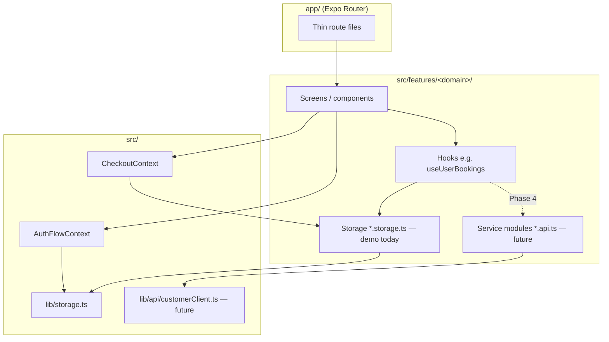

# FSD 00 — Architecture & API Layer

Shared patterns for all Customer features when migrating from AsyncStorage demo to **QuickMaid-API Phase 4**.

**Status:** `UI-DEMO` (data layer) · `PHASE-4` (HTTP)

## Layer diagram



## Planned API client

**New file (Phase 4):** `src/lib/api/customerClient.ts`

| Concern | Implementation |
|---------|----------------|
| Base URL | `EXPO_PUBLIC_API_BASE_URL` → `https://api.quickmaid.in` (prod) |
| Auth | JWT from `POST /api/v1/auth/otp/verify` stored in `expo-secure-store` |
| Role header | `X-App-Client: customer` (same phone can be customer + maid) |
| Phone context | `Authorization: Bearer <token>` |
| Errors | Map `4xx/5xx` → `CustomerApiError` with `code`, `message` |
| Retry | Idempotent GET retry ×1; POST booking actions no auto-retry |

### Suggested service module layout

```
src/features/<domain>/lib/<domain>.api.ts   # HTTP calls only
src/features/<domain>/lib/<domain>.storage.ts # demo (keep until cutover)
src/features/<domain>/hooks/use<Domain>.ts    # calls .api.ts OR .storage.ts via flag
```

**Feature flag:** `EXPO_PUBLIC_USE_API=true` switches hooks from storage to API.

## Global contexts

### `AuthFlowContext` (`src/context/AuthFlowContext.tsx`)

| Field | Used by | API impact |
|-------|---------|------------|
| `city`, `phone` | City → Login → OTP → Signup | OTP send/verify body |
| `name`, `email`, `gender`, `homeType`, `locality` | Signup → Permissions | `POST /customers/register` payload |

Pre-auth only; cleared after session established.

### `CheckoutContext` (`src/context/CheckoutContext.tsx`)

| Method | Demo today | Phase 4 API |
|--------|------------|-------------|
| `startCheckout(service)` | Seeds draft from `profile.storage` | — (client state) |
| `processPaymentAndPlaceOrder()` | `completePayment` + `addStoredBooking` + `pushBookingToPartnerBridge` | `POST /customers/me/bookings` |
| `refreshAccount()` | `getProfileAccount()` | `GET /customers/me` |

**Call site:** Checkout stack + `useStartBooking` — see [04-CHECKOUT](./04-CHECKOUT.md).

## Auth endpoints (shared)

| Endpoint | Method | Body | Response | Replaces |
|----------|--------|------|----------|----------|
| `/api/v1/auth/otp/send` | POST | `{ phone, app_client: "customer" }` | `{ request_id, expires_in }` | Demo skip on login |
| `/api/v1/auth/otp/verify` | POST | `{ phone, otp, app_client: "customer" }` | `{ token, refresh_token, user, customer? }` | `DEMO_OTP` check in `otp.tsx` |
| `/api/v1/auth/refresh` | POST | `{ refresh_token }` | `{ token }` | — |
| `/api/v1/auth/logout` | POST | — | `204` | `clearSession()` |

## Customer profile endpoints (shared)

| Endpoint | Method | Body | Response | Replaces |
|----------|--------|------|----------|----------|
| `/api/v1/customers/me` | GET | — | `CustomerProfile` + embedded account | `getUserProfile()` + `getProfileAccount()` |
| `/api/v1/customers/me` | PATCH | partial profile | `CustomerProfile` | `saveUserProfile()` / `saveProfileAccount()` |
| `/api/v1/customers/register` | POST | signup payload | `CustomerProfile` | `completeRegistration()` |
| `/api/v1/customers/me/delete-request` | POST | `{ confirm_phone, reason? }` | `pending_deletion` | `account.delete.ts` |

See [`CUSTOMER_DATA.md`](../CUSTOMER_DATA.md) for field-level shapes.

## Cross-feature API index

| Domain | GET | POST | PATCH | DELETE |
|--------|-----|------|-------|--------|
| Bookings | `/customers/me/bookings`, `/bookings/:id` | create (checkout) | reschedule | cancel |
| Catalogue | `/catalogue/services`, `/services/:id` | — | — | — |
| Payments | `/customers/me/payments` | capture (gateway callback) | — | — |
| Wallet | `/customers/me/wallet` | top-up (future) | — | — |
| Plus | `/customers/me/membership` | subscribe | pause / resume / cancel | — |
| Notifications | `/customers/me/notifications` | mark-read batch | — | — |
| Support | `/customers/me/tickets` | create, messages | — | — |
| Addresses | `/customers/me/addresses` | create | update default | delete |
| Referrals | `/customers/me/referrals` | — | — | — |

Detail per feature in `01`–`16` FSDs.

## Demo bridges (dual-app)

| File | Key | Purpose |
|------|-----|---------|
| `src/lib/booking-partner-bridge.ts` | `BOOKING_PARTNER_BRIDGE_KEY` (shared) | New booking → partner job offer queue |
| `src/lib/visit-location-bridge.ts` | `VISIT_LOCATION_BRIDGE_KEY` (shared) | Partner live GPS → customer track UI |

Phase 4 replaces bridges with WebSocket / polling on booking endpoints.

## Error handling contract

| HTTP | UI behaviour | Example caller |
|------|--------------|----------------|
| 400 | Inline field error | Signup, checkout address |
| 401 | Force re-login | Any authenticated call |
| 403 | Alert: city not live | Catalogue |
| 404 | Empty state | Booking not found |
| 409 | Slot unavailable | Checkout schedule |
| 422 | OTP wrong | Auth OTP |
| 429 | Resend cooldown | Auth OTP resend |
| 5xx | Alert + retry CTA | Checkout payment |

## Realtime (future, not in demo)

| Channel | Event | Subscriber |
|---------|-------|------------|
| WebSocket `/customers/me/events` | `booking.assigned` | Bookings list refresh |
| | `booking.location` | `BookingLiveLocationCard` |
| | `booking.completed` | Detail + rate prompt |

## Migration order (recommended)

1. Auth OTP + JWT + `GET/PATCH /customers/me`  
2. Catalogue services (read-only) + service detail  
3. Checkout create booking + payment capture  
4. Bookings list, reschedule, cancel, rate  
5. Plus membership + wallet  
6. Notifications + support tickets  

## File index (data layer today)

| Path | Role |
|------|------|
| `src/lib/storage.ts` | Session, identity, onboarding, register map |
| `src/features/profile/lib/profile.storage.ts` | Addresses, payments, prefs, membership |
| `src/features/checkout/lib/bookings.storage.ts` | Placed orders + lifecycle |
| `src/features/notifications/lib/notifications.storage.ts` | Inbox |
| `src/features/payment/lib/payment.storage.ts` | Gateway records |
| `src/features/plus/lib/plus.subscribe.ts` | Plus subscription record |
| `src/features/wallet/lib/wallet.storage.ts` | Wallet ledger |
| `src/features/coupons/lib/coupon.storage.ts` | Coupon wallet |
| `src/features/support/lib/support.storage.ts` | Tickets |
| `src/constants/app.ts` | `STORAGE_KEYS`, `DEMO_OTP` |
