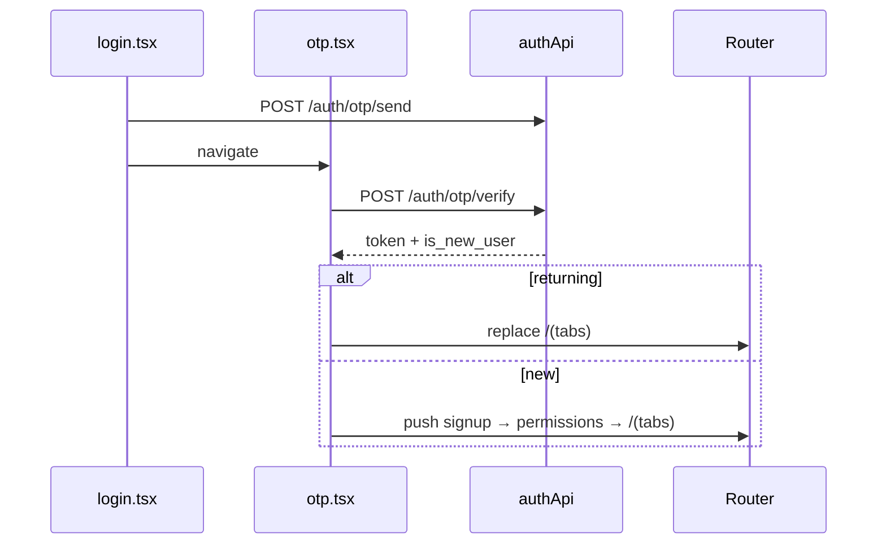

# FSD 01 — Auth & Onboarding

**Status:** `UI-DEMO`  
**Domain:** `app/(auth)/`, `app/index.tsx`, `src/lib/storage.ts`

## Overview

Customer sign-in flow: animated splash → 3-slide onboarding → city picker → phone login → OTP → new user signup + permissions OR returning user session restore → home tabs.

### User stories

| ID | Story |
|----|-------|
| AUTH-1 | First launch sees splash then onboarding once |
| AUTH-2 | Customer picks Raipur (only live city) before login |
| AUTH-3 | Customer enters 10-digit phone and receives OTP |
| AUTH-4 | Returning user lands on `/(tabs)` after OTP |
| AUTH-5 | New user completes profile + optional permissions |
| AUTH-6 | Session persists across restarts until logout/delete |

## Route & component map

| Route | Route file | Screen / component | Key imports |
|-------|------------|-------------------|-------------|
| `/` | `app/index.tsx` | `AppSplashScreen` + fade | `getInitialRoute()` |
| `/(auth)/onboarding` | `app/(auth)/onboarding.tsx` | `OnboardingScreen` | `ONBOARDING_SLIDES`, `setOnboardingDone()` |
| `/(auth)/city` | `app/(auth)/city.tsx` | `CityScreen` | `CITIES`, `useAuthFlow().setCity` |
| `/(auth)/login` | `app/(auth)/login.tsx` | `LoginScreen` | `PhoneInput`, `setPhone` |
| `/(auth)/otp` | `app/(auth)/otp.tsx` | `OtpScreen` | `DEMO_OTP`, `isReturningUser`, `signInExistingUser` |
| `/(auth)/signup` | `app/(auth)/signup.tsx` | `SignupScreen` | `AuthScreenLayout`, profile fields |
| `/(auth)/permissions` | `app/(auth)/permissions.tsx` | `PermissionsScreen` | `completeRegistration`, `expo-location` |

**Flow:** splash → onboarding → city → login → otp → (signup → permissions) → `/(tabs)`.

## Data model

| Entity | Type | Storage key |
|--------|------|-------------|
| Onboarding flag | `boolean` | `@qm/onboarding_done` |
| Auth session | `boolean` | `@qm/auth_complete` |
| Registered map | `Record<phone, UserProfile>` | `@qm/registered_users` |
| Active profile | `UserProfile` | `@qm/user_profile` |

See [`CUSTOMER_DATA.md`](../CUSTOMER_DATA.md) § Identity.

## Current demo behaviour

| Function | File | What it does |
|----------|------|--------------|
| `getInitialRoute()` | `storage.ts` | `/(tabs)` if authed, else onboarding or login |
| `setOnboardingDone()` | `storage.ts` | Sets flag after carousel |
| `isReturningUser(phone)` | `storage.ts` | Checks registered map for name + phone |
| `signInExistingUser(phone)` | `storage.ts` | Loads profile + `setAuthComplete` |
| `completeRegistration(profile)` | `storage.ts` | Saves profile + register map + auth |
| OTP check | `otp.tsx` | Hardcoded `DEMO_OTP` (`123456`) from `constants/app.ts` |

**Login does not call any API** — only stores phone in `AuthFlowContext` and navigates.

## Phase 4 API

### 1. Send OTP

```
POST /api/v1/auth/otp/send
```

**Request:**
```json
{
  "phone": "9876543210",
  "app_client": "customer",
  "country_code": "+91"
}
```

**Response `200`:**
```json
{
  "request_id": "otp_req_abc",
  "expires_in": 600,
  "resend_after": 30
}
```

### 2. Verify OTP

```
POST /api/v1/auth/otp/verify
```

**Request:**
```json
{
  "phone": "9876543210",
  "otp": "123456",
  "app_client": "customer"
}
```

**Response `200`:** `{ token, refresh_token, is_new_user, customer? }` — see [`CUSTOMER_DATA.md`](../CUSTOMER_DATA.md).

### 3. Register (signup + permissions)

```
POST /api/v1/customers/register
Authorization: Bearer <token>
```

**Request:** Mirrors `completeRegistration` + optional `app_permissions`.

**Response `201`:** `CustomerProfile` with `public_id`.

## API call site matrix

| UI location | Event | Hook / function (today) | Phase 4 service | Endpoint |
|-------------|-------|-------------------------|-----------------|----------|
| `app/index.tsx` | Splash mount | `getInitialRoute()` | `authApi.getSession()` | `GET /customers/me` (if token) |
| `onboarding.tsx` | Get started | `setOnboardingDone()` | — (local) | — |
| `city.tsx` | Continue | `setCity` only | — | — |
| `login.tsx` | Continue | `setPhone` only | `authApi.sendOtp(phone)` | `POST /auth/otp/send` |
| `otp.tsx` | Verify (returning) | `signInExistingUser` → `/(tabs)` | `authApi.verifyOtp` | `POST /auth/otp/verify` |
| `otp.tsx` | Verify (new) | → `/(auth)/signup` | `authApi.verifyOtp` | `POST /auth/otp/verify` |
| `otp.tsx` | Resend | Timer reset (demo) | `authApi.sendOtp(phone)` | `POST /auth/otp/send` |
| `signup.tsx` | Continue | Context fields only | — | — |
| `permissions.tsx` | Allow / Skip | `completeRegistration` | `customerApi.register` | `POST /customers/register` |
| `permissions.tsx` | Location allow | `Location.requestForegroundPermissionsAsync` | Device API | — |

## Sequence — OTP verify



## Errors & edge cases

| Case | Demo | API |
|------|------|-----|
| Invalid phone | Inline error login | 400 `invalid_phone` |
| Wrong OTP | Inline error otp | 422 `otp_invalid` |
| Expired OTP | — | 422 `otp_expired` |
| Resend too soon | Button disabled 30s | 429 + `retry_after` |
| Signup name < 2 chars | Inline error | 400 field errors |
| City not live | Card disabled | 403 `city_unavailable` |
| Network offline | — | Alert + retry |

## Migration checklist

- [ ] Add `src/lib/api/auth.api.ts` with send/verify/refresh  
- [ ] Store JWT in `expo-secure-store`  
- [ ] Replace `DEMO_OTP` check in `otp.tsx` with `authApi.verifyOtp`  
- [ ] `login.tsx` Continue → call send OTP before navigate  
- [ ] `permissions.tsx` → `POST /customers/register` instead of `completeRegistration`  
- [ ] `getInitialRoute()` → check secure token + `GET /customers/me`  
- [ ] Seed `profile.storage` from API response on first login  
- [ ] Keep `AuthFlowContext` for pre-auth flows only  
