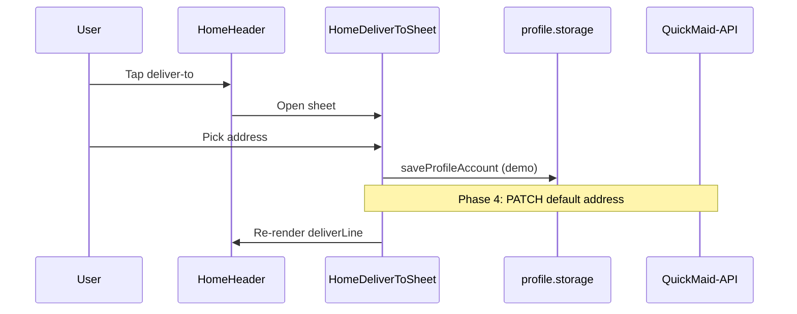

# FSD 02 — Home Dashboard

**Status:** `UI-DEMO`  
**Domain:** `src/features/home/`  
**Routes:** `app/(tabs)/index.tsx` → `HomeScreen`, `app/(tabs)/catalogue.tsx` → `CatalogueScreen`

## Overview

Primary landing after auth: personalized greeting, deliver-to address chip, quick service grid, rebook card, featured rails, Plus upsell, and entry to full catalogue search.

### User stories

| ID | Story |
|----|-------|
| HOME-1 | Customer sees greeting and default delivery address |
| HOME-2 | Customer changes deliver-to address from header sheet |
| HOME-3 | Customer books a service from quick grid in one tap |
| HOME-4 | Customer browses catalogue with search, category, sort |
| HOME-5 | Customer sees unread notification badge on header |
| HOME-6 | Pull-to-refresh reloads profile and addresses |

## Route & component map

| Component | File | Responsibility |
|-----------|------|----------------|
| `HomeScreen` | `home/components/HomeScreen.tsx` | Orchestrates home sections |
| `HomeHeader` | `HomeHeader.tsx` | Greeting, avatar, deliver-to, notifications |
| `HomeDeliverToSheet` | `HomeDeliverToSheet.tsx` | Address picker modal |
| `HomeQuickGrid` | `HomeQuickGrid.tsx` | Top services → detail or checkout |
| `HomeFeaturedRail` | `HomeFeaturedRail.tsx` | City-scoped featured services |
| `HomeRebookCard` | `HomeRebookCard.tsx` | Last booking rebook CTA |
| `HomePlusCard` | `HomePlusCard.tsx` | Plus membership nudge |
| `CatalogueScreen` | `home/components/CatalogueScreen.tsx` | Full catalogue + search |
| `HomeSearchBar` | `HomeSearchBar.tsx` | react-hook-form search + quick tags |
| `HomeServiceFeed` | `HomeServiceFeed.tsx` | Paginated service cards |
| `HomeCategoryRail` | `HomeCategoryRail.tsx` | Category filter chips |
| `HomeServiceFilterSheet` | `HomeServiceFilterSheet.tsx` | Sort: popular, price, name |

### Hooks

| Hook | File | Data source |
|------|------|-------------|
| `useHomeProfile` | `hooks/useHomeProfile.ts` | `getUserProfile()` |
| `useHomeDeliveryAddress` | `hooks/useHomeDeliveryAddress.ts` | `profile.storage` default address |
| `useHomeSearch` | `hooks/useHomeSearch.ts` | Local form state |
| `useNotifications` | `notifications/hooks/useNotifications.ts` | `notifications.storage` |

## Data model

| Entity | Source | See |
|--------|--------|-----|
| `UserProfile` | `@qm/user_profile` | CUSTOMER_DATA § Identity |
| `ProfileAddress` | `@qm/profile_account` | CUSTOMER_DATA § Addresses |
| `ServiceItem` | `constants/services.ts` | Static catalogue (Phase 4: API) |

## Current demo behaviour

| Function | File | Behaviour |
|----------|------|-----------|
| `useHomeProfile().refresh` | `useHomeProfile.ts` | Reads `getUserProfile()` |
| `useHomeDeliveryAddress` | `useHomeDeliveryAddress.ts` | Reads/saves default address in profile account |
| `filterAndSortServices` | `lib/home.catalogue.ts` | Client-side filter on `HOME_SERVICES` |
| `useStartBooking().bookService` | `checkout/hooks/useStartBooking.ts` | `CheckoutContext.startCheckout` |
| `useOpenServiceDetail` | `service/hooks/useOpenServiceDetail.ts` | `router.push(/service/:id)` |

No network calls. Catalogue is seeded from `src/constants/services.ts`.

## Phase 4 API

| Endpoint | Method | Purpose |
|----------|--------|---------|
| `/api/v1/customers/me` | GET | Profile + default address |
| `/api/v1/catalogue/services` | GET | `?city=&category=&q=&sort=&page=` |
| `/api/v1/catalogue/featured` | GET | `?city=Raipur` home rails |
| `/api/v1/customers/me/notifications` | GET | `?unread_only=true&limit=1` badge |

### GET catalogue services (subset)

Query: `city=Raipur&category=cleaning&sort=popular&limit=20`

**Response:**
```json
{
  "services": [{ "id": "regular", "name": "Regular cleaning", "price": "₹499", "...": "..." }],
  "page": 1,
  "total": 42
}
```

## API call site matrix

| Component | User action | Today | Phase 4 |
|-----------|-------------|-------|---------|
| `HomeScreen` | Mount / focus | `useHomeProfile`, `useHomeDeliveryAddress` | `GET /customers/me` |
| `HomeScreen` | Pull refresh | Same hooks | Same |
| `HomeHeader` | Notifications tap | `router.push(/notifications)` | Same |
| `HomeHeader` | Deliver-to tap | Open sheet or `/account/address-picker` | Same |
| `HomeDeliverToSheet` | Select address | `selectAddress` → `saveProfileAccount` | `PATCH /customers/me/addresses/:id` |
| `HomeQuickGrid` | Tap service | `bookService` or `openServiceDetail` | Same nav |
| `CatalogueScreen` | Search / filter | `filterAndSortServices` local | `GET /catalogue/services` |
| `HomeServiceFeed` | Tap card | `router.push(/service/:id)` | Same |
| `HomeRebookCard` | Rebook | `useRebookBooking` | `POST /customers/me/bookings` (prefill) |

## Sequence — deliver-to change



## Errors

| Case | UI |
|------|-----|
| No addresses saved | Redirect to `/account/address-picker` |
| Profile load fail | `HomeSkeleton` then empty greeting |
| City not in catalogue | Empty feed + help CTA |
| Offline refresh | Toast; keep cached data |

## Migration checklist

- [ ] `useHomeProfile` → `GET /customers/me` (identity slice)  
- [ ] `useHomeDeliveryAddress` → addresses from same response  
- [ ] `CatalogueScreen` paginate `GET /catalogue/services`  
- [ ] Cache catalogue in React Query with city key  
- [ ] Featured rail uses `GET /catalogue/featured`  
- [ ] Keep client-side search debounce; pass `q` to API  
