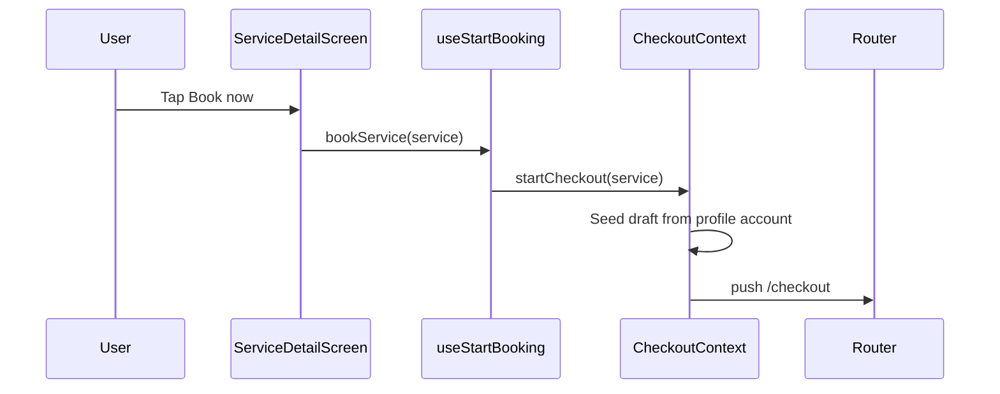

# FSD 03 — Service Detail

**Status:** `UI-DEMO`  
**Domain:** `src/features/service/`  
**Route:** `app/service/[id].tsx` → `ServiceDetailScreen`

## Overview

Full service marketing page: hero image, pricing (with Plus member price), highlights, how-it-works steps, FAQs, similar services, save-to-favourites, and primary **Book now** CTA into checkout.

### User stories

| ID | Story |
|----|-------|
| SVC-1 | Customer opens service from home, catalogue, or deep link |
| SVC-2 | Customer sees list price and Plus savings |
| SVC-3 | Customer saves service to favourites |
| SVC-4 | Customer shares service link |
| SVC-5 | Customer taps Book now → checkout flow |
| SVC-6 | Invalid id shows empty state with back CTA |

## Route & component map

| Route | File | Screen | Params |
|-------|------|--------|--------|
| `/service/[id]` | `app/service/[id].tsx` | `ServiceDetailScreen` | `id` — service slug |

### In-screen sections (`ServiceDetailScreen.tsx`)

| Section | Data source |
|---------|-------------|
| Hero + gallery | `getServiceImages(id)`, `HomePhoto` |
| Price / Plus price | `parseServicePrice`, `plusMemberPrice` |
| Highlights | `getServiceHighlights(service)` |
| How it works | `SERVICE_STEPS` constant |
| FAQs | `getServiceFaqs(service)` |
| Reviews strip | `DEMO_SERVICE_REVIEWS` |
| Similar services | `getSimilarServices(service)` |
| Sticky CTA | `useStartBooking().bookService` |

### Related utilities

| Module | File |
|--------|------|
| `getServiceById` | `service/lib/service.utils.ts` |
| `getCategoryLabel` | `service/lib/service.utils.ts` |
| `useSavedServices` | `saved-services/hooks/useSavedServices.ts` |
| `useStartBooking` | `checkout/hooks/useStartBooking.ts` |

## Data model

| Entity | Type | Source |
|--------|------|--------|
| `ServiceItem` | id, name, price, icon, category, duration, perks | `constants/services.ts` |
| Saved service ids | `string[]` | `@qm/profile_account` → saved services |

See [`CUSTOMER_DATA.md`](../CUSTOMER_DATA.md) — catalogue aligns with admin service SKUs.

## Current demo behaviour

| Function | File | Behaviour |
|----------|------|-----------|
| `getServiceById(id)` | `service.utils.ts` | Lookup in `HOME_SERVICES` + `FEATURED_SERVICES` |
| `bookService(service)` | `useStartBooking.ts` | `CheckoutContext.startCheckout(service)` |
| `toggle(saved)` | `useSavedServices.ts` | Persists to profile account |
| Share | `ServiceDetailScreen` | `Share.share` with service name |

**No API calls.** Missing `id` renders inline empty state.

## Phase 4 API

| Endpoint | Method | Purpose |
|----------|--------|---------|
| `/api/v1/catalogue/services/:id` | GET | Full service detail + FAQs |
| `/api/v1/catalogue/services/:id/reviews` | GET | Paginated reviews |
| `/api/v1/customers/me/saved-services` | GET | Saved ids |
| `/api/v1/customers/me/saved-services` | POST | `{ service_id }` toggle |

### GET service detail

**Response `200`:**
```json
{
  "id": "deep-clean",
  "name": "Deep cleaning",
  "price_paise": 149900,
  "plus_price_paise": 127400,
  "duration_minutes": 240,
  "category": "cleaning",
  "highlights": ["Kitchen degrease", "Bathroom descale"],
  "faqs": [{ "q": "...", "a": "..." }]
}
```

## API call site matrix

| Component | User action | Today | Phase 4 |
|-----------|-------------|-------|---------|
| `ServiceDetailScreen` | Mount | `getServiceById(id)` local | `GET /catalogue/services/:id` |
| `ServiceDetailScreen` | Book now | `bookService(service)` | Same → checkout creates booking |
| `ServiceDetailScreen` | Save heart | `useSavedServices.toggle` | `POST /customers/me/saved-services` |
| `ServiceDetailScreen` | Share | Native share | Same (deep link URL) |
| Similar service card | Tap | `router.push(/service/:id)` | Same |
| `useOpenServiceDetail` | Programmatic | `router.push` | Same |

## Sequence — book from detail



## Errors & edge cases

| Case | Demo | API |
|------|------|-----|
| Unknown service id | Empty state + back | 404 → same UI |
| Service unavailable in city | — | 403 + message |
| Plus price without membership | Shows strikethrough list price | From API `plus_price_paise` |
| Checkout with no address | Checkout address step prompts add | 400 on order |

## Migration checklist

- [ ] Add `src/features/service/lib/service.api.ts`  
- [ ] `ServiceDetailScreen` fetch on `id` change with loading skeleton  
- [ ] Move FAQs/reviews to API response  
- [ ] Wire `useSavedServices` to `GET/POST saved-services`  
- [ ] Deep link `quickmaid://service/:id` unchanged  
- [ ] Keep `useStartBooking` as checkout entry point  
