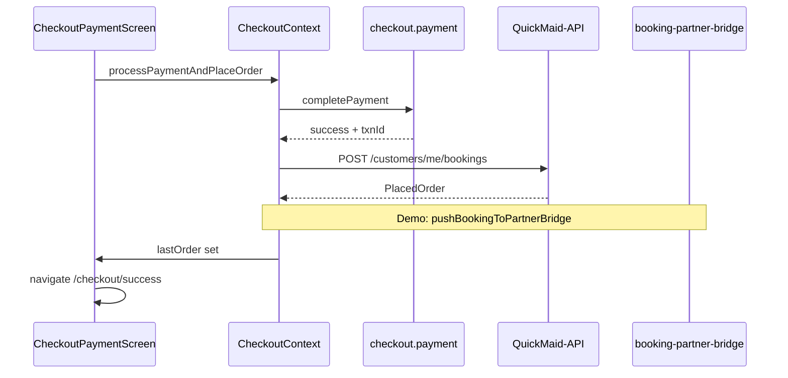

# FSD 04 — Checkout Flow

**Status:** `UI-DEMO` · payment `MOCK-API`  
**Domain:** `src/features/checkout/`, `src/context/CheckoutContext.tsx`  
**Routes:** `app/checkout/*` (5 screens)

## Overview

Five-step booking checkout: cart summary → address → schedule → payment → success. `CheckoutContext` owns draft state, validates payment, places order locally, pushes to partner bridge, and writes wallet/notification side effects.

### Checkout screens

| Step | Route | Component |
|------|-------|-----------|
| 1 Cart | `/checkout` | `CheckoutCartScreen` (`app/checkout/index.tsx`) |
| 2 Address | `/checkout/address` | `CheckoutAddressScreen` |
| 3 Schedule | `/checkout/schedule` | `CheckoutScheduleScreen` |
| 4 Payment | `/checkout/payment` | `CheckoutPaymentScreen` |
| 5 Success | `/checkout/success` | `CheckoutSuccessScreen` |

Layout: `app/checkout/_layout.tsx` — calls `refreshAccount()` on mount.

### User stories

| ID | Story |
|----|-------|
| CHK-1 | Customer reviews line items and applies coupon |
| CHK-2 | Customer picks saved address or adds new |
| CHK-3 | Customer selects visit date and slot |
| CHK-4 | Customer pays via UPI/card/wallet/gateway simulate |
| CHK-5 | Success shows booking ref + navigates to detail |
| CHK-6 | Order enqueued for partner app via bridge |

## Route & component map

```
CheckoutLayout (_layout.tsx)
  ├── index → CheckoutCartScreen
  ├── address → CheckoutAddressScreen
  ├── schedule → CheckoutScheduleScreen
  ├── payment → CheckoutPaymentScreen
  └── success → CheckoutSuccessScreen (gesture disabled)
```

| Module | File | Role |
|--------|------|------|
| `CheckoutContext` | `context/CheckoutContext.tsx` | Draft, account, place order |
| `checkout.utils` | `lib/checkout.utils.ts` | Summary, dates, `generateBookingRef` |
| `checkout.payment` | `lib/checkout.payment.ts` | Validate, simulate, `completePayment` |
| `bookings.storage` | `lib/bookings.storage.ts` | `addStoredBooking` |
| `booking-partner-bridge` | `lib/booking-partner-bridge.ts` | `pushBookingToPartnerBridge` |
| `maid.assign` | `bookings/lib/maid.assign.ts` | `autoAssignMaid`, `completionOtp` |

## Data model

| Entity | Type | Storage |
|--------|------|---------|
| `CheckoutDraft` | items, addressId, slotId, visitDate, paymentMode, coupon | In-memory (`CheckoutContext`) |
| `PlacedOrder` | Full booking record | `@qm/user_bookings` |
| `ProfileAccountData` | addresses, payments, wallet | `@qm/profile_account` |

See [`CUSTOMER_DATA.md`](../CUSTOMER_DATA.md) § Addresses, Payments, Booking preferences.

## Current demo behaviour

### `startCheckout(service)`

1. Load `getProfileAccount()`  
2. Default address, slot from `PREFERRED_SLOTS`, first visit date  
3. Build cart item via `serviceToCartItem`  
4. `router.push('/checkout')`

### `processPaymentAndPlaceOrder(onStep, gatewayResult?)`

1. `computeOrderSummary` + `validatePayment`  
2. `completePayment` (simulate or gateway mock)  
3. Deduct wallet → `saveProfileAccount`, `addWalletTransaction`  
4. `autoAssignMaid` → maid name, id, `completionOtp`  
5. Build `PlacedOrder` with `generateBookingRef`  
6. `addStoredBooking` + **`pushBookingToPartnerBridge(order, account.name)`**  
7. `addNotification`, `addPaymentRecord`, `markCouponUsed`  
8. Return order → success screen

### Partner bridge (`booking-partner-bridge.ts`)

Writes to shared `BOOKING_PARTNER_BRIDGE_KEY` (AsyncStorage) and attempts `buildPartnerBookingDeepLink` via `expo-linking`.

## Phase 4 API

| Endpoint | Method | Purpose |
|----------|--------|---------|
| `/api/v1/customers/me/bookings` | POST | Create booking + payment intent |
| `/api/v1/customers/me/bookings/:id` | GET | Poll assignment status |
| `/api/v1/payments/intent` | POST | Razorpay order id |
| `/api/v1/payments/capture` | POST | Confirm gateway payment |

### POST create booking

**Request:**
```json
{
  "service_id": "deep-clean",
  "address_id": "addr_1",
  "slot_id": "morning",
  "visit_date": "2026-06-15",
  "payment_mode": "upi",
  "coupon_code": "SAVE50",
  "wallet_amount_paise": 5000,
  "payment_intent_id": "pi_abc"
}
```

**Response `201`:**
```json
{
  "id": "bkg_xyz",
  "booking_ref": "QM-482916",
  "status": "upcoming",
  "maid": { "id": "maid_1", "name": "Sunita" },
  "completion_otp": "482916",
  "amount_paid_paise": 144900
}
```

## API call site matrix

| Component | User action | Today | Phase 4 |
|-----------|-------------|-------|---------|
| `useStartBooking` | Book | `CheckoutContext.startCheckout` | Same (client) |
| `CheckoutLayout` | Mount | `refreshAccount` | `GET /customers/me` |
| `CheckoutCartScreen` | Apply coupon | `updateDraft` | Validate coupon API |
| `CheckoutAddressScreen` | Select address | `updateDraft` | — |
| `CheckoutScheduleScreen` | Pick date/slot | `updateDraft` | `GET /slots?date=` |
| `CheckoutPaymentScreen` | Pay | `processPaymentAndPlaceOrder` | `POST /bookings` + capture |
| `CheckoutContext` | After pay | `addStoredBooking` | Response body |
| `CheckoutContext` | After pay | `pushBookingToPartnerBridge` | Server dispatches to maid |
| `CheckoutSuccessScreen` | View booking | `lastOrder` | `GET /bookings/:id` |

## Sequence — place order



## Errors & edge cases

| Case | Demo | API |
|------|------|-----|
| No payment method | Inline error payment screen | 400 |
| Wallet covers full amount | Skip gateway | Same |
| Payment simulate fail | Return null, stay on payment | 402 payment_failed |
| Slot full | — | 409 slot_unavailable |
| Bridge / partner not installed | Queue still written | N/A (server dispatch) |

## Migration checklist

- [ ] `processPaymentAndPlaceOrder` → `POST /customers/me/bookings`  
- [ ] Remove `pushBookingToPartnerBridge` when API dispatches jobs  
- [ ] Razorpay via `EXPO_PUBLIC_RAZORPAY_KEY` + capture endpoint  
- [ ] Slot availability from API on schedule step  
- [ ] Coupon validation `POST /customers/me/coupons/validate`  
- [ ] Optimistic UI with rollback on 5xx  
