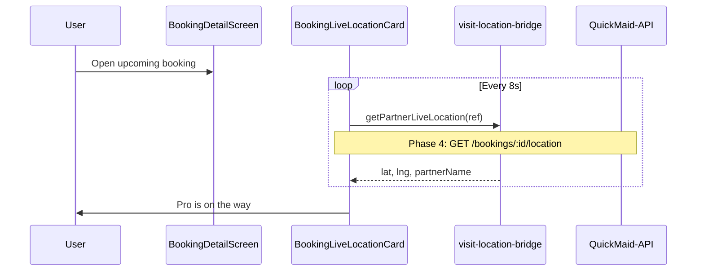

# FSD 05 — Bookings (List, Detail, Lifecycle)

**Status:** `UI-DEMO`  
**Domain:** `src/features/bookings/`  
**Routes:** `app/(tabs)/bookings.tsx`, `app/booking/*`

## Overview

Customer booking hub: filtered list, detail with timeline, live location card, track map, reschedule, cancel with refund breakdown, rate visit, invoice/receipt PDF, dispute, and rebook.

### Booking lifecycle

```
upcoming → completed
upcoming → cancelled
```

Visit completion: customer shares `completionOtp` with pro; partner verifies → status `completed`.

## Route & component map

| Route | File | Screen |
|-------|------|--------|
| `/(tabs)/bookings` | `(tabs)/bookings.tsx` | `BookingsScreen` |
| `/booking/[id]` | `booking/[id].tsx` | `BookingDetailScreen` |
| `/booking/track/[id]` | `booking/track/[id].tsx` | `BookingTrackScreen` |
| `/booking/reschedule/[id]` | `booking/reschedule/[id].tsx` | `BookingRescheduleScreen` |
| `/booking/cancel/[id]` | `booking/cancel/[id].tsx` | `BookingCancelScreen` |
| `/booking/rate/[id]` | `booking/rate/[id].tsx` | `BookingRateScreen` |
| `/booking/invoice/[id]` | `booking/invoice/[id].tsx` | `BookingDocumentScreen` (invoice) |
| `/booking/receipt/[id]` | `booking/receipt/[id].tsx` | `BookingDocumentScreen` (receipt) |
| `/booking/dispute/[id]` | `booking/dispute/[id].tsx` | Dispute form |

### Key components

| Component | File | Role |
|-----------|------|------|
| `BookingsScreen` | `BookingsScreen.tsx` | List orchestrator |
| `BookingsBody` | `BookingsBody.tsx` | Cards + filters |
| `BookingCard` | `BookingCard.tsx` | Row with quick actions |
| `BookingDetailScreen` | `BookingDetailScreen.tsx` | Full detail + actions |
| `BookingLiveLocationCard` | `BookingLiveLocationCard.tsx` | Partner GPS from bridge |
| `BookingCompletionOtpCard` | `BookingCompletionOtpCard.tsx` | Show/share OTP |
| `BookingTrackScreen` | `BookingTrackScreen.tsx` | Animated map + ETA |
| `BookingTrackMap` | `BookingTrackMap.tsx` | Demo map UI |

### Storage & libs

| Function | File |
|----------|------|
| `getAllBookings`, `getBookingById` | `checkout/lib/bookings.storage.ts` |
| `rescheduleBookingById` | `bookings.storage.ts` |
| `cancelBookingById` | `bookings.storage.ts` |
| `submitBookingReview` | `bookings.storage.ts` |
| `completeBookingById` | `bookings.storage.ts` |
| `getPartnerLiveLocation` | `lib/visit-location-bridge.ts` |
| `verifyMaidCompletionOtp` | `bookings/lib/booking.completion.ts` |
| `buildBookingDocument` | `bookings/lib/booking.document.ts` |

## Data model

| Entity | Key fields | See |
|--------|------------|-----|
| `DemoBooking` / `PlacedOrder` | id, bookingRef, status, maid, completionOtp | `constants/demo.ts` |
| `VisitLocationBridgeEntry` | lat, lng, recordedAt, partnerName | `shared/visit-location-bridge` |

See [`CUSTOMER_DATA.md`](../CUSTOMER_DATA.md) — bookings map to admin CRM visits.

## Current demo behaviour

| Feature | Implementation |
|---------|----------------|
| List | `useUserBookings` merges `DEMO_BOOKINGS` + `@qm/user_bookings` + overrides |
| Filters | `BookingsFilterRail`: all / upcoming / completed / cancelled |
| Live location | `BookingLiveLocationCard` polls `getPartnerLiveLocation(bookingRef)` every 8s |
| Track | `BookingTrackScreen` uses `booking.tracking.ts` simulated progress |
| Reschedule | `rescheduleBookingById` patches date/slot in storage |
| Cancel | `cancelBookingById` + `computeRefundBreakdown` |
| Rate | `submitBookingReview` stores rating + comment |
| Invoice | `buildBookingDocument` → PDF via `booking.documentPdf.ts` |
| Rebook | `useRebookBooking` → `startCheckout` with same service |

### `BookingLiveLocationCard`

Only renders when `booking.status === 'upcoming'` and bridge has coordinates for `bookingRef`. Data written by partner app during in-progress visit.

## Phase 4 API

| Endpoint | Method | Purpose |
|----------|--------|---------|
| `/api/v1/customers/me/bookings` | GET | `?status=&page=` |
| `/api/v1/customers/me/bookings/:id` | GET | Detail |
| `/api/v1/customers/me/bookings/:id/reschedule` | PATCH | New date/slot |
| `/api/v1/customers/me/bookings/:id/cancel` | POST | `{ reason_code }` |
| `/api/v1/customers/me/bookings/:id/review` | POST | `{ rating, comment }` |
| `/api/v1/customers/me/bookings/:id/location` | GET | Latest pro coordinates |
| `/api/v1/customers/me/bookings/:id/invoice` | GET | PDF URL |

### PATCH reschedule

```json
{ "visit_date": "2026-06-18", "slot_id": "afternoon" }
```

### POST cancel

```json
{ "reason_code": "plans_changed", "reason_text": "optional" }
```

## API call site matrix

| Component | User action | Today | Phase 4 |
|-----------|-------------|-------|---------|
| `BookingsScreen` | Focus | `useUserBookings.refresh` | `GET /customers/me/bookings` |
| `BookingDetailScreen` | Mount | `getBookingById` | `GET /bookings/:id` |
| `BookingLiveLocationCard` | Poll 8s | `getPartnerLiveLocation` | `GET /bookings/:id/location` |
| `BookingTrackScreen` | Mount | Simulated progress | `GET /bookings/:id/location` |
| `BookingRescheduleScreen` | Confirm | `rescheduleBookingById` | `PATCH /bookings/:id/reschedule` |
| `BookingCancelScreen` | Confirm | `cancelBookingById` | `POST /bookings/:id/cancel` |
| `BookingRateScreen` | Submit | `submitBookingReview` | `POST /bookings/:id/review` |
| `BookingDocumentScreen` | Download | `downloadBookingDocumentPdf` | `GET /bookings/:id/invoice` |
| `BookingCompletionOtpCard` | Verify | `verifyMaidCompletionOtp` | Server-side on partner complete |
| `BookingsRebookRail` | Rebook | `useRebookBooking` | New `POST /bookings` |

## Sequence — track live visit



## Errors & edge cases

| Case | Demo | API |
|------|------|-----|
| Booking not found | Empty + back | 404 |
| Reschedule past cutoff | Inline warning | 409 |
| Cancel after start | Refund rules differ | 403 |
| No live location yet | Card hidden | Empty 204 |
| Rate already submitted | `BookingReviewSubmittedCard` | 409 |

## Migration checklist

- [ ] `useUserBookings` → paginated `GET /customers/me/bookings`  
- [ ] Replace bridge polling with API location endpoint or WebSocket  
- [ ] Reschedule/cancel/rate → respective REST actions  
- [ ] Invoice PDF from signed URL  
- [ ] Keep `completionOtp` server-generated only  
- [ ] Dispute → `POST /customers/me/tickets` with `booking_id`  
