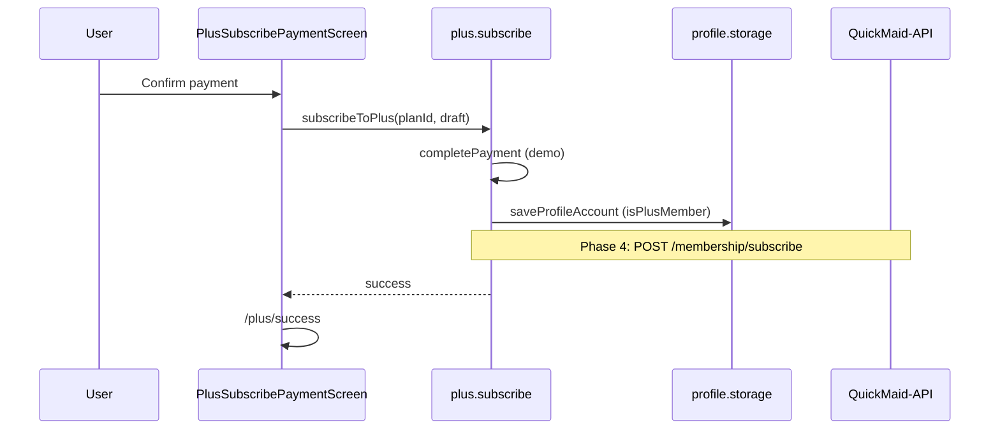

# FSD 06 — QuickMaid Plus Membership

**Status:** `UI-DEMO`  
**Domain:** `src/features/plus/`  
**Routes:** `app/(tabs)/plans.tsx`, `app/plus/*`

## Overview

Plus subscription: marketing tab, subscribe wizard (plan picker → payment → success), manage membership (pause, resume, cancel), and billing history. Member pricing reflected on service detail and checkout.

### User stories

| ID | Story |
|----|-------|
| PLUS-1 | Customer browses Plus benefits on Plans tab |
| PLUS-2 | Customer subscribes monthly/annual with wallet + gateway |
| PLUS-3 | Customer sees member pricing on services |
| PLUS-4 | Customer pauses or cancels membership |
| PLUS-5 | Customer views past Plus invoices |

## Route & component map

| Route | File | Screen |
|-------|------|--------|
| `/(tabs)/plans` | `(tabs)/plans.tsx` | `PlusScreen` |
| `/plus/subscribe` | `plus/subscribe.tsx` | `PlusSubscribeScreen` |
| `/plus/payment` | `plus/payment.tsx` | `PlusSubscribePaymentScreen` |
| `/plus/success` | `plus/success.tsx` | `PlusSubscribeSuccessScreen` |
| `/plus/manage` | `plus/manage.tsx` | `PlusManageScreen` |
| `/plus/billing` | `plus/billing.tsx` | `PlusBillingHistoryScreen` |

Layout: `app/plus/_layout.tsx` — bottom sheet animation for subscribe flow.

### Key components

| Component | File |
|-----------|------|
| `PlusScreen` | `plus/components/PlusScreen.tsx` |
| `PlusBody` | `PlusBody.tsx` — perks, FAQ, social proof |
| `PlusPlanPicker` | `PlusPlanPicker.tsx` |
| `PlusSubscribeScreen` | `PlusSubscribeScreen.tsx` |
| `PlusManageScreen` | `PlusManageScreen.tsx` |
| `HomePlusCard` | `home/components/HomePlusCard.tsx` — home upsell |

### Lib modules

| Module | File | Role |
|--------|------|------|
| `plus.plans` | `lib/plus.plans.ts` | Plan definitions, pricing |
| `plus.subscribe` | `lib/plus.subscribe.ts` | Payment + activate membership |
| `plus.membership` | `lib/plus.membership.ts` | Pause, resume, cancel |
| `plus.billing` | `lib/plus.billing.ts` | Invoice history seeds |

## Data model

| Entity | Storage key | Fields |
|--------|-------------|--------|
| Membership | `@qm/profile_account` → `plan`, `plusPaused` | `CUSTOMER_DATA` § Membership |
| Subscription record | `@qm/plus_last_subscription` | `PlusSubscriptionRecord` |
| Payment record | `@qm/payment_history` | Gateway txn after subscribe |

See [`CUSTOMER_DATA.md`](../CUSTOMER_DATA.md) § Membership.

## Current demo behaviour

| Function | File | Behaviour |
|----------|------|-----------|
| `subscribeToPlus(planId, draft, ...)` | `plus.subscribe.ts` | `completePayment` → update `profile.account.plan` → `savePlusSubscription` |
| `pausePlusMembership` | `plus.membership.ts` | Sets `plusPaused`, updates plan label |
| `resumePlusMembership` | `plus.membership.ts` | Clears pause flags |
| `cancelPlusMembership` | `plus.membership.ts` | Reverts to free plan |
| `plusMemberPrice(price)` | `service/lib/service.utils.ts` | 15% discount display |
| `useOpenPlusSubscribe` | `hooks/useOpenPlusSubscribe.ts` | `router.push(/plus/subscribe)` |

Plans tab shows `PlusScreen` with member state from `getProfileAccount()`. Non-members see subscribe CTA; members see manage link.

## Phase 4 API

| Endpoint | Method | Purpose |
|----------|--------|---------|
| `/api/v1/customers/me/membership` | GET | Current plan + renewal |
| `/api/v1/customers/me/membership/subscribe` | POST | Start subscription |
| `/api/v1/customers/me/membership/pause` | POST | Pause billing |
| `/api/v1/customers/me/membership/resume` | POST | Resume |
| `/api/v1/customers/me/membership/cancel` | POST | End at period end |
| `/api/v1/customers/me/membership/invoices` | GET | Billing history |

### POST subscribe

**Request:**
```json
{
  "plan_id": "plus_monthly",
  "payment_mode": "upi",
  "payment_method_id": "pm_1",
  "wallet_amount_paise": 0
}
```

**Response `201`:**
```json
{
  "plan_type": "monthly",
  "is_plus_member": true,
  "plus_renew_date": "2026-07-11",
  "plus_visits_left": 4
}
```

## API call site matrix

| Component | User action | Today | Phase 4 |
|-----------|-------------|-------|---------|
| `PlusScreen` | Mount | `getProfileAccount` | `GET /membership` |
| `PlusSubscribeScreen` | Continue | Navigate payment | — |
| `PlusSubscribePaymentScreen` | Pay | `subscribeToPlus` | `POST /membership/subscribe` |
| `PlusSubscribeSuccessScreen` | Done | Local state | Refresh membership |
| `PlusManageScreen` | Pause | `pausePlusMembership` | `POST /membership/pause` |
| `PlusManageScreen` | Resume | `resumePlusMembership` | `POST /membership/resume` |
| `PlusManageScreen` | Cancel | `cancelPlusMembership` | `POST /membership/cancel` |
| `PlusBillingHistoryScreen` | Mount | `plus.billing` demo | `GET /membership/invoices` |
| `ServiceDetailScreen` | Price display | `plusMemberPrice` local | From API price fields |
| `CheckoutCartScreen` | Plus discount | `computeOrderSummary` | Server-side pricing |

## Sequence — subscribe



## Errors & edge cases

| Case | Demo | API |
|------|------|-----|
| Payment fails | Stay on payment screen | 402 |
| Already subscribed | Manage CTA instead | 409 |
| Pause while active visit | Allowed in demo | Business rule TBD |
| Wallet partial pay | `computePlusPayable` | Same logic server-side |

## Migration checklist

- [ ] `subscribeToPlus` → `POST /membership/subscribe` + payment capture  
- [ ] Membership state from `GET /membership` not local `plan` object  
- [ ] Checkout/service prices use API `plus_price_paise` when member  
- [ ] Billing history from `GET /membership/invoices`  
- [ ] Webhook-driven renewal updates (no local `plusRenewDate` math)  
