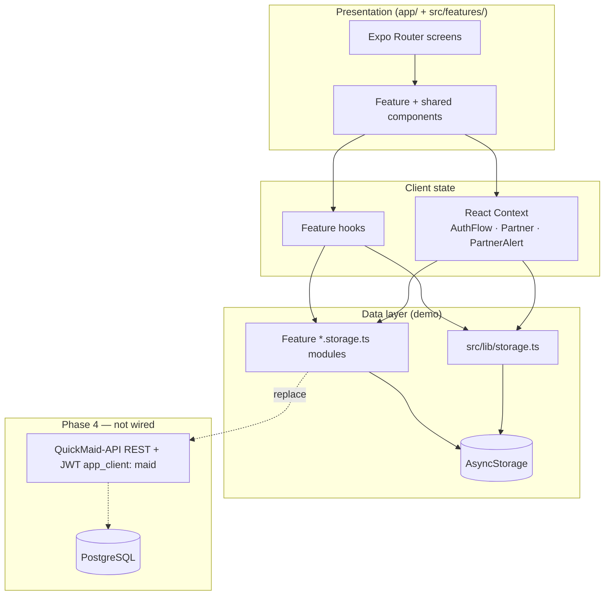
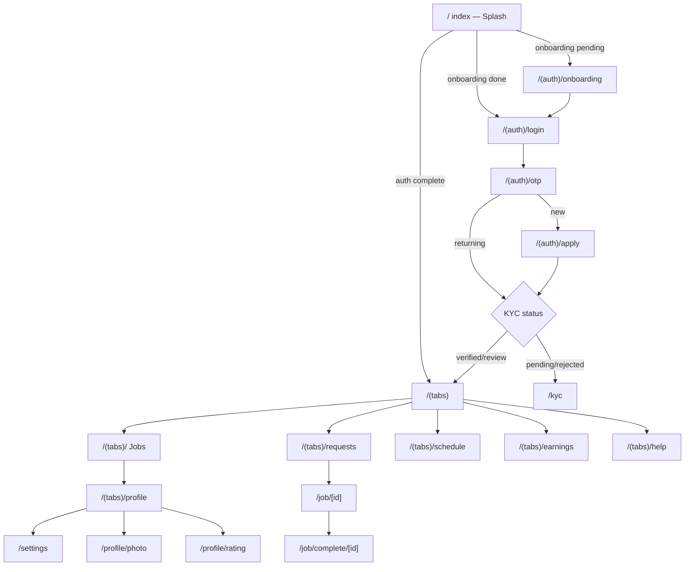
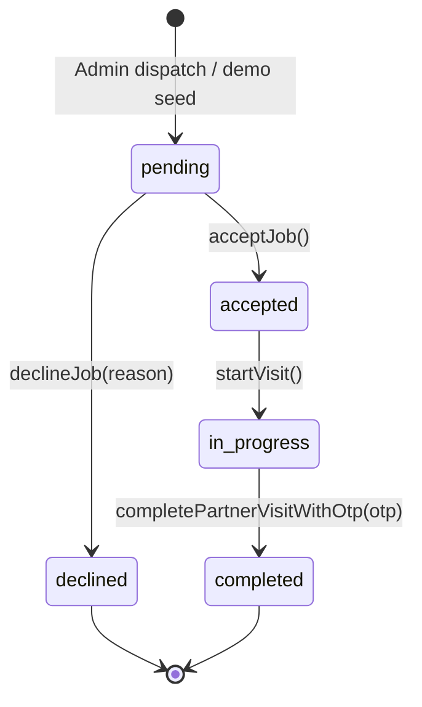
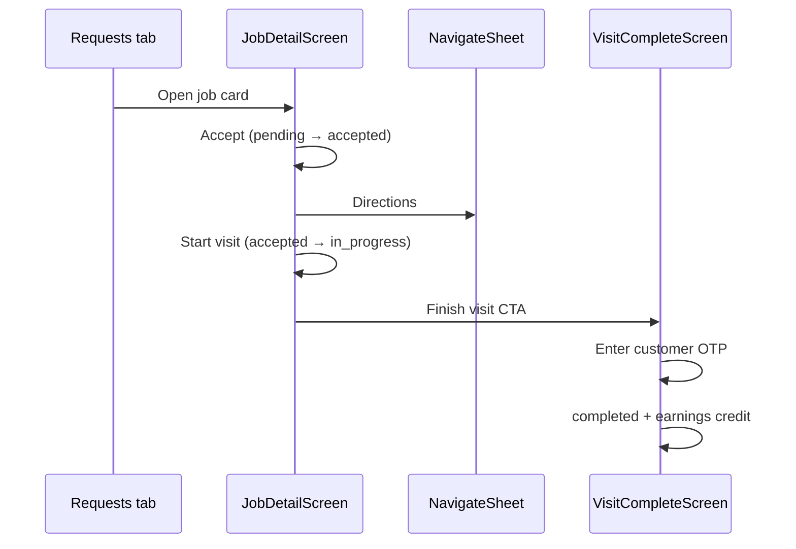
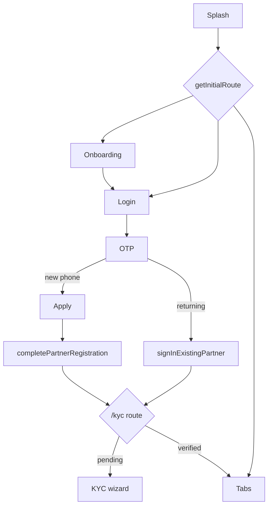

# QuickMaid Partner App

<p align="center">
  <strong>Native partner (maid) mobile app for QuickMaid</strong><br>
  Accept jobs, complete visits, verify KYC, track earnings · React Native · Expo SDK 56 · TypeScript
</p>

| | |
|---|---|
| **Package** | `partner` v1.0.0 |
| **Bundle ID** | `in.quickmaid.partner` |
| **Deep link scheme** | `quickmaid-partner://` |
| **Runtime** | UI-only demo — **no HTTP backend** (AsyncStorage) |
| **Planned backend** | QuickMaid-API Phase 3/4 |
| **Dev port** | `8082` (runs alongside Customer app on `8081`) |

---

## Table of contents

1. [Project overview](#1-project-overview)
2. [Architecture](#2-architecture)
3. [Setup instructions](#3-setup-instructions)
4. [Environment variables](#4-environment-variables)
5. [Folder & file structure](#5-folder--file-structure)
6. [Routing](#6-routing)
7. [State management](#7-state-management)
8. [API & data layer](#8-api--data-layer)
9. [UI components](#9-ui-components)
10. [Feature screens](#10-feature-screens)
11. [Styling](#11-styling)
12. [Error handling & logging](#12-error-handling--logging)
13. [Build & deployment](#13-build--deployment)
14. [Testing](#14-testing)
15. [Conventions & best practices](#15-conventions--best-practices)
16. [Cross-reference index](#16-cross-reference-index)
17. [Job lifecycle & visit flow](#17-job-lifecycle--visit-flow)
18. [KYC wizard deep dive](#18-kyc-wizard-deep-dive)
19. [Earnings & payouts](#19-earnings--payouts)
20. [Profile & settings system](#20-profile--settings-system)
21. [Navigation hooks](#21-navigation-hooks)
22. [Native modules reference](#22-native-modules-reference)
23. [Demo & seed data catalog](#23-demo--seed-data-catalog)
24. [Auth flow specification](#24-auth-flow-specification)
25. [Config & build files](#25-config--build-files)
26. [Appendix: feature file index](#26-appendix-feature-file-index)
27. [Feature Specification Documents (FSD)](#27-feature-specification-documents-fsd)

---

## 1. Project overview

### Purpose

The QuickMaid **Partner App** is the mobile client for verified maids/partners in Raipur to go online, receive job requests, accept or decline visits, navigate to customers, complete visits with OTP verification, manage KYC for payouts, and track weekly earnings.

It mirrors admin dispatch (`/admin/dispatch`) and maid CRM (`/admin/maids`) data shapes so QuickMaid-API can replace AsyncStorage without UI rewrites.

### Key features

| Domain | Capabilities |
|--------|-------------|
| **Onboarding & auth** | Splash, 3-slide onboarding, phone OTP (demo `123456`), apply form, KYC gate |
| **Jobs hub** | Online toggle, pending requests (12 demo), accept/decline with reason picker |
| **Visit flow** | Job detail, navigate sheet (Maps/Waze), start visit, live GPS card, OTP complete |
| **Schedule** | Week calendar, accepted visits grouped by day |
| **Earnings** | Balance, pending pay, activity ledger, job earning focus, payout detail |
| **KYC** | 6-step wizard: Aadhaar OTP, selfie, PAN API, bank/UPI API, review |
| **Profile** | Identity, work address, photo, rating breakdown, slots, referral |
| **Settings** | Notifications inbox link, job history, book-home, legal, delete account |
| **Support** | Help tab FAQ, live chat UI, call/WhatsApp |
| **Notifications** | In-app inbox with job/payout/KYC deep links |
| **Dual role** | Book for my home → opens Customer app / Play Store |

### Tech stack

| Layer | Choice |
|-------|--------|
| Framework | React Native 0.85 + Expo ~56 |
| Navigation | Expo Router 56 (file-based, typed routes) |
| Language | TypeScript 6 (strict) |
| Persistence | `@react-native-async-storage/async-storage` |
| Animation | react-native-reanimated 4 |
| Fonts | Plus Jakarta Sans |
| Icons | `@expo/vector-icons` (Ionicons) |

### Demo credentials

| Flow | Value |
|------|-------|
| Phone (verified partner) | `9876543210` |
| OTP (auth + Aadhaar) | `123456` |
| Maid ID | `MD-903210` |
| Visit completion OTP | `482916` (jobs `j2`, `j11`) |
| PAN verify | `ABCDE1234F` |
| Bank | Account `1234567890`, IFSC `SBIN0001234` |
| UPI | `demo.partner@okaxis` |

---

## 2. Architecture

### High-level diagram



### Layer responsibilities

| Layer | Location | Responsibility |
|-------|----------|----------------|
| **Routes** | `app/` | Thin route files; import screens from `src/features/` |
| **Features** | `src/features/<domain>/` | Screens, components, hooks, `lib/`, `constants/*.premium.ts` |
| **Shared UI** | `src/components/` | `QmButton`, `PartnerStackShell`, inputs, splash |
| **Context** | `src/context/` | Auth phone, partner profile/state, global alerts |
| **Persistence** | `src/lib/` + `src/features/*/lib/*.storage.ts` | AsyncStorage + demo seeds |
| **Theme** | `src/theme/` | Colors, typography, spacing |

### Provider tree

```
SafeAreaProvider
└── AuthFlowProvider
    └── PartnerProvider
        └── PartnerAlertProvider
            └── Stack (Expo Router)
```

---

## 3. Setup instructions

### Prerequisites

- Node.js 18+ or 20+ LTS
- npm 9+
- Expo Go on device (recommended)
- Customer app uses port **8081**; Partner uses **8082** — both can run together

### Install

```bash
cd QuickMaid-App/apps/partner
npm install
```

### Run (development)

```bash
npm start
# or
npx expo start --port 8082

npm run android
npm run ios
npm run typecheck   # tsc --noEmit
```

### Tunnel

```bash
npx expo start --port 8082 --tunnel
```

### TypeScript path alias

`@/*` → `src/*` (see `tsconfig.json`).

---

## 4. Environment variables

### Current state

Config via `app.config.ts` + `eas.json` profiles. No local `.env` required for demo.

| Source | Contents |
|--------|----------|
| `app.config.ts` | Bundle IDs, splash, `EXPO_PUBLIC_APP_ENV`, `EXPO_PUBLIC_API_BASE_URL` |
| `src/constants/app.ts` | `DEMO_OTP`, `STORAGE_KEYS` |
| `src/constants/demo.ts` | Jobs, earnings, notifications seeds |
| `src/config/env.ts` | Reads `expo-constants` extra |

### EAS profile env vars

| Profile | `EXPO_PUBLIC_APP_ENV` | `EXPO_PUBLIC_API_BASE_URL` |
|---------|----------------------|------------------------------|
| development | `development` | `''` |
| test | `test` | `https://api-test.quickmaid.in/api/v1` |
| beta | `beta` | `https://api-beta.quickmaid.in/api/v1` |
| production | `production` | `https://api.quickmaid.in/api/v1` |

---

## 5. Folder & file structure

```
apps/partner/
├── app/                    # Expo Router — 44 route/layout files
├── assets/                 # Icon, splash, adaptive icons
├── docs/
│   ├── PARTNER_APP.md      # Short blueprint
│   ├── PARTNER_DATA.md     # API data contract
│   └── FSD/                # Per-feature specs (API + call sites)
│       ├── README.md       # FSD index
│       ├── 00-ARCHITECTURE.md
│       └── 01-AUTH.md … 17-ACCOUNT.md
├── src/
│   ├── components/         # Shared UI + splash + PartnerStackShell
│   ├── constants/          # app.ts, demo.ts
│   ├── context/            # AuthFlow, Partner, PartnerAlert
│   ├── features/           # 17 domain modules
│   ├── hooks/              # useAppFonts, useLayoutMetrics, useListPagination
│   ├── lib/                # storage, customer-handoff, quickmaid-ids
│   └── theme/              # Design tokens
├── app.config.ts           # Dynamic Expo config
├── eas.json                # EAS build profiles
├── package.json
├── tsconfig.json
├── babel.config.js
├── AGENTS.md
├── CLAUDE.md
└── README.md               # This file
```

### `src/features/` domains

| Feature | Key screens / libs |
|---------|-------------------|
| `auth/` | `PartnerOnboardingScreen`, `PartnerAuthLayout` |
| `home/` | `PartnerHomeScreen`, requests preview, earnings hero |
| `jobs/` | Requests, detail, history, visit complete, modals |
| `schedule/` | `PartnerScheduleScreen`, visit cards |
| `earnings/` | `PartnerEarningsScreen`, activity cards |
| `payout/` | `PartnerPayoutDetailScreen` |
| `kyc/` | `PartnerKycFlowScreen`, PAN/bank/Aadhaar steps |
| `profile/` | Profile, photo, rating, edit modals |
| `settings/` | `PartnerSettingsScreen` |
| `slots/` | `PartnerSlotsScreen` |
| `notifications/` | Inbox + detail |
| `support/` | `PartnerSupportChatScreen` |
| `help/` | `PartnerHelpScreen` |
| `referral/` | `PartnerReferralScreen` |
| `book-home/` | Customer app handoff |
| `legal/` | Privacy + partner terms |
| `account/` | Delete account |

---

## 6. Routing

### Navigation model

- **Stack** at root for pushed flows (job, kyc, settings, …)
- **Tabs** for main shell: Jobs, Requests, Schedule, Earnings, Help
- **Profile tab hidden** (`href: null`) — opened from Home header avatar
- **Splash** always `app/index.tsx` on cold start

### Routing diagram



### Full route table

| Route | Component | Entry points |
|-------|-----------|--------------|
| `/` | `PartnerSplashScreen` + `getInitialRoute()` | Cold start |
| `/(auth)/onboarding` | `PartnerOnboardingScreen` | First launch |
| `/(auth)/login` | Inline `LoginScreen` | Pre-auth |
| `/(auth)/otp` | Inline `OtpScreen` | After login |
| `/(auth)/apply` | Inline `ApplyScreen` | New partner post-OTP |
| `/(tabs)/` | `PartnerHomeScreen` | Jobs tab |
| `/(tabs)/requests` | `PartnerRequestsScreen` | Requests tab |
| `/(tabs)/schedule` | `PartnerScheduleScreen` | Schedule tab |
| `/(tabs)/earnings` | `PartnerEarningsScreen` | Earnings tab |
| `/(tabs)/help` | `PartnerHelpScreen` | Help tab |
| `/(tabs)/profile` | `PartnerProfileScreen` | Home header (hidden tab) |
| `/job/[id]` | `JobDetailScreen` | Requests, notifications |
| `/job/history` | `PartnerJobHistoryScreen` | Profile, settings |
| `/job/complete/[id]` | `PartnerVisitCompleteScreen` | Job detail finish |
| `/kyc` | `PartnerKycFlowScreen` | Post-auth gate, profile card |
| `/slots` | `PartnerSlotsScreen` | Profile, schedule, settings |
| `/notifications` | `PartnerNotificationsScreen` | Home bell, settings |
| `/notifications/[id]` | `PartnerNotificationDetailScreen` | Inbox |
| `/support/chat` | `PartnerSupportChatScreen` | Help, job detail |
| `/payout/[id]` | `PartnerPayoutDetailScreen` | Earnings, notifications |
| `/settings` | `PartnerSettingsScreen` | Profile settings card |
| `/profile/photo` | `PartnerProfilePhotoScreen` | Profile, settings |
| `/profile/rating` | `PartnerRatingScreen` | Profile performance card |
| `/referral` | `PartnerReferralScreen` | Profile, settings |
| `/book-home` | `PartnerBookHomeScreen` | Profile, settings |
| `/legal/privacy` | `PartnerLegalScreen` | Profile, settings |
| `/legal/partner-terms` | `PartnerLegalScreen` | Profile, settings |
| `/account/delete` | `PartnerDeleteAccountScreen` | Settings danger zone |
| `/requests` | Redirect → `/(tabs)/requests` | Deep link alias |

### Splash boot logic

| Condition | Route |
|-----------|-------|
| `authComplete === true` | `/(tabs)` |
| `onboardingDone === true` | `/(auth)/login` |
| else | `/(auth)/onboarding` |

Post-OTP / post-apply: `kycPostAuthHref(kycStatus)` → `/kyc` or `/(tabs)`.

---

## 7. State management

### React Context

#### `AuthFlowContext`

| Field | Purpose |
|-------|---------|
| `phone`, `setPhone` | 10-digit number across login → OTP → apply |

#### `PartnerContext`

| Field / method | Purpose |
|----------------|---------|
| `profile` | `PartnerProfile` from storage |
| `state` | `isOnline`, `todayEarningsPaise`, `weekJobs` |
| `loading` | Initial load |
| `refresh()` | Reload profile + state |
| `setOnline(boolean)` | Toggle dispatch availability |
| `updateProfile(patch)` | Merge profile fields |

#### `PartnerAlertContext`

| Method | Purpose |
|--------|---------|
| `alert(options)` | Premium modal alerts (replaces system Alert) |

### AsyncStorage keys

| Key | Module | Data |
|-----|--------|------|
| `@qmp/onboarding_done` | `storage.ts` | Boolean |
| `@qmp/auth_complete` | `storage.ts` | Session |
| `@qmp/partner_profile` | `storage.ts` | `PartnerProfile` |
| `@qmp/partner_state` | `storage.ts` | Online + stats |
| `@qmp/registered_partners` | `storage.ts` | Phone → profile map |
| `@qmp/partner_jobs` | `jobs.storage.ts` | Job list |
| `@qmp/partner_kyc_draft` | `kyc.storage.ts` | KYC wizard draft |
| `@qmp/partner_notifications_read` | `notifications.storage.ts` | Read IDs |
| `@qmp/partner_notifications_inbox` | `notifications.storage.ts` | Custom rows |
| `@qmp/partner_support_tickets` | `support.storage.ts` | Chat tickets |

---

## 8. API & data layer

### Current: no HTTP calls

All data via AsyncStorage. KYC PAN/bank/UPI use **in-app mock APIs** (`kyc.pan.ts`, `kyc.bank.ts`, `kyc.aadhaar.ts`).

### Data contract

See [`docs/PARTNER_DATA.md`](./docs/PARTNER_DATA.md).

### Planned REST API (Phase 4)

| Endpoint | Method | Replaces | Caller |
|----------|--------|----------|--------|
| `/api/v1/auth/otp/send` | POST | Demo skip | `login.tsx` |
| `/api/v1/auth/otp/verify` | POST | `DEMO_OTP` check | `otp.tsx` |
| `/api/v1/maids/me` | GET/PATCH | `getPartnerProfile()` | Profile, apply |
| `/api/v1/maids/me/online` | PATCH | `setOnline()` | Home header |
| `/api/v1/maids/me/jobs` | GET | `getPartnerJobs()` | Requests, home |
| `/api/v1/jobs/:id/accept` | POST | `acceptJob()` | Job detail |
| `/api/v1/jobs/:id/decline` | POST | `declineJob()` | Decline modal |
| `/api/v1/jobs/:id/start` | POST | `startVisit()` | Job detail |
| `/api/v1/jobs/:id/complete` | POST | `completePartnerVisitWithOtp()` | Visit complete |
| `/api/v1/maids/me/kyc` | POST | `kyc.storage` submit | KYC review |
| `/api/v1/maids/me/earnings` | GET | `DEMO_EARNINGS` | Earnings tab |
| `/api/v1/maids/me/payouts/:id` | GET | Payout detail | `/payout/[id]` |
| `/api/v1/maids/me/notifications` | GET | `getNotifications()` | Inbox |
| `/api/v1/maids/me/tickets` | GET/POST | `support.storage` | Support chat |

JWT header: `app_client: maid` (same phone can have customer + maid roles).

### Storage → screen map

| Module | Screens |
|--------|---------|
| `storage.ts` | Splash, auth, profile logout, delete account |
| `jobs.storage.ts` | Requests, home, job detail, history, schedule |
| `kyc.storage.ts` | KYC wizard |
| `notifications.storage.ts` | Notifications list + detail |
| `support.storage.ts` | Support chat |
| `earnings` (demo constants) | Earnings, payout detail |

---

## 9. UI components

### Design-system (`src/components/ui/`)

| Component | Purpose |
|-----------|---------|
| `QmButton` | Primary/secondary/ghost/dark CTAs |
| `OtpInput` | 6-digit OTP cells |
| `PhoneInput` | +91 phone field |
| `PartnerStackShell` | Premium teal hero + sheet overlap layout |
| `ListPagination` | Paginated lists (history) |
| `PartnerDobInput` | DD/MM/YYYY picker |
| `PartnerPremiumAlert` | Global alert modal |

### Splash

`src/components/splash/PartnerSplashScreen.tsx` — branded reveal on `app/index.tsx`.

### Premium layout pattern

Most stack screens use `PartnerStackShell`:

- Teal gradient header + glow orbs
- Gold tab icon + eyebrow label
- Stat bar (3 chips)
- Green sheet `#EFF8F7` with handle + scroll content

Reference implementations: `PartnerSlotsScreen`, `PartnerSettingsScreen`, `PartnerReferralScreen`.

---

## 10. Feature screens

### Screen inventory (32+ routes)

| Screen | File | Data source |
|--------|------|-------------|
| `PartnerHomeScreen` | `features/home/` | `usePartnerJobs`, `PartnerContext` |
| `PartnerRequestsScreen` | `features/jobs/` | `jobs.storage`, filters |
| `PartnerScheduleScreen` | `features/schedule/` | Active + accepted jobs |
| `PartnerEarningsScreen` | `features/earnings/` | `DEMO_EARNINGS`, jobs |
| `PartnerHelpScreen` | `features/help/` | `PARTNER_FAQ_ITEMS` |
| `PartnerProfileScreen` | `features/profile/` | `PartnerContext` |
| `JobDetailScreen` | `features/jobs/` | Single job + modals |
| `PartnerKycFlowScreen` | `features/kyc/` | `kyc.storage` |
| `PartnerNotificationsScreen` | `features/notifications/` | `notifications.storage` |
| `PartnerSupportChatScreen` | `features/support/` | `support.storage` |
| Auth screens | `app/(auth)/*.tsx` | `AuthFlowContext`, `storage.ts` |

### Embedded modals (not routes)

| Modal | Trigger |
|-------|---------|
| `PartnerJobDeclineModal` | Decline on job detail |
| `PartnerJobAcceptedModal` | Accept success |
| `PartnerVisitStartModal` | Start visit confirm |
| `PartnerJobNavigateSheet` | Directions CTA |
| `PartnerEditProfileModal` | Profile edit |
| `PartnerKycSubmittedModal` | KYC submit success |

---

## 11. Styling

### Brand tokens (`src/theme/colors.ts`)

```ts
primary: '#0B6E67'
primaryDark: '#084F4A'
primaryLight: '#E6F4F2'
ink: '#0F1419'
partnerGold: '#F59E0B'  // eyebrow accents
```

### Typography

Plus Jakarta Sans — `fonts.extraBold` for titles, `fonts.medium` for subs.

### Layout

- `useSafeAreaInsets()` — header/footer
- `useLayoutMetrics()` — tab-bar scroll padding
- `PartnerStackShell` — `PARTNER_SHEET_OVERLAP = 14`

---

## 12. Error handling & logging

| Pattern | Where |
|---------|-------|
| `try/catch` on JSON parse | All storage modules |
| `PartnerAlertContext` | User-facing errors (slots, delete, referral) |
| OTP mismatch message | Visit complete, Aadhaar step |
| KYC name mismatch | PAN/bank/UPI verify cards |
| No Sentry/logger yet | Add via EAS in production |

---

## 13. Build & deployment

### EAS profiles (`eas.json`)

```bash
eas build --profile test --platform android      # internal APK
eas build --profile production --platform android  # Play Store AAB
```

| Profile | Android output | API |
|---------|----------------|-----|
| test | APK | api-test.quickmaid.in |
| beta | Store | api-beta.quickmaid.in |
| production | AAB | api.quickmaid.in |

### Store identifiers

| Platform | Value |
|----------|-------|
| Android package | `in.quickmaid.partner` |
| iOS bundle | `in.quickmaid.partner` |
| Scheme | `quickmaid-partner` |

### Play Store listing

**QuickMaid Partner** — separate from Customer (`in.quickmaid.customer`). Customer app's "Become a Partner" opens Partner Play Store URL.

---

## 14. Testing

### Current state

No automated tests. Manual QA via Expo Go.

### Manual test script

```
1. Cold start → splash → onboarding (clear app data first run)
2. Login 9876543210 → OTP 123456
3. Apply form (new user) OR returning → KYC or tabs
4. Home → toggle Online → see request count badge
5. Requests tab → 12 pending → filter by zone/service
6. Open job → Accept → Navigate sheet → Start visit
7. Job j2 in_progress → Finish → OTP 482916 → success
8. Earnings tab → tap activity → payout detail
9. Schedule → week view → Maps on visit card
10. Profile → KYC (reset if needed) → PAN ABCDE1234F → bank/UPI verify
11. Profile photo → selfie → save
12. Settings → notifications, referral, book-home, delete (cancel)
13. Help → chat → send message
14. Notifications → open job alert → job detail
```

### Typecheck

```bash
npm run typecheck
```

---

## 15. Conventions & best practices

### Route file pattern

```tsx
// app/settings/index.tsx
import { PartnerSettingsScreen } from '@/features/settings/components/PartnerSettingsScreen';
export default function SettingsRoute() {
  return <PartnerSettingsScreen />;
}
```

### Feature folder

```
src/features/<domain>/
├── components/
├── hooks/
├── lib/
├── constants/*.premium.ts
└── types/
```

### Commit message style

```
feat(partner): add referral history screen
fix(partner): job accept badge count
```

### Phase 4 migration

1. Add `src/lib/api/client.ts` with JWT + `app_client: maid`
2. Replace `*.storage.ts` internals with API calls
3. Keep hook signatures stable (`usePartnerJobs`, `usePartner`)
4. Wire `EXPO_PUBLIC_API_BASE_URL` from EAS profiles

---

## 16. Cross-reference index

### Related docs

| Document | Location |
|----------|----------|
| Partner data contract | [`docs/PARTNER_DATA.md`](./docs/PARTNER_DATA.md) |
| **Feature specs (FSD)** | [`docs/FSD/README.md`](./docs/FSD/README.md) — API + component call sites per feature |
| Short blueprint | [`docs/PARTNER_APP.md`](./docs/PARTNER_APP.md) |
| Environments | [`../../docs/ENVIRONMENTS.md`](../../docs/ENVIRONMENTS.md) |
| Customer app README | [`../customer/README.md`](../customer/README.md) |
| DB schema | `QuickMaid/docs/database/quickmaid.schema.dbml` |
| Monorepo README | [`../../README.md`](../../README.md) |

---

## 17. Job lifecycle & visit flow

### Status machine



### Visit flow sequence



### Key functions

| Action | Function | File |
|--------|----------|------|
| Load jobs | `getPartnerJobs()` | `jobs.storage.ts` |
| Accept | `updatePartnerJobStatus(id, 'accepted')` | `jobs.storage.ts` |
| Decline | `updatePartnerJobStatus(id, 'declined', { declineReason })` | `jobs.storage.ts` |
| Start | `updatePartnerJobStatus(id, 'in_progress')` | `jobs.storage.ts` |
| Complete | `completePartnerVisitWithOtp(id, otp)` | `job.completion.ts` |

### Demo jobs summary

| Status | Count | IDs (sample) |
|--------|-------|--------------|
| pending | 12 | j1, j4, j5, j12–j20 |
| accepted | 4 | j6, j7, j8, j11 |
| in_progress | 1 | j2 |
| completed | 3 | j3, j9, j10 |

---

## 18. KYC wizard deep dive

### Steps

| Step | ID | UI component | Verification |
|------|-----|--------------|--------------|
| 0 | intro | Intro cards | — |
| 1 | aadhaar | `PartnerKycAadhaarDigiLocker` | OTP `123456` |
| 2 | documents | Selfie slot | Camera via `kyc.photo.ts` |
| 3 | pan | `PartnerKycPanDigiLocker` | Mock ITD API + name match |
| 4 | payout | `PartnerKycPayoutVerify` | IFSC + bank/UPI name match |
| 5 | review | Consent + submit | → `kycStatus: under_review` |

### Routing helpers (`kyc.routing.ts`)

- `needsKycCompletion(status)` — pending or rejected
- `kycPostAuthHref(status)` — `/kyc` vs `/(tabs)`
- `resolveKycWizardStart(draft)` — resume at first incomplete step
- `canAdvanceFromStep(step, draft)` — gate Next button

### KYC status UI

| Status | Profile badge | Can accept jobs (demo) |
|--------|---------------|------------------------|
| pending | Amber | Yes (demo) |
| under_review | Blue | Yes |
| verified | Green | Yes + payouts unlocked |
| rejected | Red | Must re-submit KYC |

---

## 19. Earnings & payouts

### Ledger (`DEMO_EARNINGS`)

- **Credits** — per completed job (net after ~10% platform fee)
- **Payouts** — weekly UPI batch (negative amounts)

### Earnings screen sections

| Section | Data |
|---------|------|
| Balance hero | Total credits − payouts |
| Pending card | Scheduled + completed-not-paid |
| Activity list | `DEMO_EARNINGS` + job-derived rows |
| Job focus card | Deep link from history (`?jobId=`) |

### Payout schedule

Monday weekly batch (demo copy). Payout detail at `/payout/[id]` (demo id `e5` in notifications).

---

## 20. Profile & settings system

### Profile sections (`PartnerProfilePremiumSections`)

| Section | Links |
|---------|-------|
| Identity hero | Edit profile modal |
| Verification card | `/kyc` |
| Performance | `/profile/rating` |
| Availability | `/slots` |
| Actions list | Photo, referral, book-home, history, notifications, help |
| Settings card | `/settings` |
| Legal links | `/legal/privacy`, `/legal/partner-terms` |
| Logout card | Below settings — `clearSession()` |

### Settings sections (`settings.premium.ts`)

- Account: photo, rating, slots, notifications
- Jobs & earnings: history, referral, book-home
- Support: help centre
- Legal: privacy, partner terms
- Danger zone: delete account

---

## 21. Navigation hooks

| Hook | Target |
|------|--------|
| `useOpenNotifications()` | `/notifications` |
| `useOpenSupportChat()` | `/support/chat?topic=…` |
| `usePartnerJobs()` | In-memory jobs + refresh on focus |

Most navigation uses `router.push()` / `router.replace()` from `expo-router` directly.

---

## 22. Native modules reference

| Package | Used for |
|---------|----------|
| `expo-router` | Navigation |
| `expo-haptics` | Button feedback |
| `expo-linear-gradient` | Hero headers |
| `expo-location` | Live location during visit |
| `expo-image-picker` | Profile photo, KYC selfie |
| `expo-linking` | Maps, Waze, Customer app handoff |
| `expo-font` | Plus Jakarta Sans |
| `expo-splash-screen` | Boot splash |
| `@react-native-async-storage/async-storage` | All persistence |
| `react-native-reanimated` | FadeIn animations |
| `react-native-gesture-handler` | Root import |
| `react-native-safe-area-context` | Safe areas |

**Not used:** `expo-notifications` (push removed per product decision — in-app inbox only).

---

## 23. Demo & seed data catalog

### Jobs (`constants/demo.ts` → `DEMO_JOBS`)

20 jobs total — 12 pending, 4 accepted, 1 in_progress, 3 completed.

### Notifications (`DEMO_NOTIFICATIONS`)

11 items — job alerts, payout, KYC verified, peak bonus, demand system messages.

### Zones (`RAIPUR_ZONES` + `ZONE_DEMAND_LABEL`)

Shankar Nagar, Sector 5, Civil Lines, Pandri, Telibandha, Tatibandh.

### Default profile (`DEFAULT_PARTNER_PROFILE`)

Sunita Verma · `9876543210` · Shankar Nagar · verified KYC · `MD-903210`.

### Support (`SUPPORT_CONTACT`)

Phone `+91 98765 43210` · WhatsApp `919876543210` · `partners@quickmaid.in`.

---

## 24. Auth flow specification



| Screen | Persistence on success |
|--------|------------------------|
| Onboarding | `setOnboardingDone()` |
| OTP (new) | → Apply |
| OTP (returning) | `signInExistingPartner()` + `setAuthComplete()` |
| Apply | `completePartnerRegistration()` → KYC or tabs |
| KYC submit | `kycStatus: under_review` |

---

## 25. Config & build files

| File | Purpose |
|------|---------|
| `package.json` | Deps; port 8082 scripts |
| `app.config.ts` | Dynamic name, bundle ID suffix per env |
| `eas.json` | test / beta / production profiles |
| `babel.config.js` | `babel-preset-expo` + reanimated plugin |
| `tsconfig.json` | Strict + `@/*` paths |
| `app/_layout.tsx` | Providers + stack registration |

---

## 26. Appendix: feature file index

### Hooks (all)

**Context:** `useAuthFlow`, `usePartner`, `usePartnerAlert`

**Features:** `usePartnerJobs`, `useVisitLiveLocation`, `useNotifications`, `useOpenNotifications`, `useOpenSupportChat`, `usePartnerWorkAddress`

**Shared:** `useAppFonts`, `useLayoutMetrics`, `useListPagination`

### Premium constant files

`auth`, `book-home`, `complete`, `decline`, `earnings`, `home`, `kyc`, `legal`, `navigate`, `payout`, `photo`, `profile`, `rating`, `referral`, `requests`, `schedule`, `settings`, `slots`, `account`

### Status summary

| Area | UI (Phase 1–3) | API (Phase 4) |
|------|----------------|---------------|
| Auth | ✅ Demo | ❌ Pending |
| Jobs & visits | ✅ Demo | ❌ Pending |
| KYC | ✅ Demo mock APIs | ❌ Pending |
| Earnings & payouts | ✅ Demo | ❌ Pending |
| Notifications | ✅ In-app inbox | ❌ Pending |
| Push notifications | ❌ Removed | Optional later |
| Play Store build | ⚙️ EAS ready | ❌ Not submitted |

---

## 27. Feature Specification Documents (FSD)

In-depth per-feature documentation: screens, components, demo behaviour, **planned REST endpoints**, and **exact API call site matrices** (which component calls which hook/service).

**Start here:** [`docs/FSD/README.md`](./docs/FSD/README.md)

| FSD | Feature |
|-----|---------|
| [00-ARCHITECTURE](./docs/FSD/00-ARCHITECTURE.md) | Shared API client, contexts, migration order |
| [01-AUTH](./docs/FSD/01-AUTH.md) | Splash, onboarding, login, OTP, apply |
| [02-HOME](./docs/FSD/02-HOME.md) | Home dashboard |
| [03-JOBS](./docs/FSD/03-JOBS.md) | Requests, job detail, visit, history |
| [04-SCHEDULE](./docs/FSD/04-SCHEDULE.md) | Week schedule |
| [05-EARNINGS](./docs/FSD/05-EARNINGS.md) | Earnings ledger |
| [06-PAYOUT](./docs/FSD/06-PAYOUT.md) | Payout detail |
| [07-KYC](./docs/FSD/07-KYC.md) | KYC wizard + verify APIs |
| [08-PROFILE](./docs/FSD/08-PROFILE.md) | Profile, photo, rating, addresses |
| [09-SETTINGS](./docs/FSD/09-SETTINGS.md) | Settings hub |
| [10-SLOTS](./docs/FSD/10-SLOTS.md) | Work slots |
| [11-NOTIFICATIONS](./docs/FSD/11-NOTIFICATIONS.md) | In-app inbox |
| [12-SUPPORT](./docs/FSD/12-SUPPORT.md) | Support chat |
| [13-HELP](./docs/FSD/13-HELP.md) | FAQ tab |
| [14-REFERRAL](./docs/FSD/14-REFERRAL.md) | Referral program |
| [15-BOOK-HOME](./docs/FSD/15-BOOK-HOME.md) | Dual-role customer handoff |
| [16-LEGAL](./docs/FSD/16-LEGAL.md) | Legal policies |
| [17-ACCOUNT](./docs/FSD/17-ACCOUNT.md) | Delete account |

---

## Quick commands

```bash
npm install
npm start                 # Metro on :8082
npm run typecheck
npx expo start --lan --clear --port 8082
```

---

<p align="center">
  <sub>QuickMaid Partner App · Expo SDK 56 · UI demo complete · Phase 4 API integration planned</sub>
</p>
