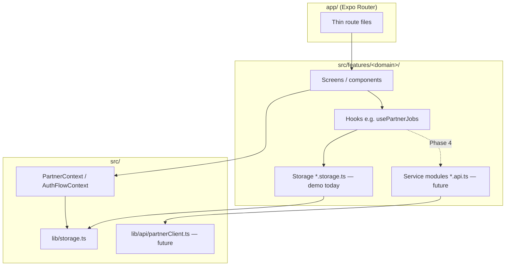

# FSD 00 — Architecture & API Layer

Shared patterns for all Partner features when migrating from AsyncStorage demo to **QuickMaid-API Phase 4**.

## Layer diagram



## Planned API client

**New file (Phase 4):** `src/lib/api/partnerClient.ts`

| Concern | Implementation |
|---------|----------------|
| Base URL | `EXPO_PUBLIC_API_URL` → `https://api.quickmaid.in` (prod) |
| Auth | JWT from `POST /api/v1/auth/otp/verify` stored in secure storage |
| Role header | `X-App-Client: maid` (same phone can be customer + maid) |
| Phone context | `Authorization: Bearer <token>` |
| Errors | Map `4xx/5xx` → `PartnerApiError` with `code`, `message` |
| Retry | Idempotent GET retry ×1; POST job actions no auto-retry |

### Suggested service module layout

```
src/features/<domain>/lib/<domain>.api.ts   # HTTP calls only
src/features/<domain>/lib/<domain>.storage.ts # demo (keep until cutover)
src/features/<domain>/hooks/use<Domain>.ts    # calls .api.ts OR .storage.ts via flag
```

**Feature flag:** `EXPO_PUBLIC_USE_API=true` switches hooks from storage to API.

## Global contexts

### `AuthFlowContext` (`src/context/AuthFlowContext.tsx`)

| Field | Used by | API impact |
|-------|---------|------------|
| `phone` | Login → OTP → Apply | Sent in OTP send/verify body |

### `PartnerContext` (`src/context/PartnerContext.tsx`)

| Method | Demo today | Phase 4 API |
|--------|------------|-------------|
| `refresh()` | `getPartnerProfile()` + `getPartnerState()` | `GET /maids/me` + stats derived |
| `setOnline(v)` | `savePartnerState()` | `PATCH /maids/me/online` |
| `updateProfile(patch)` | `savePartnerProfile()` | `PATCH /maids/me` |

**Call site:** Every screen using `usePartner()` — see per-feature FSD matrices.

### `PartnerAlertContext`

UI-only; no API. Used for error surfacing after failed API calls.

## Auth endpoints (shared)

| Endpoint | Method | Body | Response | Replaces |
|----------|--------|------|----------|----------|
| `/api/v1/auth/otp/send` | POST | `{ phone, app_client: "maid" }` | `{ request_id, expires_in }` | Demo skip on login |
| `/api/v1/auth/otp/verify` | POST | `{ phone, otp, app_client: "maid" }` | `{ token, refresh_token, user, maid_profile? }` | `DEMO_OTP` check in `otp.tsx` |
| `/api/v1/auth/refresh` | POST | `{ refresh_token }` | `{ token }` | — |
| `/api/v1/auth/logout` | POST | — | `204` | `clearSession()` |

## Maid profile endpoints (shared)

| Endpoint | Method | Body | Response | Replaces |
|----------|--------|------|----------|----------|
| `/api/v1/maids/me` | GET | — | `PartnerProfile` | `getPartnerProfile()` |
| `/api/v1/maids/me` | PATCH | partial profile | `PartnerProfile` | `updateProfile()` |
| `/api/v1/maids/me/online` | PATCH | `{ is_online: boolean }` | `{ is_online }` | `setOnline()` |
| `/api/v1/maids/me/delete-request` | POST | `{ confirm_phone, reason? }` | `pending_deletion` + `purge_at` | `deletePartnerAccount()` (soft) |
| `/api/v1/auth/otp/verify` | POST | — | Auto-restore if within grace | `signInExistingPartner()` |
| `/api/v1/maids/register` | POST | apply form payload | `PartnerProfile` | `completePartnerRegistration()` |

## Cross-feature API index

| Domain | GET | POST | PATCH | DELETE |
|--------|-----|------|-------|--------|
| Jobs | `/maids/me/jobs`, `/jobs/:id` | accept, decline, start, complete | — | — |
| KYC | `/maids/me/kyc/status` | `/maids/me/kyc`, verify sub-routes | draft autosave | — |
| Earnings | `/maids/me/earnings` | — | — | — |
| Payouts | `/maids/me/payouts`, `/maids/me/payouts/:id` | — | — | — |
| Notifications | `/maids/me/notifications` | mark-read batch | — | — |
| Support | `/maids/me/tickets` | `/maids/me/tickets`, `.../messages` | — | — |
| Referral | `/maids/me/referrals` | — | — | — |
| Addresses | `/maids/me/addresses` | create | update default | delete |
| Photo | — | `POST /maids/me/photo` multipart | — | — |
| Slots | — | — | `PATCH /maids/me/slots` | — |

Detail per feature in `01`–`17` FSDs.

## Error handling contract

| HTTP | UI behaviour | Example caller |
|------|--------------|----------------|
| 400 | Inline field error | Apply form, KYC verify |
| 401 | Force re-login | Any authenticated call |
| 403 | Alert: KYC required | Accept job when unverified |
| 404 | Empty state | Job not found |
| 409 | Alert: job already taken | Accept race |
| 422 | OTP wrong | Visit complete |
| 429 | Resend cooldown | Auth OTP resend |
| 5xx | `PartnerAlert` retry CTA | All |

## Realtime (future, not in demo)

| Channel | Event | Subscriber |
|---------|-------|------------|
| WebSocket `/maids/me/events` | `job.offer` | `usePartnerJobs` refresh |
| | `job.cancelled` | Job detail + notifications |
| | `payout.sent` | Earnings + notifications |

Push notifications intentionally removed; inbox polls `GET /notifications` on focus.

## Migration order (recommended)

1. Auth OTP + JWT + `GET/PATCH /maids/me`  
2. Online toggle + jobs list + accept/decline  
3. Visit start/complete + earnings ledger  
4. KYC submit + status polling  
5. Notifications + support tickets  
6. Referral, delete account, photo upload  

## File index (data layer today)

| Path | Role |
|------|------|
| `src/lib/storage.ts` | Session, profile, state, register, delete |
| `src/features/jobs/lib/jobs.storage.ts` | Job CRUD |
| `src/features/jobs/lib/job.completion.ts` | OTP complete |
| `src/features/kyc/lib/kyc.storage.ts` | KYC draft |
| `src/features/kyc/lib/kyc.{pan,bank,aadhaar}.ts` | Mock verify |
| `src/features/notifications/lib/notifications.storage.ts` | Inbox |
| `src/features/support/lib/support.storage.ts` | Tickets |
