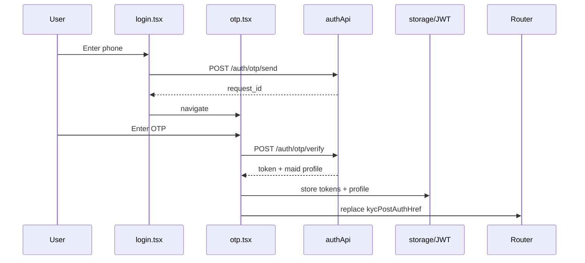

# FSD 01 — Auth & Onboarding

**Status:** `UI-DEMO`  
**Domain:** `src/features/auth/` + `app/(auth)/`, `app/index.tsx`

## Overview

Partner sign-in flow: branded splash → 3-slide onboarding → phone login → OTP → new user apply form OR returning user session restore → KYC gate or tabs.

### User stories

| ID | Story |
|----|-------|
| AUTH-1 | First launch sees onboarding once, then login |
| AUTH-2 | Partner enters 10-digit phone and receives OTP |
| AUTH-3 | Returning partner (`9876543210`) lands on tabs or KYC if pending |
| AUTH-4 | New partner completes apply form and registers profile |
| AUTH-5 | Session persists across app restarts until logout/delete |

## Route & component map

| Route | Route file | Screen / component | Key imports |
|-------|------------|-------------------|-------------|
| `/` | `app/index.tsx` | `PartnerSplashScreen` | `getInitialRoute()` |
| `/(auth)/onboarding` | `app/(auth)/onboarding.tsx` | `PartnerOnboardingScreen` | `setOnboardingDone()` |
| `/(auth)/login` | `app/(auth)/login.tsx` | `PartnerAuthLayout` + phone form | `useAuthFlow().setPhone` |
| `/(auth)/otp` | `app/(auth)/otp.tsx` | OTP verify | `isReturningPartner`, `signInExistingPartner` |
| `/(auth)/apply` | `app/(auth)/apply.tsx` | Multi-step apply form | `seedProfileFromApply`, `completePartnerRegistration` |

### Component tree

```
PartnerSplashScreen
  └── getInitialRoute() → replace href

PartnerOnboardingScreen
  ├── Carousel slides (AUTH_PREMIUM)
  └── CTA → setOnboardingDone() → /login

LoginScreen (login.tsx)
  ├── PartnerAuthLayout
  ├── PhoneInput
  └── Continue → setPhone → /otp

OtpScreen (otp.tsx)
  ├── OtpInput
  ├── verify() → storage routing
  └── resend() (demo timer only)

ApplyScreen (apply.tsx)
  ├── PartnerAuthLayout (long form)
  ├── Zone/skills/slots pickers
  └── submit → completePartnerRegistration → /kyc or /(tabs)
```

## Data model

| Entity | Type | Storage key |
|--------|------|-------------|
| Onboarding flag | `boolean` | `@qmp/onboarding_done` |
| Auth session | `boolean` | `@qmp/auth_complete` |
| Registered map | `Record<phone, PartnerProfile>` | `@qmp/registered_partners` |
| Active profile | `PartnerProfile` | `@qmp/partner_profile` |

See [`PARTNER_DATA.md`](../PARTNER_DATA.md) § Identity.

## Current demo behaviour

| Function | File | What it does |
|----------|------|--------------|
| `getInitialRoute()` | `storage.ts` | onboarding → login → tabs |
| `setOnboardingDone()` | `storage.ts` | Sets flag after carousel |
| `isReturningPartner(phone)` | `storage.ts` | Checks registered map |
| `signInExistingPartner(phone)` | `storage.ts` | Loads profile + `setAuthComplete` |
| `seedProfileFromApply(input)` | `storage.ts` | Builds `PartnerProfile` from form |
| `completePartnerRegistration(profile)` | `storage.ts` | Saves profile + auth + register map |
| OTP check | `otp.tsx` | Hardcoded `DEMO_OTP` (`123456`) |

**Login does not call any API** — only stores phone in context and navigates.

## Phase 4 API

### 1. Send OTP

```
POST /api/v1/auth/otp/send
```

**Request:**
```json
{
  "phone": "9876543210",
  "app_client": "maid",
  "country_code": "+91"
}
```

**Response `200`:**
```json
{
  "request_id": "otp_req_abc",
  "expires_in": 600,
  "resend_after": 30
}
```

### 2. Verify OTP

```
POST /api/v1/auth/otp/verify
```

**Request:**
```json
{
  "phone": "9876543210",
  "otp": "123456",
  "app_client": "maid"
}
```

**Response `200` (returning maid):**
```json
{
  "token": "eyJ...",
  "refresh_token": "rt_...",
  "is_new_user": false,
  "maid": { "kyc_status": "verified", "...": "PartnerProfile fields" }
}
```

**Response `200` (new phone):**
```json
{
  "token": "eyJ...",
  "refresh_token": "rt_...",
  "is_new_user": true,
  "maid": null
}
```

### 3. Register (apply)

```
POST /api/v1/maids/register
Authorization: Bearer <token>
```

**Request:** Full apply payload (mirrors `seedProfileFromApply` input).

**Response `201`:** `PartnerProfile` with `public_id`, `kyc_status: "pending"`.

## API call site matrix

| UI location | Event | Hook / function (today) | Phase 4 service | Endpoint |
|-------------|-------|-------------------------|-----------------|----------|
| `app/index.tsx` | Splash mount | `getInitialRoute()` | `authApi.getSession()` | `GET /maids/me` (if token) |
| `PartnerOnboardingScreen` | Get started | `setOnboardingDone()` | `authApi.setOnboardingSeen()` | `PATCH /maids/me/preferences` (optional) |
| `login.tsx` → Continue | Tap | `setPhone` only | `authApi.sendOtp(phone)` | `POST /auth/otp/send` |
| `otp.tsx` → Verify (returning) | Tap | `signInExistingPartner` → `/(tabs)/requests` | `POST /auth/otp/verify` |
| `otp.tsx` → Verify (new) | Tap | → `/(auth)/refer-welcome` | Refer program + optional code |
| `otp.tsx` → Resend | Tap | Timer reset (demo) | `authApi.sendOtp(phone)` | `POST /auth/otp/send` |
| `apply.tsx` → Submit | Tap | `completePartnerRegistration` | `maidApi.register(payload)` | `POST /maids/register` |
| `apply.tsx` → Submit | After success | `usePartner().refresh()` | `maidApi.getMe()` | `GET /maids/me` |
| Post-verify routing | — | `kycPostAuthHref(kycStatus)` | Same (client routing) | — |

## Sequence — returning partner login



## Errors & edge cases

| Case | Demo | API |
|------|------|-----|
| Invalid phone | Inline error login | 400 `invalid_phone` |
| Wrong OTP | Inline error otp | 422 `otp_invalid` |
| Expired OTP | — | 422 `otp_expired` |
| Resend too soon | Button disabled 30s | 429 + `retry_after` |
| Apply validation | Inline DOB/skills | 400 field errors |
| Network offline | — | Alert + retry |

## Migration checklist

- [ ] Add `src/lib/api/auth.api.ts` with send/verify/refresh  
- [ ] Store JWT in `expo-secure-store`  
- [ ] Replace `DEMO_OTP` check in `otp.tsx` with `authApi.verifyOtp`  
- [ ] `login.tsx` Continue → call send OTP before navigate  
- [ ] `apply.tsx` → `POST /maids/register` instead of `completePartnerRegistration`  
- [ ] `getInitialRoute()` → check secure token + `GET /maids/me`  
- [ ] Keep `AuthFlowContext.phone` for pre-auth flows only  
