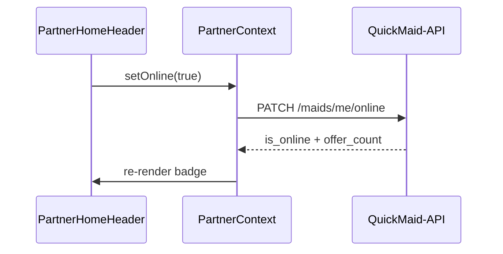

# FSD 02 — Home Dashboard

**Status:** `UI-DEMO`  
**Domain:** `src/features/home/`  
**Route:** `app/(tabs)/index.tsx` → `PartnerHomeScreen`

## Overview

Primary landing after auth: online toggle, today's earnings hero, active visit banner, pending requests preview, schedule snippet, notification badge, work-address sheet.

### User stories

| ID | Story |
|----|-------|
| HOME-1 | Partner toggles online/offline for dispatch |
| HOME-2 | Sees count of pending requests when online |
| HOME-3 | Jumps to active in-progress visit |
| HOME-4 | Previews top pending jobs → requests tab |
| HOME-5 | Changes default work address from header |

## Route & component map

| Component | File | Responsibility |
|-----------|------|----------------|
| `PartnerHomeScreen` | `home/components/PartnerHomeScreen.tsx` | Orchestrates all sections |
| `PartnerHomeHeader` | `PartnerHomeHeader.tsx` | Greeting, online switch |
| `PartnerEarningsHero` | `PartnerEarningsHero.tsx` | Today/week stats from `state` |
| `PartnerActiveJobBanner` | `PartnerActiveJobBanner.tsx` | In-progress job CTA |
| `PartnerRequestsPreview` | `PartnerRequestsPreview.tsx` | Top 3 pending cards |
| `PartnerScheduleVisitCard` | `schedule/...` | Next accepted visit |
| `PartnerWorkAddressSheet` | `profile/...` | Address picker modal |
| `PartnerHomeWidgets` | `PartnerHomeWidgets.tsx` | Quick links (KYC, earnings) |

## Data sources (today)

| Data | Source | Refresh trigger |
|------|--------|-----------------|
| `profile`, `state` | `usePartner()` → `storage.ts` | Mount + `refresh()` |
| `pending`, `active` jobs | `usePartnerJobs()` → `jobs.storage.ts` | Tab focus |
| `unreadCount` | `useNotifications()` | Tab focus |
| Work address | `usePartnerWorkAddress()` | Profile patch |

## Phase 4 API

| Endpoint | Method | Purpose |
|----------|--------|---------|
| `/api/v1/maids/me` | GET | Profile + embedded stats |
| `/api/v1/maids/me/online` | PATCH | Online toggle |
| `/api/v1/maids/me/jobs` | GET | `?status=pending,accepted,in_progress` |
| `/api/v1/maids/me/notifications` | GET | `?unread_only=true&limit=1` for badge |

### PATCH online

```json
{ "is_online": true }
```

**Response:**
```json
{
  "is_online": true,
  "pending_offers_count": 12
}
```

### GET jobs (home subset)

Query: `status=pending&limit=3&sort=offer_expires_at`

## API call site matrix

| Component | User action | Today | Phase 4 |
|-----------|-------------|-------|---------|
| `PartnerHomeHeader` | Toggle online | `usePartner().setOnline()` → `savePartnerState` | `PATCH /maids/me/online` via `PartnerContext.setOnline` |
| `PartnerHomeScreen` | Mount / focus | `usePartner().refresh()` | `GET /maids/me` |
| `PartnerHomeScreen` | Mount / focus | `usePartnerJobs().refresh()` | `GET /maids/me/jobs` |
| `PartnerHomeScreen` | Mount / focus | `useNotifications().refresh()` | `GET /maids/me/notifications` |
| `PartnerEarningsHero` | Render | `state.todayEarningsPaise`, `state.weekJobs` | From `GET /maids/me` stats block |
| `PartnerActiveJobBanner` | Tap | `router.push(/job/:id)` | Same (local nav) |
| `PartnerRequestsPreview` | Tap card | `router.push(/job/:id)` | Same |
| `PartnerWorkAddressSheet` | Save address | `usePartnerWorkAddress().saveAddress` → `updateProfile` | `PATCH /maids/me/addresses/:id` or `POST` |

## Sequence — go online



## Errors

| Case | UI |
|------|-----|
| Toggle fails (offline) | Revert switch + alert |
| KYC not verified + go online | Allow online but block accept (jobs FSD) |
| No work address | Prompt address sheet |

## Migration checklist

- [ ] Extend `GET /maids/me` response with `today_earnings_paise`, `week_jobs_count`  
- [ ] Wire `setOnline` to API in `PartnerContext`  
- [ ] Home jobs preview uses paginated jobs API  
- [ ] Optional: WebSocket `job.offer` invalidates `usePartnerJobs`  
