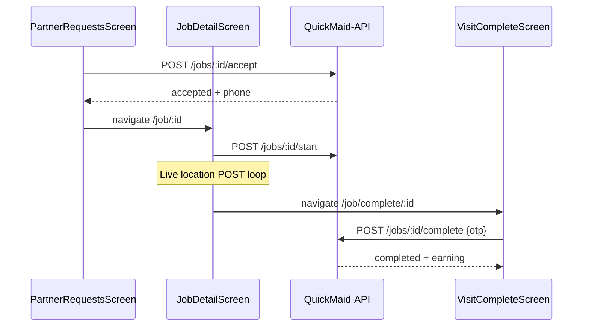

# FSD 03 — Jobs (Requests, Detail, Visit, History)

**Status:** `UI-DEMO`  
**Domain:** `src/features/jobs/`  
**Routes:** `(tabs)/requests`, `requests/index`, `job/[id]`, `job/complete/[id]`, `job/history`

## Overview

Core partner workflow: browse pending offers, accept/decline, navigate to customer, start visit, share live location UI, complete with customer OTP, view history.

### Job lifecycle

```
pending → accepted → in_progress → completed
pending → declined
```

## Route & component map

| Route | Screen | Key components |
|-------|--------|----------------|
| `(tabs)/requests` | `PartnerRequestsScreen` | Filters, `PartnerRequestCard`, decline/accept modals |
| `job/[id]` | `JobDetailScreen` | Actions by status, navigate sheet, live location |
| `job/complete/[id]` | `PartnerVisitCompleteScreen` | OTP entry |
| `job/history` | `PartnerJobHistoryScreen` | Paginated completed/declined |

### Modals (embedded)

| Modal | Triggered from | Storage/API action |
|-------|----------------|-------------------|
| `PartnerJobDeclineModal` | Decline CTA | `declineJob(id)` + reason patch |
| `PartnerJobAcceptedModal` | Accept success | — |
| `PartnerVisitStartModal` | Start visit | `startVisit(id)` |
| `PartnerJobNavigateSheet` | Directions | Opens Maps/Waze (no API) |
| `PartnerVisitFinishModal` | Finish (on detail) | `completeVisit(id, otp)` |

## Data model — `PartnerJob`

See [`PARTNER_DATA.md`](../PARTNER_DATA.md) § Jobs.

Key fields for API: `id`, `booking_ref`, `status`, `amount_paise`, `completion_otp` (server-only until in_progress), `decline_reason`.

## Current demo implementation

| Function | File | Behaviour |
|----------|------|-----------|
| `getPartnerJobs()` | `jobs.storage.ts` | Merge `DEMO_JOBS` + AsyncStorage overrides |
| `getPartnerJobById(id)` | `jobs.storage.ts` | List lookup |
| `updatePartnerJobStatus(id, status, patch?)` | `jobs.storage.ts` | Local status transition |
| `usePartnerJobs()` | `hooks/usePartnerJobs.ts` | Hook: refresh, accept, decline, start, complete |
| `completePartnerVisitWithOtp(id, otp)` | `job.completion.ts` | Validates OTP → `completed` |

### Hook exports

```ts
acceptJob(id)   → updatePartnerJobStatus(id, 'accepted')
declineJob(id)  → updatePartnerJobStatus(id, 'declined')
startVisit(id)  → updatePartnerJobStatus(id, 'in_progress')
completeVisit(id, otp) → completePartnerVisitWithOtp
```

## Phase 4 API

| Endpoint | Method | Body | Response |
|----------|--------|------|----------|
| `/api/v1/maids/me/jobs` | GET | `?status=&zone=&service=` | `{ jobs: PartnerJob[] }` |
| `/api/v1/jobs/:id` | GET | — | `PartnerJob` (detail, may unmask phone) |
| `/api/v1/jobs/:id/accept` | POST | — | `PartnerJob` status `accepted` |
| `/api/v1/jobs/:id/decline` | POST | `{ reason_code, reason_text? }` | `PartnerJob` status `declined` |
| `/api/v1/jobs/:id/start` | POST | `{ lat?, lng? }` | `PartnerJob` status `in_progress` |
| `/api/v1/jobs/:id/complete` | POST | `{ otp: "482916" }` | `PartnerJob` + `earning` row |
| `/api/v1/jobs/:id/location` | POST | `{ lat, lng, accuracy }` | `204` (live share) |

### Decline reason codes

Map from `decline.premium.ts` `DeclineReasonId`:

| Code | Label |
|------|-------|
| `too_far` | Too far |
| `slot_conflict` | Slot conflict |
| `low_pay` | Pay too low |
| `personal` | Personal reason |
| `other` | Other |

### Accept response notes

- `403` if `kyc_status !== verified`  
- `409` if offer expired or taken  
- Returns `customer_phone` only after accept  

## API call site matrix

| Component | Action | Today | Phase 4 endpoint |
|-----------|--------|-------|------------------|
| `PartnerRequestsScreen` | Focus | `usePartnerJobs().refresh()` | `GET /maids/me/jobs` |
| `PartnerRequestsScreen` | Accept (card/modal) | `acceptJob(id)` | `POST /jobs/:id/accept` |
| `PartnerJobDeclineModal` | Confirm decline | `declineJob(id)` + `updatePartnerJobStatus` patch reason | `POST /jobs/:id/decline` |
| `JobDetailScreen` | Load | `getPartnerJobById(id)` | `GET /jobs/:id` |
| `JobDetailScreen` | Accept | `acceptJob(id)` | `POST /jobs/:id/accept` |
| `JobDetailScreen` | Start visit | `updatePartnerJobStatus` / hook `startVisit` | `POST /jobs/:id/start` |
| `PartnerVisitStartModal` | Confirm | `startVisit(id)` | `POST /jobs/:id/start` |
| `PartnerVisitFinishModal` | Submit OTP | `completePartnerVisitWithOtp` | `POST /jobs/:id/complete` |
| `PartnerVisitCompleteScreen` | Submit OTP | `completePartnerVisitWithOtp` | `POST /jobs/:id/complete` |
| `PartnerLiveLocationCard` | Periodic (UI demo) | Static coords | `POST /jobs/:id/location` every 30s |
| `PartnerJobHistoryScreen` | Focus | `usePartnerJobs()` filtered | `GET /maids/me/jobs?status=completed,declined` |
| `PartnerHomeScreen` | Preview | `usePartnerJobs().pending` | `GET /maids/me/jobs?status=pending&limit=3` |
| `support/job.lookup` | Ticket context | `getPartnerJobById` | `GET /jobs/:id` |

## Sequence — accept → complete



## Errors

| Error | Where shown |
|-------|-------------|
| Wrong visit OTP | `PartnerVisitCompleteScreen`, `PartnerVisitFinishModal` |
| Start before accept | `job.completion.ts` message |
| Offline decline | Alert on requests screen |
| Offer expired | Accept modal error |

## Migration checklist

- [ ] Create `jobs.api.ts` with all job endpoints  
- [ ] `usePartnerJobs` switches to API via feature flag  
- [ ] Remove `DEMO_JOBS` merge logic from storage (keep as dev seed script)  
- [ ] Decline modal sends `reason_code` to API  
- [ ] Wire `PartnerLiveLocationCard` to `expo-location` + location POST  
- [ ] On complete success, invalidate earnings + notifications caches  
