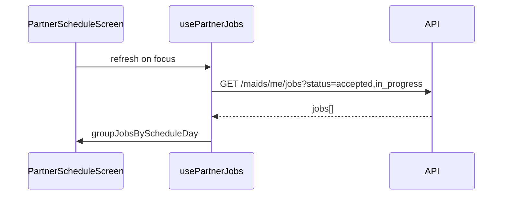

# FSD 04 — Schedule

**Status:** `UI-DEMO`  
**Domain:** `src/features/schedule/`  
**Route:** `app/(tabs)/schedule.tsx` → `PartnerScheduleScreen`

## Overview

Week-view calendar of accepted and in-progress visits grouped by day. Filters by status; Maps CTA on each card.

## Route & component map

| Component | File | Role |
|-----------|------|------|
| `PartnerScheduleScreen` | `schedule/components/PartnerScheduleScreen.tsx` | Main screen |
| `PartnerScheduleVisitCard` | `PartnerScheduleVisitCard.tsx` | Single visit row + Maps |
| `PartnerScheduleSections` | `PartnerScheduleSections.tsx` | Day headers, empty states |
| `schedule.utils.ts` | `schedule/lib/` | Group by day, filters, counts |

## Data (today)

| Source | Usage |
|--------|-------|
| `usePartnerJobs().jobs` | Filter `accepted` + `in_progress` |
| `schedule.utils.ts` | `groupJobsByScheduleDay`, `scheduleInProgressCount` |
| `usePartnerWorkAddress()` | Distance context on cards |

**No dedicated storage** — derived from jobs list.

## Phase 4 API

```
GET /api/v1/maids/me/jobs?status=accepted,in_progress&from=2026-06-02&to=2026-06-08
```

**Response:**
```json
{
  "jobs": [ /* PartnerJob[] */ ],
  "grouped_by_date": {
    "2026-06-06": ["j12", "j4"]
  }
}
```

Optional dedicated endpoint:

```
GET /api/v1/maids/me/schedule?week_start=2026-06-02
```

## API call site matrix

| Component | Event | Today | Phase 4 |
|-----------|-------|-------|---------|
| `PartnerScheduleScreen` | Tab focus | `usePartnerJobs().refresh()` | `GET /maids/me/schedule` or filtered jobs |
| `PartnerScheduleScreen` | Filter chip | Client filter on `jobs` | Query param `status` |
| `PartnerScheduleVisitCard` | Maps tap | `Linking.openURL(jobMapsQuery)` | Same (external) |
| `PartnerScheduleVisitCard` | Card tap | `router.push(/job/:id)` | Same |
| `PartnerHomeScreen` | In-progress count | `scheduleInProgressCount(active)` | From jobs API subset |

## Sequence



## Migration checklist

- [ ] Add date-range query to jobs API client  
- [ ] Consider server-side grouping for timezone correctness (IST)  
- [ ] Cache week window in hook to avoid refetch on every chip toggle  
