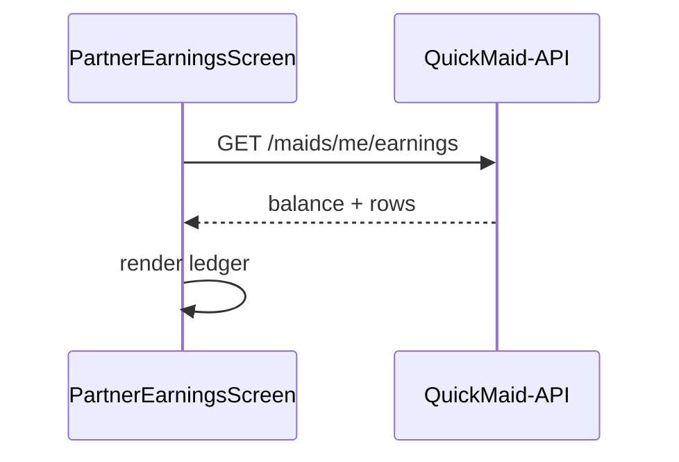

# FSD 05 — Earnings

**Status:** `UI-DEMO`  
**Domain:** `src/features/earnings/`  
**Route:** `app/(tabs)/earnings.tsx` → `PartnerEarningsScreen`

## Overview

Partner financial dashboard: available balance, pending payout, weekly net, activity ledger (credits + payouts), optional job earning focus via query param `?jobId=`.

## Route & component map

| Component | File | Role |
|-----------|------|------|
| `PartnerEarningsScreen` | `earnings/components/PartnerEarningsScreen.tsx` | Main tab |
| `PartnerEarningsSections` | `PartnerEarningsSections.tsx` | Balance cards |
| `PartnerEarningsActivityCard` | `PartnerEarningsActivityCard.tsx` | Ledger row |
| `PartnerJobEarningFocusCard` | `PartnerJobEarningFocusCard.tsx` | Single job breakdown |
| `earnings.utils.ts` | `earnings/lib/` | Filters, totals, fee math |

## Data model — `EarningRow`

| Field | API field |
|-------|-----------|
| `id` | `ledger_id` |
| `title` | `title` |
| `subtitle` | `reference` |
| `amountPaise` | `amount_paise` |
| `kind` | `credit` \| `payout` |
| `date` | `posted_at` (display formatted) |

**Demo source:** `DEMO_EARNINGS` constant in `constants/demo.ts` + job breakdown from `jobEarningsBreakdown()`.

Platform fee: 10% — `netEarningPaise(gross)` in `home.greeting.ts`.

## Current implementation

| Function | Usage |
|----------|-------|
| `filterEarnings(rows, filter)` | Tab filters: all/credits/payouts/this_week |
| `earningsWeekNet(rows)` | Hero stat |
| `earningsCreditTotal` / `earningsPayoutTotal` | Summary chips |
| `getPartnerJobById(jobId)` | Focus card when `?jobId=` |
| `jobEarningsBreakdown(job)` | Gross/fee/net display |

## Phase 4 API

### Ledger list

```
GET /api/v1/maids/me/earnings?filter=all&from=&to=
```

**Response:**
```json
{
  "balance_paise": 124500,
  "pending_payout_paise": 45000,
  "week_net_paise": 32000,
  "rows": [
    {
      "id": "e1",
      "kind": "credit",
      "title": "Deep clean · 2h",
      "subtitle": "QM-74990101",
      "amount_paise": 135000,
      "job_id": "j2",
      "posted_at": "2026-06-06T10:00:00+05:30"
    }
  ]
}
```

### Job earning detail

```
GET /api/v1/maids/me/earnings/by-job/:jobId
```

**Response:**
```json
{
  "job_id": "j2",
  "gross_paise": 150000,
  "platform_fee_paise": 15000,
  "net_paise": 135000,
  "status": "credited"
}
```

## API call site matrix

| Component | Event | Today | Phase 4 |
|-----------|-------|-------|---------|
| `PartnerEarningsScreen` | Tab focus | Static `DEMO_EARNINGS` + `usePartnerJobs().refresh` | `GET /maids/me/earnings` |
| `PartnerEarningsScreen` | Filter change | `filterEarnings(DEMO_EARNINGS, filter)` | Query `?filter=` |
| `PartnerEarningsActivityCard` | Tap payout row | `router.push(/payout/:id)` | Same (id from API) |
| `PartnerEarningsActivityCard` | Tap credit row | `router.push(/job/:id)` if `job_id` | Same |
| `PartnerJobEarningFocusCard` | `?jobId=` mount | `getPartnerJobById` + `jobEarningsBreakdown` | `GET /earnings/by-job/:id` |
| `PartnerEarningsSections` | Render balance | Derived from demo rows | API `balance_paise`, `pending_payout_paise` |
| `PartnerHomeScreen` | Today earnings | `state.todayEarningsPaise` | From `GET /maids/me` or earnings summary |

## Sequence — open earnings tab



## Errors

| Case | UI |
|------|-----|
| Empty ledger | Empty state in sections |
| Focus job not found | Hide focus card |

## Migration checklist

- [ ] Replace `DEMO_EARNINGS` import with `earnings.api.ts`  
- [ ] Sync `PartnerContext.state.todayEarningsPaise` from API summary  
- [ ] On job complete, append ledger row via invalidation  
- [ ] Payout rows link using server `payout_id` not demo slug  
