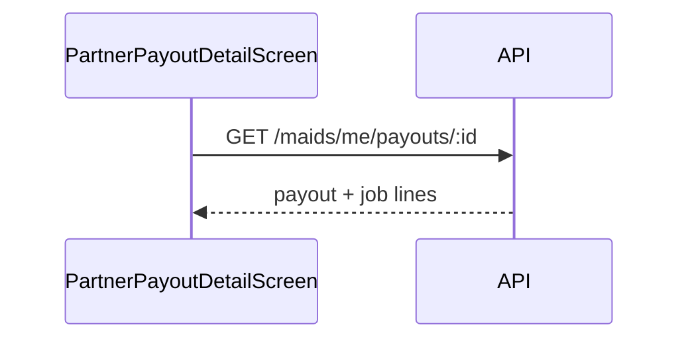

# FSD 06 — Payout Detail

**Status:** `UI-DEMO`  
**Domain:** `src/features/payout/`  
**Route:** `app/payout/[id].tsx` → `PartnerPayoutDetailScreen`

## Overview

Drill-down for a weekly UPI payout row from earnings ledger: amount, UPI mask, included jobs, status timeline, support CTA.

## Route & component map

| Component | File | Role |
|-----------|------|------|
| `PartnerPayoutDetailScreen` | `payout/components/PartnerPayoutDetailScreen.tsx` | Full screen |
| `payout.utils.ts` | `buildPayoutDetail(id, jobs)` | Demo builder from earnings id |
| `payout.premium.ts` | Constants for timeline copy |

## Data (today)

`buildPayoutDetail(payoutId, completedJobs)` synthesizes:

- Gross/net totals from linked demo jobs  
- UPI from `profile.upiId`  
- Status steps: initiated → processing → credited  

No AsyncStorage — pure derivation from `DEMO_EARNINGS` id + jobs.

## Phase 4 API

```
GET /api/v1/maids/me/payouts/:id
```

**Response:**
```json
{
  "id": "payout_w24",
  "status": "credited",
  "amount_paise": -45000,
  "upi_mask": "demo****@okaxis",
  "initiated_at": "2026-06-03T18:00:00+05:30",
  "credited_at": "2026-06-04T09:12:00+05:30",
  "jobs": [
    { "job_id": "j2", "booking_ref": "QM-74990102", "net_paise": 13500 }
  ],
  "failure_reason": null
}
```

List endpoint (optional):

```
GET /api/v1/maids/me/payouts?limit=20
```

## API call site matrix

| Component | Event | Today | Phase 4 |
|-----------|-------|-------|---------|
| `PartnerPayoutDetailScreen` | Mount `[id]` | `buildPayoutDetail(id, jobs)` | `GET /maids/me/payouts/:id` |
| `PartnerPayoutDetailScreen` | Mount | `usePartnerJobs()` for job names | Included in payout response |
| `PartnerPayoutDetailScreen` | Support CTA | `useOpenSupportChat({ topic: 'payouts' })` | Same + pass `payout_id` |
| `PartnerEarningsActivityCard` | Tap | `router.push(/payout/${row.id})` | Same |

## Sequence



## Migration checklist

- [ ] Add `payout.api.ts`  
- [ ] Map negative `amount_paise` in ledger to payout ids from API  
- [ ] Handle `failed` status with retry messaging  
