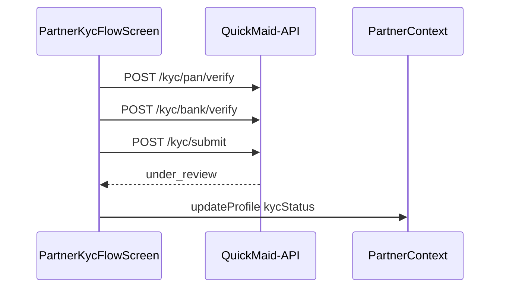

# FSD 07 — KYC Wizard

**Status:** `UI-DEMO` + `MOCK-API`  
**Domain:** `src/features/kyc/`  
**Route:** `app/kyc/index.tsx` → `PartnerKycFlowScreen`

## Overview

Six-step maid verification before payouts: Aadhaar OTP → selfie → PAN → bank OR UPI → review & submit. Gates tab access via `kycPostAuthHref()`.

## Steps

| Step | Component | Verification |
|------|-----------|--------------|
| 1 Intro | `PartnerKycSections` intro | — |
| 2 Aadhaar | `PartnerKycAadhaarDigiLocker` | `kyc.aadhaar.ts` demo OTP |
| 3 Selfie | `PartnerKycUploadSlot` | `expo-image-picker` |
| 4 PAN | `PartnerKycPanDigiLocker` | `kyc.pan.ts` mock API |
| 5 Payout | `PartnerKycPayoutVerify` | `kyc.bank.ts` mock |
| 6 Review | Review section | `submitKycDraft()` |

Routing logic: `kyc.routing.ts` — `kycPostAuthHref`, `kycChecklist`, step guards.

## Route & component map

| File | Role |
|------|------|
| `PartnerKycFlowScreen.tsx` | Wizard shell, step state |
| `PartnerKycStepBar.tsx` | Progress |
| `kyc.storage.ts` | Draft CRUD `@qmp/partner_kyc_draft` |
| `kyc.utils.ts` | Checklist completion |
| `kyc.validation.ts` | PAN/IFSC/UPI validators |
| `kyc.photo.ts` | Camera/gallery picker |
| `PartnerKycSubmittedModal` | Success after submit |

## Data model — `KycDraft`

See [`PARTNER_DATA.md`](../PARTNER_DATA.md) § KYC draft.

On submit: `profile.kycStatus` → `under_review` via `updateProfile` + clear draft.

## Current demo implementation

| Function | File | Behaviour |
|----------|------|-----------|
| `loadKycDraft()` | `kyc.storage.ts` | Read/migrate draft |
| `saveKycDraft(patch)` | `kyc.storage.ts` | Autosave each step |
| `submitKycDraft(draft)` | `kyc.storage.ts` | Mark submitted |
| `verifyAadhaarOtp(...)` | `kyc.aadhaar.ts` | Demo OTP `123456` |
| `verifyDigiLockerPan(...)` | `kyc.pan.ts` | Name match vs profile |
| `verifyBankAccountInternal(...)` | `kyc.bank.ts` | IFSC + demo account |
| `verifyUpiInternal(...)` | `kyc.bank.ts` | UPI + name match |
| `resetPartnerKycToPending()` | `storage.ts` | Dev reset from profile |

## Phase 4 API

### Status

```
GET /api/v1/maids/me/kyc/status
```

```json
{
  "status": "pending|under_review|verified|rejected",
  "rejection_reason": null,
  "steps": { "aadhaar": true, "selfie": true, "pan": false }
}
```

### Draft autosave

```
PATCH /api/v1/maids/me/kyc/draft
```

Body: partial `KycDraft` (no raw Aadhaar stored client-side in prod — use tokenized refs).

### Step verifications

| Step | Endpoint | Method |
|------|----------|--------|
| Aadhaar send OTP | `/api/v1/maids/me/kyc/aadhaar/otp` | POST |
| Aadhaar verify | `/api/v1/maids/me/kyc/aadhaar/verify` | POST |
| Selfie upload | `/api/v1/maids/me/kyc/selfie` | POST multipart |
| PAN verify | `/api/v1/maids/me/kyc/pan/verify` | POST |
| Bank verify | `/api/v1/maids/me/kyc/bank/verify` | POST |
| UPI verify | `/api/v1/maids/me/kyc/upi/verify` | POST |

### Final submit

```
POST /api/v1/maids/me/kyc/submit
```

**Response:** `{ status: "under_review" }`

Admin review via QuickMaid Admin `/admin/maids` — webhook updates app via polling or WS.

## API call site matrix

| Component | Action | Today | Phase 4 |
|-----------|--------|-------|---------|
| `PartnerKycAadhaarDigiLocker` | Send OTP | Local timer | `POST /kyc/aadhaar/otp` |
| `PartnerKycAadhaarDigiLocker` | Verify | `verifyAadhaarOtp` | `POST /kyc/aadhaar/verify` |
| `PartnerKycUploadSlot` | Capture selfie | `pickKycDocumentFromSource` → `saveKycDraft` | `POST /kyc/selfie` + draft PATCH |
| `PartnerKycPanDigiLocker` | Verify PAN | `verifyDigiLockerPan` | `POST /kyc/pan/verify` |
| `PartnerKycPayoutVerify` | Verify bank | `verifyBankAccountInternal` | `POST /kyc/bank/verify` |
| `PartnerKycPayoutVerify` | Verify UPI | `verifyUpiInternal` | `POST /kyc/upi/verify` |
| `PartnerKycFlowScreen` | Each step change | `saveKycDraft` | `PATCH /kyc/draft` |
| `PartnerKycFlowScreen` | Submit | `submitKycDraft` + `updateProfile({ kycStatus: 'under_review' })` | `POST /kyc/submit` |
| `PartnerKycFlowScreen` | Mount | `loadKycDraft` | `GET /kyc/status` + draft |
| `otp.tsx` / apply routing | Post-auth | `kycPostAuthHref` | `GET /kyc/status` |
| `PartnerProfileSections` | KYC row tap | Navigate `/kyc` | Same |
| Profile reset (dev) | Reset KYC | `resetPartnerKycToPending` | Admin-only API |

## Sequence — submit KYC



## Errors

| Case | UI component |
|------|--------------|
| Name mismatch PAN/bank/UPI | Inline on `PartnerKycPayoutVerify` / PAN card |
| Invalid IFSC | Bank card error |
| Consent not checked | Review step blocked |
| Rejected KYC | Profile banner → re-enter wizard |

## Migration checklist

- [ ] Replace mock verify modules with `kyc.api.ts`  
- [ ] Upload selfie as multipart, store CDN URL in draft  
- [ ] Poll `GET /kyc/status` on profile focus when `under_review`  
- [ ] Block `POST /jobs/:id/accept` server-side until `verified`  
