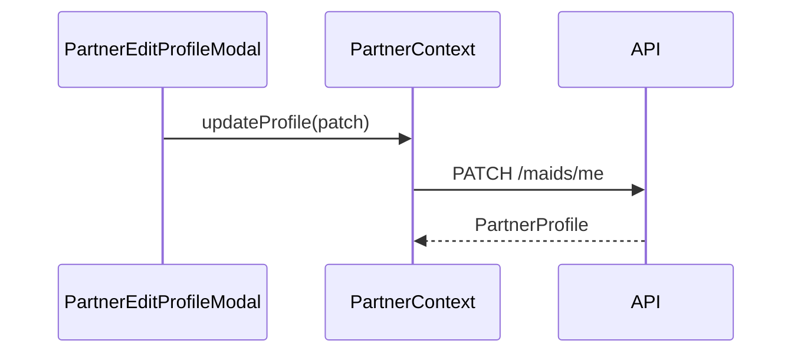

# FSD 08 — Profile

**Status:** `UI-DEMO`  
**Domain:** `src/features/profile/`  
**Routes:** `(tabs)/profile`, `profile/photo`, `profile/rating`

## Overview

Partner identity hub: stats, KYC badge, work address, slots link, edit profile modal, photo upload, rating breakdown, logout.

## Route & component map

| Route | Screen | Components |
|-------|--------|------------|
| `(tabs)/profile` | `PartnerProfileScreen` | `PartnerProfileSections`, `PartnerProfilePremiumSections` |
| `profile/photo` | `PartnerProfilePhotoScreen` | Camera/gallery, guidelines |
| `profile/rating` | `PartnerRatingScreen` | Star breakdown demo |

### Modals / sheets

| UI | File | Action |
|----|------|--------|
| `PartnerEditProfileModal` | profile/components | `updateProfile(patch)` |
| `PartnerWorkAddressSheet` | profile/components | `usePartnerWorkAddress` |
| `PartnerAddressFormModal` | profile/components | Add/edit address |

## Data model

`PartnerProfile` — see [`PARTNER_DATA.md`](../PARTNER_DATA.md).

Rating demo: hardcoded in `rating.premium.ts` (future: server aggregates).

## Current implementation

| Function / hook | File | Behaviour |
|---------------|------|-----------|
| `usePartner()` | `PartnerContext` | Read/update profile |
| `usePartnerWorkAddress()` | `hooks/usePartnerWorkAddress.ts` | Address CRUD via `updateProfile` |
| `address.utils.ts` | normalize, upsert, default select | Pure |
| `profile.utils.ts` | `initials`, `kycMeta`, completion % | Pure |
| `PartnerProfileSections` | Logout | `clearSession()` → `/login` |
| `PartnerProfilePhotoScreen` | Save photo | `updateProfile({ photoUri })` |

## Phase 4 API

| Endpoint | Method | Purpose |
|----------|--------|---------|
| `/api/v1/maids/me` | GET | Full profile |
| `/api/v1/maids/me` | PATCH | Edit profile fields |
| `/api/v1/maids/me/photo` | POST | Multipart image upload |
| `/api/v1/maids/me/addresses` | GET/POST | List/create addresses |
| `/api/v1/maids/me/addresses/:id` | PATCH | Update address |
| `/api/v1/maids/me/addresses/:id/default` | POST | Set default |
| `/api/v1/maids/me/ratings` | GET | Rating breakdown |

### PATCH profile example

```json
{
  "bio": "5 years experience in deep cleaning",
  "languages": ["Hindi", "Chhattisgarhi"],
  "travel_mode": "bus",
  "work_radius_km": 8
}
```

### Photo upload

```
POST /api/v1/maids/me/photo
Content-Type: multipart/form-data
file: <jpeg>
```

**Response:** `{ "photo_url": "https://cdn.../maids/abc.jpg" }`

## API call site matrix

| Component | Action | Today | Phase 4 |
|-----------|--------|-------|---------|
| `PartnerProfileScreen` | Mount | `usePartner()` | `GET /maids/me` via context refresh |
| `PartnerEditProfileModal` | Save | `updateProfile(patch)` | `PATCH /maids/me` |
| `PartnerProfilePhotoScreen` | Pick image | Local `photoUri` | Image picker → temp URI |
| `PartnerProfilePhotoScreen` | Save | `updateProfile({ photoUri })` | `POST /maids/me/photo` then PATCH |
| `PartnerWorkAddressSheet` | Select default | `selectAddress` → `updateProfile` | `POST /addresses/:id/default` |
| `PartnerAddressFormModal` | Save new/edit | `saveAddress` → `updateProfile` | `POST` or `PATCH /addresses/:id` |
| `PartnerRatingScreen` | Render | Static `RATING_BREAKDOWN` | `GET /maids/me/ratings` |
| `PartnerProfileSections` | Logout | `clearSession()` | `POST /auth/logout` + clear token |
| `PartnerProfileSections` | Job count stat | `usePartnerJobs().completed.length` | `GET /maids/me/stats` or jobs count |
| `PartnerHomeScreen` | Work address chip | `usePartnerWorkAddress` | `GET /maids/me/addresses` |

## Sequence — edit profile



## Migration checklist

- [ ] Photo screen uploads before PATCH (CDN URL)  
- [ ] Split addresses to dedicated API (not embedded PATCH)  
- [ ] Rating screen fetches real review aggregates  
- [ ] Logout revokes refresh token server-side  
