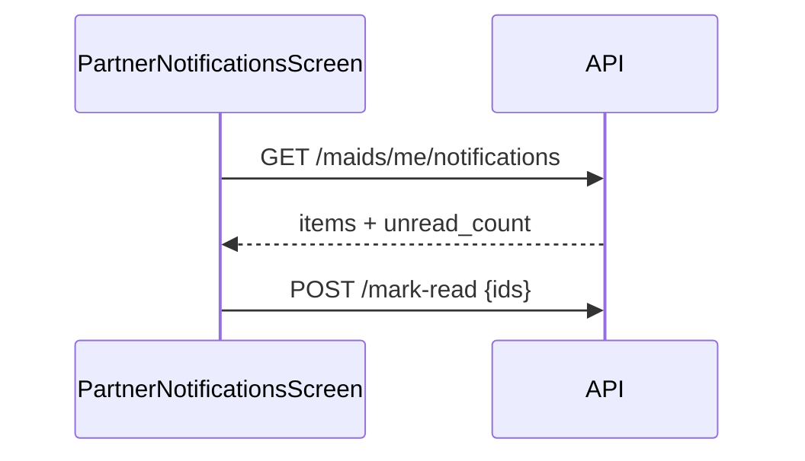

# FSD 11 — Notifications (In-App Inbox)

**Status:** `UI-DEMO`  
**Domain:** `src/features/notifications/`  
**Routes:** `app/notifications/index`, `app/notifications/[id]`

## Overview

In-app notification center for job offers, payout credits, KYC updates, system messages. **No OS push** — poll on screen focus.

## Route & component map

| Component | File | Role |
|-----------|------|------|
| `PartnerNotificationsScreen` | `notifications/components/PartnerNotificationsScreen.tsx` | List + filters |
| `PartnerNotificationDetailScreen` | `notifications/components/PartnerNotificationDetailScreen.tsx` | Detail + deep link |
| `PartnerNotificationCard` | `PartnerNotificationCard.tsx` | Row UI |
| `useNotifications` | `hooks/useNotifications.ts` | List + unread |
| `useOpenNotifications` | `hooks/useOpenNotifications.ts` | Home header bell |
| `notifications.storage.ts` | CRUD + read state | Demo |
| `notifications.utils.ts` | Kind icons, deep link href | Pure |

## Data model — `AppNotification`

| Field | API field |
|-------|-----------|
| `id` | `id` |
| `title`, `body`, `detail` | same |
| `kind` | `job` \| `payout` \| `kyc` \| `system` |
| `jobId` | `job_id` |
| `createdAt` | `created_at` |
| `read` | derived from read_ids |

Demo seeds: `DEMO_NOTIFICATIONS` merged in `getNotifications()`.

Storage keys: `@qmp/partner_notifications_read`, `@qmp/partner_notifications_inbox`.

## Current implementation

| Function | Behaviour |
|----------|-----------|
| `getNotifications()` | Merge demo + custom inbox rows |
| `getUnreadCount()` | Total − read set |
| `markNotificationRead(id)` | Add to read set |
| `markAllNotificationsRead(ids)` | Bulk read |
| `getNotificationById(id)` | Single lookup |

## Phase 4 API

```
GET /api/v1/maids/me/notifications?limit=50&cursor=
```

**Response:**
```json
{
  "items": [
    {
      "id": "n8",
      "kind": "job",
      "title": "New request nearby",
      "body": "Deep clean · Shankar Nagar",
      "detail": "Accept within 15 minutes.",
      "job_id": "j12",
      "read": false,
      "created_at": "2026-06-06T08:00:00+05:30"
    }
  ],
  "unread_count": 4,
  "next_cursor": null
}
```

```
POST /api/v1/maids/me/notifications/mark-read
```

```json
{ "ids": ["n8", "n9"] }
```

Or single: `PATCH /notifications/:id/read`

## API call site matrix

| Component | Action | Today | Phase 4 |
|-----------|--------|-------|---------|
| `PartnerNotificationsScreen` | Focus | `useNotifications().refresh()` | `GET /notifications` |
| `PartnerNotificationsScreen` | Mark all read | `markAllNotificationsRead` | `POST /mark-read` |
| `PartnerNotificationCard` | Tap | Navigate `/notifications/:id` | Same |
| `PartnerNotificationDetailScreen` | Mount | `getNotificationById` + `markNotificationRead` | `GET /notifications/:id` + mark read |
| `PartnerNotificationDetailScreen` | CTA (job) | `router.push(/job/:jobId)` | Same |
| `PartnerHomeScreen` | Bell badge | `useNotifications().unreadCount` | `GET /notifications?unread_only=true` |
| `PartnerHomeHeader` | Bell tap | `useOpenNotifications()` | Same |

## Deep link matrix

| `kind` | CTA destination |
|--------|-----------------|
| `job` | `/job/:jobId` |
| `payout` | `/payout/:id` or `/earnings` |
| `kyc` | `/kyc` |
| `system` | Stay on detail |

## Sequence



## Migration checklist

- [ ] Remove demo merge; server is source of truth  
- [ ] Optional: poll every 60s on home tab when online  
- [ ] Do not re-add expo-notifications (product decision)  
