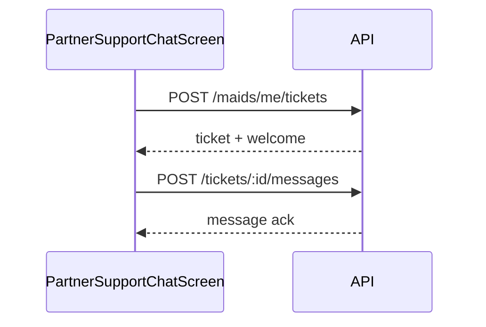

# FSD 12 — Support Chat

**Status:** `UI-DEMO`  
**Domain:** `src/features/support/`  
**Route:** `app/support/chat.tsx` → `PartnerSupportChatScreen`

## Overview

In-app support ticket chat for payouts, KYC, job issues, account. Creates tickets locally with auto agent welcome message.

## Route & component map

| Component | File | Role |
|-----------|------|------|
| `PartnerSupportChatScreen` | `support/components/PartnerSupportChatScreen.tsx` | Chat UI |
| `useOpenSupportChat` | `hooks/useOpenSupportChat.ts` | Navigate with query params |
| `support.storage.ts` | Ticket CRUD | Demo |
| `support.utils.ts` | Topics, welcome copy, ticket ID | Pure |
| `job.lookup.ts` | `getJobById` | Wraps `getPartnerJobById` |

### Entry points (who opens chat)

| Source | Query params |
|--------|--------------|
| `PartnerHelpScreen` | `?topic=general` |
| `PartnerHelpReach` | topic from FAQ |
| `JobDetailScreen` | `?topic=job&jobId=&jobRef=` |
| `PartnerPayoutDetailScreen` | `?topic=payouts` |

## Data model — `SupportTicket`

| Field | API field |
|-------|-----------|
| `id` | `ticket_id` |
| `topic` | `topic` |
| `status` | `open` \| `resolved` |
| `subject` | `subject` |
| `jobId` | `job_id` |
| `messages[]` | `messages` with `from: user\|agent` |

Storage: `@qmp/partner_support_tickets`.

## Current implementation

| Function | Behaviour |
|----------|-----------|
| `createSupportTicket(input)` | New ticket + welcome + optional seed message |
| `appendTicketMessage(ticketId, text)` | User message + demo auto-reply |
| `listSupportTickets()` | All tickets |
| `getTicketById(id)` | Single |

## Phase 4 API

```
GET /api/v1/maids/me/tickets
POST /api/v1/maids/me/tickets
GET /api/v1/maids/me/tickets/:id
POST /api/v1/maids/me/tickets/:id/messages
```

### Create ticket

**Request:**
```json
{
  "topic": "job",
  "subject": "Customer not reachable",
  "job_id": "j12",
  "context": "Visit scheduled 10 AM",
  "initial_message": "I am at the address but no response"
}
```

**Response `201`:**
```json
{
  "id": "TKT-88421",
  "status": "open",
  "messages": [
    { "id": "m1", "from": "agent", "text": "...", "at": "..." }
  ]
}
```

### Send message

```
POST /api/v1/maids/me/tickets/:id/messages
{ "text": "Any update?" }
```

Polling or WebSocket for agent replies.

## API call site matrix

| Component | Action | Today | Phase 4 |
|-----------|--------|-------|---------|
| `PartnerSupportChatScreen` | Mount (no ticket id) | `createSupportTicket` from query | `POST /tickets` |
| `PartnerSupportChatScreen` | Mount (ticket id) | `getTicketById` | `GET /tickets/:id` |
| `PartnerSupportChatScreen` | Send message | `appendTicketMessage` | `POST /tickets/:id/messages` |
| `PartnerSupportChatScreen` | Job context banner | `getJobById(jobId)` | `GET /jobs/:id` |
| `useOpenSupportChat` | Invoke | `router.push(/support/chat?...)` | Same |
| `PartnerHelpScreen` | FAQ → chat | `useOpenSupportChat` | Same |
| `JobDetailScreen` | Help CTA | `useOpenSupportChat({ topic:'job', jobId })` | Same |

## Sequence



## Migration checklist

- [ ] Persist `ticket_id` in route for return visits  
- [ ] Poll messages every 10s when chat focused  
- [ ] Attach job/payout ids automatically from query  
