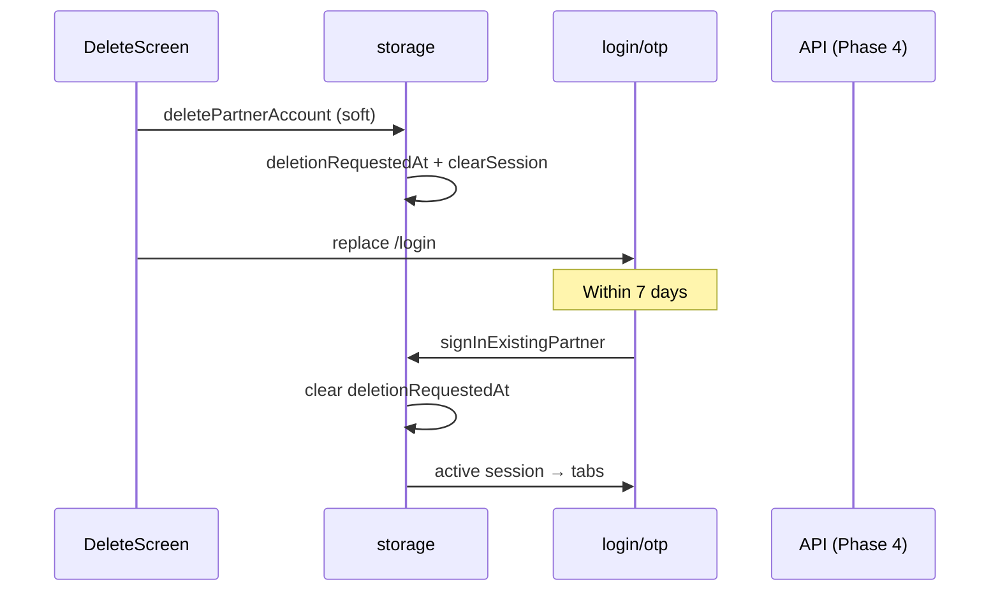
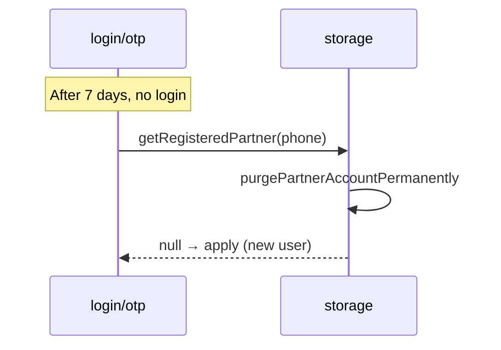

# FSD 17 — Account Deletion (7-Day Purge Window)

**Status:** `UI-DEMO`  
**Domain:** `src/features/account/`  
**Route:** `app/account/delete.tsx` → `PartnerDeleteAccountScreen`

## Overview

Self-serve account deletion with **soft delete + 7-day grace period**:

1. User confirms delete → account **deactivates immediately** (logout)  
2. Data retained for **7 days** (`ACCOUNT_DELETION_GRACE_DAYS`)  
3. **Login within 7 days** → account **automatically restored** (same profile, jobs, KYC)  
4. **No login after 7 days** → **permanent purge** on next phone lookup  

Permanent immediate wipe is **not** offered in the UI.

## Route & component map

| Component | File | Role |
|-----------|------|------|
| `PartnerDeleteAccountScreen` | `account/components/PartnerDeleteAccountScreen.tsx` | Confirmation UI |
| `account.premium.ts` | Timeline, warnings | 7-day restore copy |

## Data model

| Field | Type | Notes |
|-------|------|-------|
| `deletionRequestedAt` | `string?` (ISO) | Set on `PartnerProfile` in registered map |
| `ACCOUNT_DELETION_GRACE_DAYS` | `7` | `constants/app.ts` |

Purge deadline: `deletionRequestedAt + 7 days`.

## Current demo implementation

| Function | File | Behaviour |
|----------|------|-----------|
| `deletePartnerAccount(phone)` | `storage.ts` | **Soft delete**: sets `deletionRequestedAt`, takes offline, `clearSession()` only |
| `signInExistingPartner(phone)` | `storage.ts` | If within grace → clears `deletionRequestedAt`, restores session |
| `getRegisteredPartner(phone)` | `storage.ts` | If grace expired → `purgePartnerAccountPermanently()` |
| `purgePartnerAccountPermanently(phone)` | `storage.ts` (internal) | Full wipe after grace |
| `isWithinDeletionGracePeriod(profile)` | `storage.ts` | Grace check helper |

### Soft delete (user taps Delete)

- Sets `deletionRequestedAt` on registered profile  
- Sets `isOnline: false`  
- Clears session (`auth_complete`, active `partner_profile`)  
- **Keeps**: registered map entry, jobs, KYC draft, notifications, support tickets  

### Auto-restore (login within 7 days)

`otp.tsx` → `isReturningPartner` → `signInExistingPartner`:

- Detects `deletionRequestedAt` within grace  
- Removes `deletionRequestedAt` from registered profile  
- `savePartnerProfile` + `setAuthComplete`  
- User lands on tabs/KYC as normal — **no re-apply**

### Permanent purge (after 7 days)

Triggered when `getRegisteredPartner(phone)` runs (login OTP check, etc.):

- Removes registered map entry  
- Wipes all `@qmp/*` partner keys  

## Phase 4 API

### Request delete (soft)

```
POST /api/v1/maids/me/delete-request
```

**Request:**
```json
{
  "confirm_phone": "9876543210",
  "reason": "not_enough_jobs"
}
```

**Response `200`:**
```json
{
  "status": "pending_deletion",
  "deletion_requested_at": "2026-06-06T10:00:00+05:30",
  "purge_at": "2026-06-13T10:00:00+05:30",
  "restore_hint": "Login within 7 days to cancel deletion"
}
```

Side effects: revoke active sessions, set `is_online: false`, cancel pending offers.

### Login restores account

```
POST /api/v1/auth/otp/verify
```

If maid has `status: pending_deletion` and `now < purge_at`:

**Response includes:**
```json
{
  "maid": { "status": "active", "deletion_cancelled": true }
}
```

Server clears `deletion_requested_at` automatically.

### Permanent purge (server cron)

```
DELETE /internal/maids/:id/purge
```

Runs when `purge_at` passed and user did not restore. Mobile does not call this.

### Legacy — do NOT use immediate DELETE

`DELETE /api/v1/maids/me` → reserved for admin/legal only, not self-serve UI.

## API call site matrix

| Component | Action | Today (demo) | Phase 4 |
|-----------|--------|--------------|---------|
| `PartnerDeleteAccountScreen` | Confirm delete | `deletePartnerAccount(phone)` soft delete | `POST /maids/me/delete-request` |
| `PartnerDeleteAccountScreen` | After success | `router.replace('/login')` | `POST /auth/logout` |
| `otp.tsx` | Verify returning | `signInExistingPartner` → auto-restore | `POST /auth/otp/verify` (server restores) |
| `otp.tsx` | Verify after purge | `getRegisteredPartner` → null → apply | New registration flow |
| `getRegisteredPartner` | Lookup | Purge if grace expired | Server returns 404 / `purged` |

## Sequence — delete then restore



## Sequence — delete then purge



## Errors

| Case | UI |
|------|-----|
| Active in-progress job | Block delete — complete visit first |
| Pending payout | Warning + allow with delay |
| Login after purge | Treated as new user → apply form |

## Migration checklist

- [ ] Replace immediate `DELETE /maids/me` with `POST /delete-request`  
- [ ] OTP verify auto-cancels pending deletion server-side  
- [ ] Cron job for purge after `purge_at`  
- [ ] Mobile: map `deletionRequestedAt` ↔ API `pending_deletion` status  
