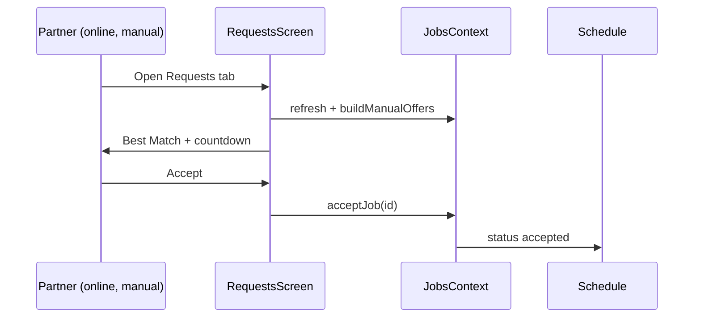
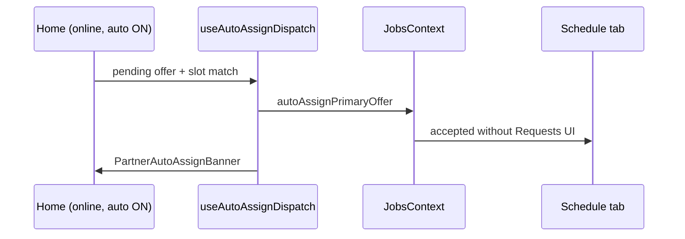

# FSD 18 — UC-Style Dispatch (Auto-assign & Manual Requests)

**Status:** `UI-DEMO`  
**Domain:** `src/features/jobs/` (dispatch modules), `src/features/settings/` (preference)  
**Routes:** Affects `(tabs)/index`, `(tabs)/requests`, `(tabs)/schedule`, `app/(tabs)/_layout.tsx`

## Overview

Urban Company–style job dispatch for the partner demo:

| Mode | Setting | Behaviour |
|------|---------|-----------|
| **Auto-assign** | Settings → Auto-assign offers **ON** (default) | Best slot-matched offer auto-accepts → **Schedule** (no Accept tap) |
| **Manual** | Auto-assign **OFF** | Offers appear on **Requests** tab → Accept / Decline |

Start visit remains **manual** on job detail after accept. Visit completion OTP demo: `123456`.

### User stories

| ID | Story |
|----|-------|
| DISP-1 | Partner toggles auto-assign in Settings (not footer) |
| DISP-2 | Manual mode: sees Best Match hero + inbox cards with countdown |
| DISP-3 | Auto mode: Requests tab hidden; jobs land on Schedule |
| DISP-4 | Decline or expiry requeues offer to next partner pool |
| DISP-5 | KYC unverified blocks accept and auto-assign |
| DISP-6 | Customer booking bridge can inject pending offers |

## Route & component map

| Component | File | Role |
|-----------|------|------|
| `DispatchAssignProvider` | `jobs/context/DispatchAssignContext.tsx` | Wraps tabs; runs auto-assign hook |
| `useAutoAssignDispatch` | `jobs/hooks/useAutoAssignDispatch.ts` | Auto-confirm primary offer when online |
| `usePartnerDispatch` | `jobs/hooks/usePartnerDispatch.ts` | Slot-matched offer lists |
| `PartnerRequestsScreen` | `jobs/components/PartnerRequestsScreen.tsx` | Manual inbox + Best Match |
| `PartnerRequestsBestMatch` | `jobs/components/PartnerRequestsSections.tsx` | UC hero card |
| `PartnerAutoAssignBanner` | `jobs/components/PartnerAutoAssignBanner.tsx` | Last auto-confirmed job banner |
| `PartnerGoToRequestsStrip` | `home/components/PartnerGoToRequestsStrip.tsx` | Manual mode CTA on Home |
| `PartnerAutoAssignKycBlock` | `home/components/PartnerHomeWidgets.tsx` | KYC blocks auto-assign |
| `PartnerSettingsPreferences` | `settings/components/PartnerSettingsPreferences.tsx` | `autoAssignOffers` toggle |
| Tab layout | `app/(tabs)/_layout.tsx` | Hides Requests tab when auto ON |

## Data & preferences

| Key / field | Storage | Default |
|-------------|---------|---------|
| `autoAssignOffers` | `settings.storage.ts` | `true` |
| `jobAlerts` | `settings.storage.ts` | Controls dispatch notifications |
| `reassignGeneration` | `PartnerJob` | Demo requeue counter (max 3) |
| Offer listed-at | `offer-expiry.storage.ts` | Per-job countdown anchor |

### Offer window (demo)

| Job type | Window |
|----------|--------|
| Normal pending | 3 minutes (`DEMO_OFFER_EXPIRY_MS`) |
| MANUAL / DECLINE test cards | 90 seconds |
| UI label | `OFFER_WINDOW_LABEL_MINUTES` (= 3) |

## Event bus

| Module | Events |
|--------|--------|
| `dispatch.events.ts` | `new_offer`, `offer_expired`, `online_pulse` |
| `useRealtimeDispatch` | Subscribes for auto-assign pulse |
| `PartnerJobsContext` | Refreshes jobs on all dispatch events |
| `useDispatchInboxAlerts` | Manual mode: haptic + alert on new/expired |

## Cross-app bridge (demo)

| Module | Purpose |
|--------|---------|
| `apps/partner/shared/booking-bridge.ts` | AsyncStorage key + deep link parse |
| `booking-partner-bridge.ts` | Ingest customer orders → pending jobs |
| `visit-location-bridge.ts` | Partner pings → customer booking detail |

See monorepo doc: [`QuickMaid-App/docs/FSD/CROSS-APP-BRIDGE.md`](../../../../docs/FSD/CROSS-APP-BRIDGE.md).

## Phase 4 API

Dispatch moves server-side; client polls or uses WebSocket/push:

| Endpoint | Method | Purpose |
|----------|--------|---------|
| `/api/v1/maids/me/dispatch/mode` | PATCH | `{ auto_assign: boolean }` |
| `/api/v1/maids/me/offers` | GET | Pending offers for manual accept |
| `/api/v1/maids/me/offers/:id/accept` | POST | Manual accept |
| `/api/v1/maids/me/offers/:id/decline` | POST | Decline + reason |
| `/api/v1/dispatch/events` | SSE or WS | `new_offer`, `offer_expired`, `auto_assigned` |

Server enforces offer TTL (15 min prod per FSD 03), KYC gate, and slot matching.

## API call site matrix (demo today)

| Component | Action | Today | Phase 4 |
|-----------|--------|-------|---------|
| `PartnerSettingsPreferences` | Toggle auto-assign | `settings.storage.update` | `PATCH /dispatch/mode` |
| `useAutoAssignDispatch` | Online + match | `autoAssignPrimaryOffer()` | Server push + confirm |
| `PartnerRequestsScreen` | Accept | `acceptJob(id)` | `POST /offers/:id/accept` |
| `offer-expiry.runner` | Expire | Local decline + `passJobToNextPartner` | Server TTL job |
| `booking-partner-bridge` | Ingest | AsyncStorage bridge | `POST /jobs` from order webhook |

## Sequence — manual accept

## Sequence — auto-assign

## Errors & edge cases

| Case | Behaviour |
|------|-----------|
| KYC not verified | `canPartnerAcceptJobs` false; alert on manual accept; KYC banner on Home |
| Offer expired | Countdown → hide actions; `offer_expired` event; requeue |
| Offline | No offers shown; toggle online on Home/Requests |
| Auto ON | Requests tab `href: null` |

## Migration checklist

- [ ] Replace `autoAssignPrimaryOffer` with server-assigned accepted job  
- [ ] Remove local `dispatch.events.ts`; use push/SSE  
- [ ] Server-side offer expiry and partner pool rotation  
- [ ] Settings preference sync via API  
- [ ] Remove demo bridge; orders create maid offers via backend dispatch  
