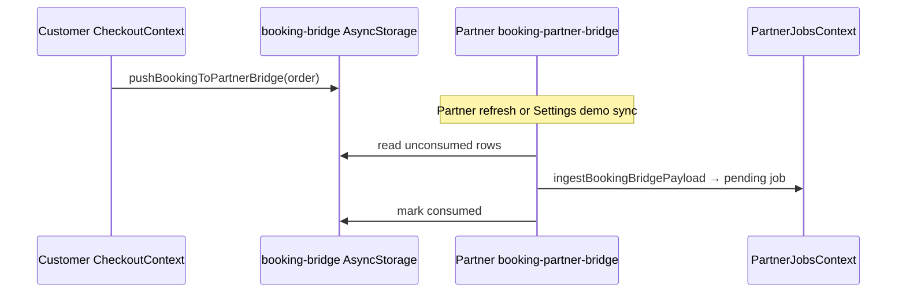
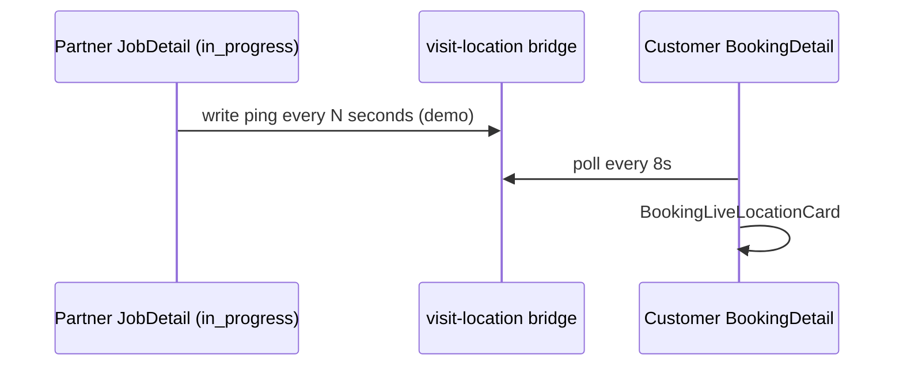

# FSD — Cross-App Bridge (Customer ↔ Partner Demo)

**Status:** `UI-DEMO`  
**Scope:** `QuickMaid-App/shared/`, `apps/partner/shared/`, customer `src/lib/*-bridge.ts`

## Overview

Demo-only bridge so a customer order can appear as a partner pending job and partner visit pings can surface on the customer booking detail — **without a backend**. Works when:

1. Both apps share the same device AsyncStorage (same app sandbox is **not** shared; use bridge sync button or deep link), or  
2. Customer pushes via deep link `quickmaid-partner://booking?...`

Production replaces this with QuickMaid-API dispatch webhooks and real-time location API.

## Modules

| File | App | Role |
|------|-----|------|
| `shared/booking-bridge.ts` | Monorepo canonical | Types, storage key, deep link build/parse |
| `apps/partner/shared/booking-bridge.ts` | Partner bundle copy | **Keep in sync** with monorepo `shared/` |
| `apps/partner/src/.../booking-partner-bridge.ts` | Partner | Read bridge → `PartnerJob` pending |
| `apps/customer/src/lib/booking-partner-bridge.ts` | Customer | `pushBookingToPartnerBridge()` after checkout |
| `shared/visit-location-bridge.ts` | Monorepo | Live location store by `bookingRef` |
| `apps/partner/shared/visit-location-bridge.ts` | Partner copy | Same sync note |
| `apps/partner/.../visit-location.storage.ts` | Partner | Write pings during visit |
| `apps/customer/.../visit-location-bridge.ts` | Customer | Poll for customer UI |
| `BookingLiveLocationCard.tsx` | Customer | Shows “Pro is on the way” |

### Storage keys

| Key | Constant |
|-----|----------|
| Booking bridge | `@qm/booking_partner_bridge_v1` |
| Visit location | `@qm/visit_location_bridge_v1` |

## Flow — customer order → partner job

## Flow — live location

## Partner demo tools

`PartnerSettingsDemoTools.tsx` → **Sync customer bookings** calls `syncCustomerBookingBridge()`.

## Metro bundling note

Partner app copies `shared/` into `apps/partner/shared/` because Metro `projectRoot` is `apps/partner`. Customer should mirror this pattern if bundle errors occur for `../../../../shared/` imports.

## Phase 4 replacement

| Demo | Production |
|------|------------|
| AsyncStorage bridge | `POST /orders` → dispatch service → `POST /maids/me/offers` |
| Deep link payload | Push notification + API fetch |
| Location bridge | `POST /jobs/:id/location` + customer `GET /bookings/:id/tracking` |

## Migration checklist

- [ ] Remove `shared/booking-bridge.ts` from mobile apps  
- [ ] Customer checkout calls `POST /customers/me/bookings`  
- [ ] Partner receives offers via API / FCM  
- [ ] Live location via WebSocket or polling endpoint  
- [ ] Delete duplicate `apps/partner/shared/` copies  
