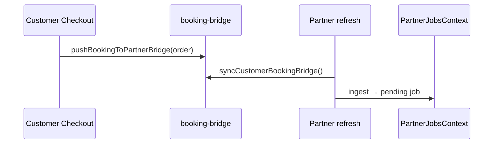
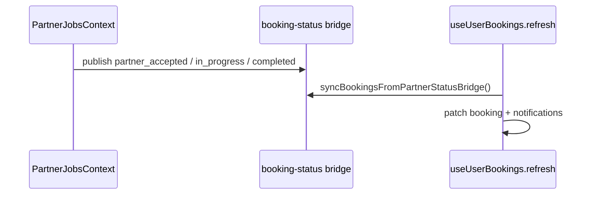
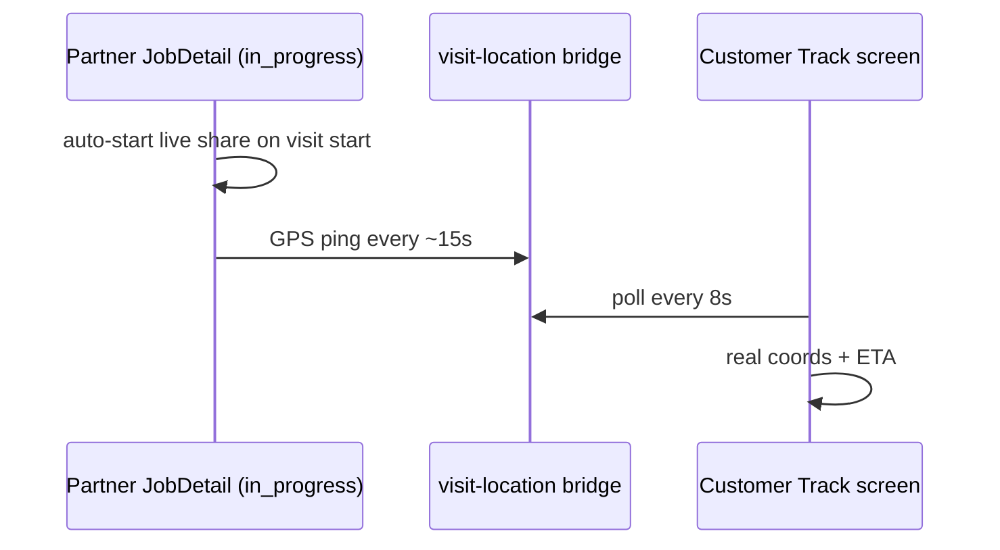
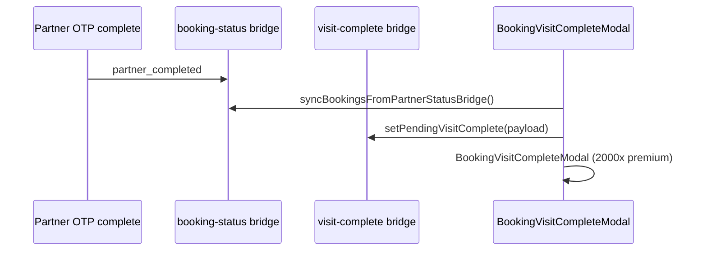

# FSD — Cross-App Bridge (Customer ↔ Partner Demo)

**Status:** `UI-DEMO`  
**Scope:** `QuickMaid-App/shared/`, `apps/partner/shared/`, `apps/customer/shared/`

## Overview

Demo-only bridge so customer orders, partner lifecycle, live location, cancel/reschedule sync across apps — **without a backend**. Works when both apps share the same device AsyncStorage (simulator / web) or via deep link handoff.

Production replaces this with QuickMaid-API dispatch webhooks and real-time location API.

## Modules

| File | App | Role |
|------|-----|------|
| `shared/booking-bridge.ts` | Monorepo canonical | Order create → partner pending job |
| `shared/booking-status-bridge.ts` | Monorepo canonical | Lifecycle events (accept → complete, cancel, reschedule) |
| `shared/visit-location-bridge.ts` | Monorepo canonical | Live location by `bookingRef` |
| `shared/visit-complete-bridge.ts` | Monorepo canonical | Post-OTP visit complete handoff → customer modal |
| `apps/partner/shared/*` | Partner bundle | Metro copies — **keep in sync** |
| `apps/customer/shared/*` | Customer bundle | Metro copies — **keep in sync** |
| `partner/.../booking-partner-bridge.ts` | Partner | Ingest customer orders |
| `partner/.../booking-status-bridge.storage.ts` | Partner | Publish + read lifecycle |
| `customer/.../booking-partner-bridge.ts` | Customer | Push order after checkout |
| `customer/.../booking-status-bridge.storage.ts` | Customer | Sync partner events → bookings |
| `partner/.../visit-location.storage.ts` | Partner | Write GPS pings |
| `customer/.../visit-location-bridge.ts` | Customer | Read pings for UI |

### Storage keys

| Key | Constant | Purpose |
|-----|----------|---------|
| `@qm/booking_partner_bridge_v1` | `BOOKING_PARTNER_BRIDGE_KEY` | New orders queue |
| `@qm/booking_status_bridge_v1` | `BOOKING_STATUS_BRIDGE_KEY` | Lifecycle events by `bookingRef` |
| `@qm/booking_status_applied_v1` | `BOOKING_STATUS_APPLIED_KEY` | Idempotency (`customer:ref`, `partner:ref`) |
| `@qm/visit_location_bridge_v1` | `VISIT_LOCATION_BRIDGE_KEY` | Latest partner ping per booking |
| `@qm/pending_visit_complete` | `VISIT_COMPLETE_BRIDGE_KEY` | One-shot visit complete modal payload |

### Status bridge events

| Event | Publisher | Consumer |
|-------|-----------|----------|
| `partner_accepted` | Partner (manual + auto-assign) | Customer → update pro name, notification |
| `partner_in_progress` | Partner start visit | Customer → notification, live track |
| `partner_completed` | Partner OTP complete | Customer → mark completed + visit modal |
| `partner_declined` | Partner decline | Customer → reassignment notification |
| `customer_cancelled` | Customer cancel | Partner → decline job |
| `customer_rescheduled` | Customer reschedule | Partner → patch visit date/slot |
| `customer_rated` | Customer rate visit | Partner → review storage, rating score, notification |

### Shared module sync

After editing `QuickMaid-App/shared/*.ts`, run from either app:

```bash
npm run sync:shared
```

Copies canonical modules into `apps/customer/shared/` and `apps/partner/shared/`.

## Flow — customer order → partner job



## Flow — lifecycle sync



## Flow — live location



## Metro bundling

Both apps pin Metro `projectRoot` to their app folder and import from `apps/{app}/shared/`. Do not import monorepo `shared/` directly from `src/` — copy files and keep in sync.

## Flow — visit complete handoff



## Batch 4 UI (live location)

| Component | App | Role |
|-----------|-----|------|
| `PartnerLiveLocationCard` | Partner | Auto GPS share on visit · bridge write |
| `PartnerLiveVisitBanner` | Partner | Schedule in-progress hero |
| `PartnerActiveJobBanner` | Partner | Home live visit CTA |
| `BookingLiveLocationCard` | Customer | Detail live ping card |
| `BookingTrackScreen` + `BookingTrackMap` | Customer | Real GPS map position |
| `BookingUpcomingHero` | Customer | GPS LIVE badge when sharing |
| `usePartnerLivePing` | Customer | Shared 8s poll hook |

## Batch 1 UI (foundation)

| Component | Screen | Role |
|-----------|--------|------|
| `CheckoutPartnerBridgeCard` | Checkout success | Order → partner bridge pipeline |
| `BookingVisitCompleteModal` | Bookings / Detail | Bridge-synced completion celebration |

## Demo OTP

All visit completion OTPs use `123456` (`DEMO_OTP`) for cross-app demo parity.

## Phase 4 replacement

| Demo | Production |
|------|------------|
| AsyncStorage bridges | API webhooks + FCM |
| Deep link payload | Push notification + fetch |
| Location bridge | `POST /jobs/:id/location` + customer tracking API |
