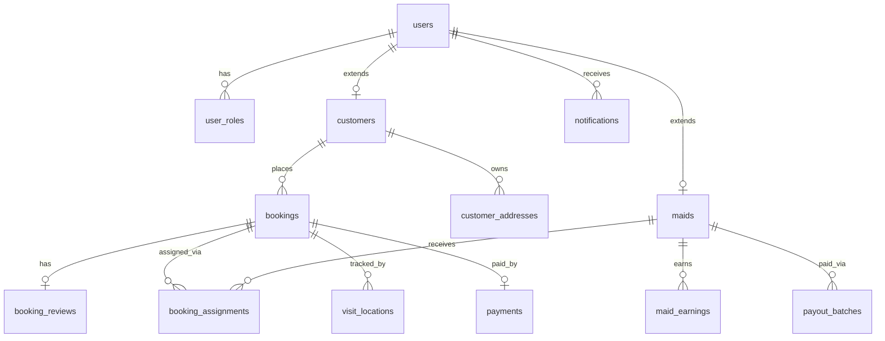
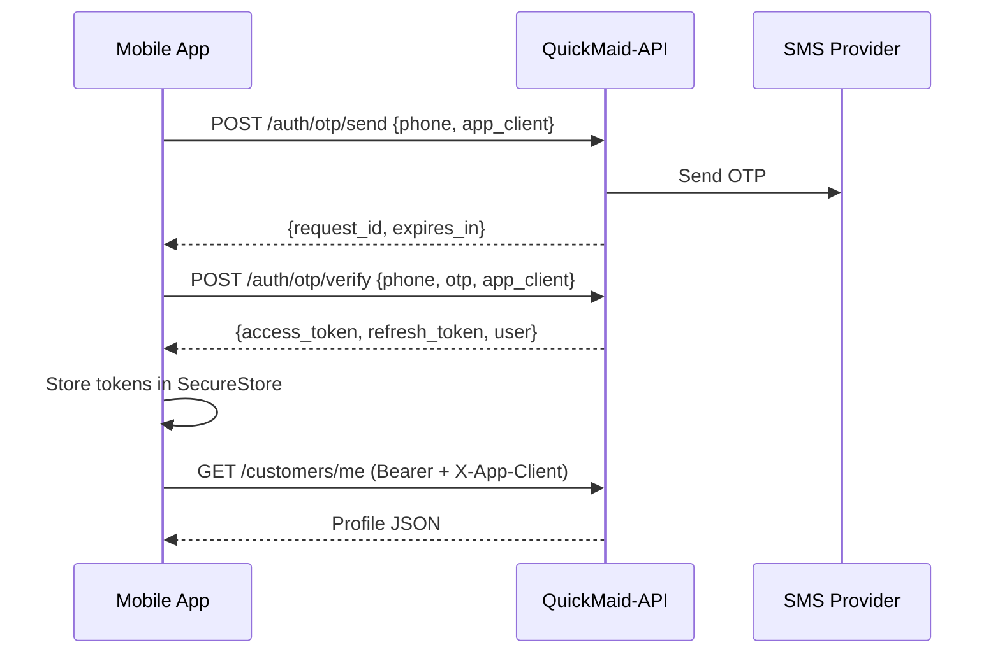
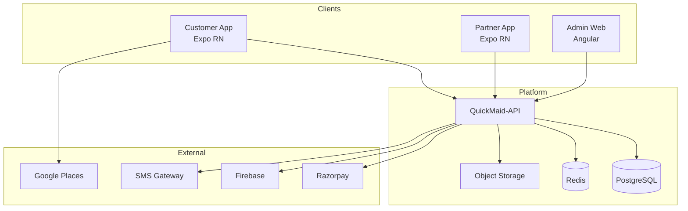
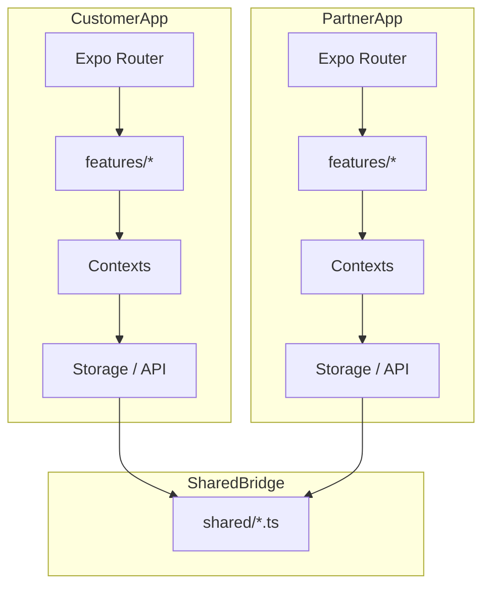

# QuickMaid Platform — Complete Documentation

**Customer App + Partner App + Backend + Admin**  
**Audience:** Developers · Project managers · Stakeholders · QA  
**Status:** Mobile UI-DEMO complete · Backend Phase 4 next  
**Version:** 1.0 · Raipur-first

> **Navigation:** This is the single combined reference. Per-screen detail lives in app FSD folders.  
> **Hub:** [docs/README.md](./README.md)

---

## Table of contents

1. [Overview](#1-overview)
2. [Functional Specification (FSD)](#2-functional-specification-fsd)
3. [System Design](#3-system-design)
4. [Data Flow & Interaction](#4-data-flow--interaction)
5. [High-Level Architecture & Diagrams](#5-high-level-architecture--diagrams)
6. [Industry Best Practices](#6-industry-best-practices)
7. [Optional Enhancements](#7-optional-enhancements)
8. [Appendix](#8-appendix)

---

## 1. Overview

### 1.1 Purpose

QuickMaid is a **home-cleaning marketplace** for Raipur, India. Homeowners book verified cleaning professionals; partners (maids/pros) receive job offers, complete visits, and earn payouts. Operations teams manage catalogue, dispatch, KYC, and payouts via a **web admin console**.

### 1.2 Target users

| User | App / Surface | Primary goals |
|------|---------------|---------------|
| **Customer** | Customer mobile app | Discover services, book, pay, track, rate |
| **Partner (Maid/Pro)** | Partner mobile app | Accept jobs, navigate, complete visits, view earnings |
| **Dual-role user** | Both apps, same phone | Book as customer AND work as partner (separate JWT roles) |
| **Support agent** | Admin + ticket API | Resolve chat tickets and disputes |
| **Ops / Admin** | QuickMaid web admin | Approve partners, dispatch, refunds, payouts, catalogue |

### 1.3 Platform components

```
┌─────────────────┐  ┌─────────────────┐  ┌─────────────────┐
│  Customer App   │  │  Partner App    │  │  Admin Web CRM  │
│  (React Native) │  │  (React Native) │  │  (Angular)      │
└────────┬────────┘  └────────┬────────┘  └────────┬────────┘
         │                    │                     │
         └────────────────────┼─────────────────────┘
                              ▼
                    ┌──────────────────┐
                    │   QuickMaid-API   │
                    │   REST + webhooks │
                    └────────┬─────────┘
                              ▼
                    ┌──────────────────┐
                    │   PostgreSQL      │
                    └──────────────────┘
```

| Component | Repo | Package / URL |
|-----------|------|---------------|
| Customer app | QuickMaid-App `apps/customer` | `in.quickmaid.customer` |
| Partner app | QuickMaid-App `apps/partner` | `in.quickmaid.partner` |
| API | QuickMaid-API | `api.quickmaid.in` |
| Admin | QuickMaid (web) | `admin.quickmaid.in` |

### 1.4 Key features — Customer app

| Area | Features |
|------|----------|
| Discovery | Home rails, catalogue (54+ services), search, filters, featured offers |
| Booking | 5-step checkout, address picker, slot selection, coupons |
| Payments | UPI, cards, wallet, Razorpay demo, pay-after-service model |
| Live visit | Track map, live location card, OTP-secured completion |
| Account | Profile, addresses, saved payments, Plus membership, app lock |
| Post-visit | Reschedule, cancel, rate & review, invoice PDF, dispute |
| Support | Help tab, live chat, tickets, notifications inbox |

### 1.5 Key features — Partner app

| Area | Features |
|------|----------|
| Jobs | Pending offers, accept/decline, job detail, visit start/complete |
| Dispatch | Auto-assign when online (UC-style), manual requests, offer expiry |
| Visit | OTP completion, live GPS share, navigate to customer |
| Earnings | Balance, ledger, per-job breakdown, payout batches |
| KYC | 6-step wizard: Aadhaar, PAN, bank/UPI, selfie |
| Profile | Photo, rating, work address, preferred slots, online toggle |
| Support | Chat tickets, help FAQ, notifications |

### 1.6 How the apps interact

| Interaction | Demo (today) | Production (Phase 4) |
|-------------|--------------|----------------------|
| New booking → partner offer | AsyncStorage `booking-bridge` | API dispatch + FCM push |
| Accept / start / complete | `booking-status-bridge` events | REST + webhooks |
| Live GPS | `visit-location-bridge` | `POST/GET .../location` |
| Visit complete modal | `visit-complete-bridge` | Webhook `visit.completed` |
| Customer rates partner | `customer_rated` event | `POST /bookings/:id/review` |
| Cross-device | Deep link `quickmaid-partner://booking?ref=` | API only |

Full bridge spec: [FSD/CROSS-APP-BRIDGE.md](./FSD/CROSS-APP-BRIDGE.md)

### 1.7 Current vs target state

| Layer | Today | Phase 4 |
|-------|-------|---------|
| Customer data | AsyncStorage `@qm/` | QuickMaid-API |
| Partner data | AsyncStorage `@qmp/` | QuickMaid-API |
| Auth | Demo OTP `123456` | SMS OTP + JWT |
| Payments | `simulatePayment()` | Razorpay + server verify |
| Sync | Same-device bridge | Server + push |

See [DEMO_STATUS.md](./DEMO_STATUS.md) for complete deferral list.

---

## 2. Functional Specification (FSD)

> **Deep dive:** Customer FSD 00–16 · Partner FSD 00–18 · API call matrices in each app.

### 2.1 Customer app — feature matrix

| ID | Feature | Routes | Inputs | Outputs | Validations |
|----|---------|--------|--------|---------|-------------|
| C-01 | Auth | `(auth)/*` | Phone, OTP, profile | Session, home | 10-digit phone, OTP 6 digits |
| C-02 | Home | `(tabs)/index` | City, address | Service rails | Default address required for checkout |
| C-03 | Catalogue | `(tabs)/catalogue` | Search, filter | Service list | — |
| C-04 | Service detail | `service/[id]` | — | Price, book CTA | Valid service ID |
| C-05 | Checkout | `checkout/*` | Address, slot, payment | Booking ref | Cart non-empty, slot in future |
| C-06 | Bookings | `(tabs)/bookings`, `booking/*` | Filters | Booking cards | — |
| C-07 | Track | `booking/track/[id]` | — | Map, ETA | Only in-progress visits |
| C-08 | Reschedule | `booking/reschedule/[id]` | New slot | Updated booking | ≥2h before visit |
| C-09 | Cancel | `booking/cancel/[id]` | Reason | Refund copy | Policy rules |
| C-10 | Rate | `booking/rate/[id]` | Stars, text | Review saved | Completed visits only |
| C-11 | Plus | `(tabs)/plans`, `plus/*` | Plan choice | Membership | Payment success |
| C-12 | Profile | `(tabs)/profile` | CRUD fields | Updated account | Address pincode, phone format |
| C-13 | Notifications | `notifications/*` | Tap | Read state | — |
| C-14 | Support | `support/*` | Messages | Ticket thread | Non-empty message |
| C-15 | Help | `(tabs)/support` | Topic | Chat open | — |
| C-16 | Security | `account/app-lock` | PIN | Lock enabled | 4–6 digit PIN |

### 2.2 Partner app — feature matrix

| ID | Feature | Routes | Inputs | Outputs | Validations |
|----|---------|--------|--------|---------|-------------|
| P-01 | Auth / Apply | `(auth)/*` | Phone, OTP, apply form | Session / pending KYC | Zone, skills required |
| P-02 | Home | `(tabs)/index` | Online toggle | Dashboard stats | — |
| P-03 | Requests | `(tabs)/requests` | Accept/decline | Job state change | KYC verified for accept |
| P-04 | Job detail | `job/[id]` | Start, navigate | Visit in progress | Assigned job only |
| P-05 | Visit complete | `job/complete/[id]` | OTP | Completed job | OTP match |
| P-06 | Schedule | `(tabs)/schedule` | — | Week calendar | — |
| P-07 | Earnings | `(tabs)/earnings` | — | Ledger | — |
| P-08 | KYC | `kyc` | Docs, verify | kycStatus | PAN/Aadhaar format |
| P-09 | Profile | `(tabs)/profile` | Edit fields | Updated profile | — |
| P-10 | Slots | `slots` | Slot toggles | preferredSlotIds | At least one slot |
| P-11 | Dispatch | settings | Auto-assign toggle | Offer behaviour | Online required |
| P-12 | Notifications | `notifications/*` | Tap | Read state | — |
| P-13 | Support | `support/chat` | Messages | Ticket | — |
| P-14 | Referral | `referral` | Share code | Ledger view | — |

### 2.3 User workflows (combined)

#### Workflow A — First-time customer booking

```
Splash → Onboarding → City (Raipur) → Login → OTP → Signup → Permissions
  → Home → Service → Checkout (cart → address → schedule → payment)
  → Success → Booking appears in Bookings tab
  → [Bridge] Partner receives pending offer (same device demo)
```

**Acceptance:** Booking ref generated, payment recorded, partner job created.

#### Workflow B — Partner accepts and completes visit

```
Partner: Requests → Accept → Job detail → Navigate → Start visit
  → Live GPS sharing → Customer tracks on map
  → Enter visit OTP → Complete
  → Earnings updated → Customer: visit-complete modal → Rate
```

**Acceptance:** Status transitions: `pending → accepted → in_progress → completed`.

#### Workflow C — Customer cancels

```
Customer: Booking detail → Cancel → Confirm reason
  → [Bridge/API] Partner job declined
  → Customer refund message → Notification both sides
```

**Edge cases:**

| Case | Customer behaviour | Partner behaviour |
|------|-------------------|-------------------|
| Partner declines | Reassignment notification | Job removed from active |
| Offer expires | "Finding another pro" copy | Offer auto-expired |
| No partner online | Booking stays pending | — |
| Wrong visit OTP | — | Inline error, retry |
| Payment fails | Stay on payment step | No job created |
| KYC pending | — | Accept blocked with banner |

### 2.4 Notifications

| Event | Customer | Partner | Channel (Phase 4) |
|-------|----------|---------|-------------------|
| Booking placed | Confirmation | New offer | Push + inbox |
| Partner accepted | Pro assigned | — | Push + inbox |
| Visit started | Track CTA | — | Push |
| Visit completed | Rate modal | Earnings update | Push |
| Cancelled | Refund info | Job removed | Push |
| Rescheduled | New slot shown | Schedule patched | Push |
| KYC approved | — | Jobs unlocked | Push |
| Payout processed | — | Payout detail | Push + SMS |

**Demo:** Local inbox items written by bridge sync handlers.

### 2.5 Real-time updates

| Data | Demo | Production |
|------|------|------------|
| Job status | Bridge poll on focus | FCM + `GET /bookings/:id` |
| Live location | Bridge poll 8s | WebSocket or 5–15s poll |
| Chat messages | Local append + auto-reply | WebSocket / long poll |
| Online partners | N/A | Redis presence + geo index |

### 2.6 Admin interactions (web — not mobile)

| Admin action | Affects Customer | Affects Partner |
|--------------|------------------|-----------------|
| Approve maid application | — | `kycStatus → verified`, can accept jobs |
| Manual dispatch | Booking assigned | New offer |
| Cancel from CRM | Booking cancelled | Job declined |
| Refund | Wallet / payment updated | Earnings adjusted |
| Catalogue edit | Home / service prices | — |
| Payout batch | — | Payout record created |

### 2.7 Error handling (functional)

| Error | User message | Recovery |
|-------|--------------|----------|
| Invalid OTP | "Incorrect code" | Retry, resend after timer |
| Slot unavailable | "Slot just taken" | Pick another slot |
| Payment declined | Gateway message | Retry payment |
| Network offline | "Check connection" | Retry button |
| Job not found | "Booking unavailable" | Back to list |
| KYC rejected | Reason shown | Re-submit wizard |

---

## 3. System Design

### 3.1 Backend architecture (target)

```
                    ┌─────────────────────────────────────┐
                    │           Load Balancer / CDN        │
                    └──────────────────┬──────────────────┘
                                       │
                    ┌──────────────────▼──────────────────┐
                    │         QuickMaid-API (Node/Nest)    │
                    │  ┌─────────┐ ┌─────────┐ ┌────────┐ │
                    │  │ Auth    │ │ Booking │ │ Dispatch│ │
                    │  │ Service │ │ Service │ │ Service │ │
                    │  └─────────┘ └─────────┘ └────────┘ │
                    │  ┌─────────┐ ┌─────────┐ ┌────────┐ │
                    │  │ Payment │ │ KYC     │ │ Notify  │ │
                    │  │ Service │ │ Service │ │ Service │ │
                    │  └─────────┘ └─────────┘ └────────┘ │
                    └──────────┬────────────┬─────────────┘
                               │            │
              ┌────────────────┼────────────┼────────────────┐
              ▼                ▼            ▼                ▼
        PostgreSQL          Redis        S3/Blob      FCM / SMS
        (primary DB)       (cache/      (KYC docs,    (push, OTP)
                            queues)     invoices)
```

| Service | Responsibility |
|---------|----------------|
| **Auth** | OTP, JWT issue/refresh, `user_roles` |
| **Booking** | Orders, status machine, reschedule/cancel |
| **Dispatch** | Offer pool, auto-assign, TTL expiry |
| **Payment** | Razorpay orders, verify, wallet ledger |
| **KYC** | Document upload, third-party verify callbacks |
| **Notify** | FCM, SMS, in-app inbox persistence |

### 3.2 Database schema (logical)

> Authoritative DBML: `QuickMaid/docs/database/quickmaid.schema.dbml` (web repo)

#### Core identity

**`users`**

| Column | Type | Notes |
|--------|------|-------|
| id | UUID PK | |
| phone | VARCHAR(15) UNIQUE | +91 format |
| created_at | TIMESTAMPTZ | |
| deleted_at | TIMESTAMPTZ NULL | Soft delete grace |

**`user_roles`**

| Column | Type | Notes |
|--------|------|-------|
| user_id | UUID FK → users | |
| role | ENUM | `customer`, `maid`, `admin` |
| UNIQUE(user_id, role) | | Same phone, both roles |

#### Customer domain

**`customers`**

| Column | Type | Notes |
|--------|------|-------|
| id | UUID PK | |
| user_id | UUID FK | |
| name | VARCHAR | |
| email | VARCHAR NULL | |
| city | VARCHAR | Raipur |
| zone | VARCHAR NULL | |
| wallet_balance_paise | BIGINT | |
| membership_plan | VARCHAR NULL | plus, flex, null |

**`customer_addresses`**

| Column | Type | Notes |
|--------|------|-------|
| id | UUID PK | |
| customer_id | UUID FK | |
| label | VARCHAR | Home, Office |
| street, landmark, zone, pincode, city | VARCHAR | |
| lat, lng | DECIMAL NULL | |
| is_default | BOOLEAN | |

**`bookings`**

| Column | Type | Notes |
|--------|------|-------|
| id | UUID PK | |
| ref | VARCHAR UNIQUE | QM-XXXXXX customer-facing |
| customer_id | UUID FK | |
| service_id | VARCHAR | Catalogue reference |
| status | ENUM | pending, upcoming, in_progress, completed, cancelled |
| scheduled_at | TIMESTAMPTZ | |
| slot_window | VARCHAR | e.g. 08:00-11:00 |
| address_snapshot | JSONB | Frozen at booking time |
| price_paise | BIGINT | |
| payment_status | ENUM | pending, paid, refunded |
| maid_id | UUID FK NULL | Assigned partner |
| created_at | TIMESTAMPTZ | |

**`booking_reviews`**

| Column | Type | Notes |
|--------|------|-------|
| booking_id | UUID FK UNIQUE | |
| rating | SMALLINT | 1–5 |
| comment | TEXT NULL | |
| customer_id | UUID FK | |

#### Partner domain

**`maids`** (partners)

| Column | Type | Notes |
|--------|------|-------|
| id | UUID PK | |
| user_id | UUID FK | |
| public_id | VARCHAR | MD-XXXXXX |
| first_name, last_name | VARCHAR | |
| zone | VARCHAR | Dispatch zone |
| skills | TEXT[] | |
| kyc_status | ENUM | pending, under_review, verified, rejected |
| is_online | BOOLEAN | |
| rating_avg | DECIMAL | Denormalized |
| photo_url | VARCHAR NULL | |

**`booking_assignments`** (partner job view)

| Column | Type | Notes |
|--------|------|-------|
| id | UUID PK | |
| booking_id | UUID FK | |
| maid_id | UUID FK | |
| status | ENUM | offered, accepted, declined, expired, in_progress, completed |
| offered_at | TIMESTAMPTZ | |
| expires_at | TIMESTAMPTZ NULL | Auto-assign TTL |
| decline_reason | VARCHAR NULL | |

**`visit_locations`**

| Column | Type | Notes |
|--------|------|-------|
| booking_id | UUID FK | |
| lat, lng | DECIMAL | |
| recorded_at | TIMESTAMPTZ | Latest ping |

**`maid_earnings`**

| Column | Type | Notes |
|--------|------|-------|
| id | UUID PK | |
| maid_id | UUID FK | |
| booking_id | UUID FK | |
| amount_paise | BIGINT | |
| status | ENUM | pending, available, paid_out |

**`payout_batches`**

| Column | Type | Notes |
|--------|------|-------|
| id | UUID PK | |
| maid_id | UUID FK | |
| amount_paise | BIGINT | |
| status | ENUM | processing, completed, failed |
| utr | VARCHAR NULL | |

#### Shared

**`payments`**

| Column | Type | Notes |
|--------|------|-------|
| id | UUID PK | |
| booking_id | UUID FK NULL | |
| razorpay_order_id | VARCHAR | |
| amount_paise | BIGINT | |
| status | ENUM | created, captured, failed, refunded |

**`notifications`**

| Column | Type | Notes |
|--------|------|-------|
| id | UUID PK | |
| user_id | UUID FK | |
| app_client | ENUM | customer, maid |
| type | VARCHAR | booking_accepted, etc. |
| payload | JSONB | |
| read_at | TIMESTAMPTZ NULL | |

**`support_tickets`**

| Column | Type | Notes |
|--------|------|-------|
| id | UUID PK | |
| user_id | UUID FK | |
| topic | VARCHAR | |
| status | ENUM | open, resolved |
| messages | JSONB[] | Thread |

#### Entity relationships



Mobile field mapping: [CUSTOMER_DATA.md](../apps/customer/docs/CUSTOMER_DATA.md) · [PARTNER_DATA.md](../apps/partner/docs/PARTNER_DATA.md)

### 3.3 API endpoints summary

Full contract: [API-CONTRACT.md](./API-CONTRACT.md)

#### Authentication

| Method | Path | Purpose | Auth |
|--------|------|---------|------|
| POST | `/auth/otp/send` | Send SMS OTP | None |
| POST | `/auth/otp/verify` | Verify → JWT | None |
| POST | `/auth/refresh` | Refresh token | Refresh token |
| POST | `/auth/logout` | Revoke session | Bearer |

#### Customer (sample)

| Method | Path | Purpose |
|--------|------|---------|
| GET | `/customers/me` | Profile + account |
| POST | `/customers/me/bookings` | Create booking |
| GET | `/customers/me/bookings` | List bookings |
| PATCH | `/customers/me/bookings/:id/reschedule` | Reschedule |
| POST | `/customers/me/bookings/:id/cancel` | Cancel |
| POST | `/customers/me/bookings/:id/review` | Rate visit |
| GET | `/bookings/:id/location` | Live partner GPS |

#### Partner (sample)

| Method | Path | Purpose |
|--------|------|---------|
| GET | `/maids/me` | Profile + online state |
| PATCH | `/maids/me/online` | Go online/offline |
| GET | `/maids/me/jobs` | Job list |
| POST | `/jobs/:id/accept` | Accept offer |
| POST | `/jobs/:id/decline` | Decline offer |
| POST | `/jobs/:id/start` | Start visit |
| POST | `/jobs/:id/complete` | OTP complete |
| POST | `/jobs/:id/location` | GPS ping |
| GET | `/maids/me/earnings` | Earnings ledger |

### 3.4 Authentication & authorization



| Rule | Implementation |
|------|----------------|
| Role separation | `X-App-Client: customer \| maid` on every request |
| Token storage | `expo-secure-store` — never AsyncStorage |
| Refresh | Silent refresh on 401, then retry once |
| Admin | Separate admin JWT with `role: admin` — web only |
| Visit OTP | Server-generated, SMS to customer, partner enters |

### 3.5 Background tasks, caching, queues

| Component | Technology | Purpose |
|-----------|------------|---------|
| **Dispatch queue** | Redis / BullMQ | Offer TTL, auto-assign matching |
| **Notification queue** | Redis / BullMQ | FCM batch send |
| **Payment webhook worker** | Queue consumer | Razorpay `payment.captured` |
| **Payout batch job** | Cron (weekly) | Aggregate `maid_earnings` → UPI |
| **Location cache** | Redis GEO | Latest partner position per booking |
| **Catalogue cache** | Redis 5min TTL | Featured services, slots |
| **Idempotency store** | Redis 24h | `Idempotency-Key` for POST bookings |

---

## 4. Data Flow & Interaction

### 4.1 Booking creation (end-to-end)

| Step | Actor | Action | Data store |
|------|-------|--------|------------|
| 1 | Customer | Select service + checkout | Client draft |
| 2 | Customer | Pay (Razorpay) | Payment order |
| 3 | API | Verify payment | `payments.status = captured` |
| 4 | API | Create booking | `bookings` row `status=pending` |
| 5 | Dispatch | Find online maids in zone | Query `maids` + slots |
| 6 | Dispatch | Create offers | `booking_assignments` offered |
| 7 | Notify | Push partner | FCM `job.offered` |
| 8 | Partner | Poll / receive push | `GET /maids/me/jobs` |
| 9 | Customer | See "Finding pro" → "Assigned" | `GET /customers/me/bookings/:id` |

**Demo shortcut:** Steps 4–7 replaced by `pushBookingToPartnerBridge()`.

### 4.2 Job accept & visit

| Step | Actor | Action | Status change |
|------|-------|--------|---------------|
| 1 | Partner | Tap Accept | `assignment: accepted`, `booking: upcoming` |
| 2 | API | Notify customer | FCM `job.accepted` |
| 3 | Partner | Tap Start visit | `booking: in_progress` |
| 4 | Partner | GPS ping every 15s | `visit_locations` insert |
| 5 | Customer | Track screen polls | `GET /bookings/:id/location` |
| 6 | Partner | Enter OTP, Complete | `booking: completed` |
| 7 | API | Credit earnings | `maid_earnings` row |
| 8 | Customer | Rate modal | `booking_reviews` insert |

### 4.3 Cancellation flow

| Step | Actor | Action |
|------|-------|--------|
| 1 | Customer | Cancel with reason |
| 2 | API | Validate policy (timing, fee) |
| 3 | API | `booking.status = cancelled` |
| 4 | API | Decline active assignment |
| 5 | Payment | Initiate refund if captured |
| 6 | Notify | Both apps + email receipt |

### 4.4 Status propagation

```
booking.status ──────────────────────────────────────────────►
  pending → upcoming → in_progress → completed
                ↓                      ↓
            cancelled              cancelled

assignment.status ───────────────────────────────────────────►
  offered → accepted → in_progress → completed
     ↓         ↓
  expired   declined
```

| Status change | Customer UI | Partner UI | Admin |
|---------------|-------------|------------|-------|
| pending | "Confirming pro" | — | Dispatch board |
| upcoming | Countdown, track prep | Job card scheduled | Calendar |
| in_progress | Live map | GPS sharing banner | Live ops map |
| completed | Rate CTA | Earnings + history | CRM timeline |
| cancelled | Refund status | Removed from schedule | Audit log |

### 4.5 Error handling & retry

| Layer | Strategy |
|-------|----------|
| Mobile GET | Retry ×1 after 2s on network error |
| Mobile POST (booking) | No auto-retry; show error + idempotency key on retry |
| Mobile token | Refresh on 401, logout on refresh fail |
| API → Razorpay | Webhook retry with signature verify |
| FCM delivery | Queue retry ×3 with backoff |
| Dispatch offer | TTL 90s → next maid in pool |
| Bridge (demo) | Idempotency keys in `booking_status_applied` |

---

## 5. High-Level Architecture & Diagrams

### 5.1 System context



### 5.2 Mobile client architecture



Detail: [SYSTEM-DESIGN-CLIENT.md](./SYSTEM-DESIGN-CLIENT.md) · [TDD.md](./TDD.md)

### 5.3 Sequence — Production booking (text)

```
Customer                API                 Dispatch           Partner
   |                     |                      |                  |
   |-- POST /bookings -->|                      |                  |
   |                     |-- create booking --->|                  |
   |                     |                      |-- offer job ----->|
   |                     |                      |                  |-- push: new offer
   |<-- 201 booking -----|                      |                  |
   |                     |                      |                  |
   |                     |                      |     <-- POST /accept --|
   |                     |<-- update status ----|                  |
   |<-- push: accepted --|                      |                  |
   |                     |                      |     <-- POST /start ---|
   |<-- push: started ---|                      |                  |
   |-- GET /location --->|                      |                  |
   |<-- lat/lng ---------|                      |                  |
   |                     |                      |   <-- POST /complete -|
   |<-- push: complete --|                      |                  |
   |-- POST /review ---->|                      |                  |
```

### 5.4 Scalability considerations

| Area | Approach |
|------|----------|
| API | Horizontal pods behind load balancer |
| DB | Read replicas for booking list / catalogue |
| Dispatch | Zone-sharded offer queues |
| Location | Redis GEO, not DB per ping |
| Media | S3 + CDN for KYC photos |
| Mobile | Pagination on all lists; image lazy load |

### 5.5 Reliability

| Risk | Mitigation |
|------|------------|
| Payment captured, booking fails | Saga: compensating refund job |
| Duplicate booking POST | Idempotency-Key |
| Missed push | Inbox polling on app foreground |
| Partner offline mid-visit | Customer support CTA; admin escalation |
| KYC verify timeout | Async webhook + status polling |

---

## 6. Industry Best Practices

### 6.1 Security

| Practice | Implementation |
|----------|----------------|
| Secrets | EAS secrets / env vars — never in git |
| Tokens | SecureStore only; short-lived JWT |
| PIN / biometric | Hashed PIN; biometric gate optional |
| API | HTTPS only; certificate pinning (Phase 5) |
| PII | Mask phone in logs; Sentry scrubbing |
| KYC docs | Encrypted S3; signed URLs; retention policy |
| OTP | Rate limit send; lockout after N failures |

### 6.2 Maintainability

| Practice | Implementation |
|----------|----------------|
| Thin routes | `app/` → `src/features/` |
| Feature modules | Domain folders with hooks + lib |
| Shared bridge | Single canonical `shared/` + sync script |
| Types | Align with CUSTOMER_DATA / PARTNER_DATA |
| Docs | FSD per feature; update on behaviour change |
| Feature flags | `EXPO_PUBLIC_USE_API` for API cutover |

### 6.3 Extensibility

| Practice | Implementation |
|----------|----------------|
| Multi-city | `city` field on profiles; zone tables |
| Multi-language | i18n provider; API `Accept-Language` |
| New service types | Catalogue driven — no app release for price change |
| New payment methods | Gateway abstraction in `payment/` feature |
| packages/shared | Planned monorepo package for types + theme |

### 6.4 Testing

| Level | Tool | Coverage target |
|-------|------|-----------------|
| Unit | Jest | Utils, bridge idempotency, payout math |
| Integration | API + MSW | Hook → mock server |
| E2E manual | DEMO_E2E_CHECKLIST | Full booking cycle |
| E2E auto | Detox / Maestro (planned) | Login + checkout |
| Contract | OpenAPI diff | Mobile types vs API |

See [TEST-STRATEGY.md](./TEST-STRATEGY.md).

### 6.5 Monitoring & logging

| Signal | Tool |
|--------|------|
| Crashes | Sentry (`EXPO_PUBLIC_SENTRY_DSN`) |
| API latency | APM on QuickMaid-API |
| Business metrics | Admin dashboard: bookings/day, accept rate |
| Dispatch health | Offer expiry rate, time-to-accept |
| Payment failures | Razorpay webhook DLQ alerts |
| Structured logs | `request_id` correlation across services |

---

## 7. Optional Enhancements

### 7.1 Customer app

| Feature | Benefit |
|---------|---------|
| Recurring bookings | Plus member retention |
| In-app tipping | Partner satisfaction |
| Voice booking (Hindi) | Accessibility |
| AR room size estimate | Pricing accuracy |
| Family accounts | Multiple addresses under one payer |
| Service bundles | Higher AOV |

### 7.2 Partner app

| Feature | Benefit |
|---------|---------|
| Route optimisation | Multi-visit days |
| Earnings forecast | Partner retention |
| Training micro-courses | Quality consistency |
| Peer chat (moderated) | Community |
| Instant micro-payout | Cash-flow for maids |

### 7.3 Admin panel

| Feature | Reports / actions |
|---------|-------------------|
| **Dispatch cockpit** | Live map, manual assign, SLA breach alerts |
| **Funnel dashboard** | Signup → KYC → first job → retention |
| **Quality scorecard** | Rating, dispute rate, cancel rate per pro |
| **Revenue dashboard** | GMV, take rate, Plus MRR, zone heatmap |
| **Payout ops** | Batch approve, failed UPI retry, export CSV |
| **Catalogue manager** | A/B pricing, seasonal banners sync to app |
| **Support console** | Unified tickets from customer + partner |
| **Fraud alerts** | Duplicate accounts, GPS spoofing flags |
| **Referral analytics** | Code usage, CAC per channel |

### 7.4 Platform

| Enhancement | Benefit |
|-------------|---------|
| OpenAPI → generated types | Type-safe mobile + API |
| Feature flags (LaunchDarkly) | Gradual rollout |
| Web booking PWA | SEO acquisition |
| WhatsApp booking bot | Raipur market fit |

---

## 8. Appendix

### 8.1 Document index

| Document | Path |
|----------|------|
| **This file** | `docs/QUICKMAID-PLATFORM.md` |
| Documentation hub | [README.md](./README.md) |
| SRS | [SRS.md](./SRS.md) |
| TDD | [TDD.md](./TDD.md) |
| Client system design | [SYSTEM-DESIGN-CLIENT.md](./SYSTEM-DESIGN-CLIENT.md) |
| API contract | [API-CONTRACT.md](./API-CONTRACT.md) |
| Customer FSD 00–16 | [apps/customer/docs/FSD/](../apps/customer/docs/FSD/README.md) |
| Partner FSD 00–18 | [apps/partner/docs/FSD/](../apps/partner/docs/FSD/README.md) |
| Cross-app bridge | [FSD/CROSS-APP-BRIDGE.md](./FSD/CROSS-APP-BRIDGE.md) |
| Demo QA | [DEMO_E2E_CHECKLIST.md](./DEMO_E2E_CHECKLIST.md) |

### 8.2 Demo credentials

| Field | Value |
|-------|-------|
| Phone | `9876543210` |
| Auth OTP | `123456` |
| Visit OTP | `123456` |

### 8.3 Tech stack summary

| Layer | Technology |
|-------|------------|
| Mobile | React Native, Expo SDK 56, Expo Router |
| State | React Context + custom hooks |
| Demo storage | AsyncStorage |
| Secure | expo-secure-store, expo-crypto |
| API (target) | REST JSON, JWT |
| DB (target) | PostgreSQL |
| Cache/queue (target) | Redis |
| Payments | Razorpay |
| Push | Firebase FCM |

### 8.4 Glossary

| Term | Definition |
|------|------------|
| **Pro / Maid / Partner** | Service provider on Partner app |
| **Visit** | Single scheduled cleaning appointment |
| **Offer** | Pending job assignment before accept |
| **Bridge** | Demo-only cross-app AsyncStorage sync |
| **Plus** | QuickMaid membership subscription |
| **Zone** | Raipur locality for dispatch matching |

---

*QuickMaid Platform Documentation · Customer + Partner + API + Admin · v1.0*
