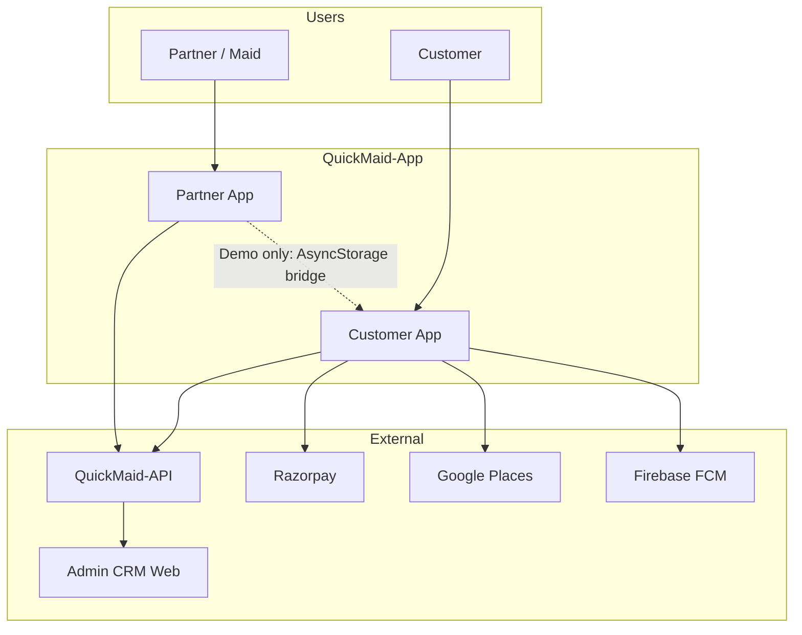
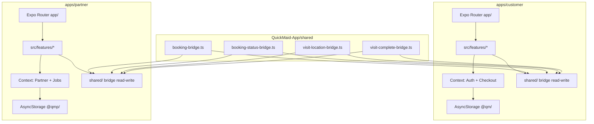
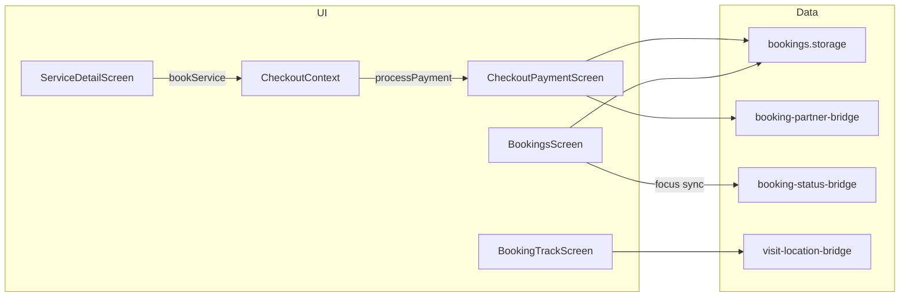
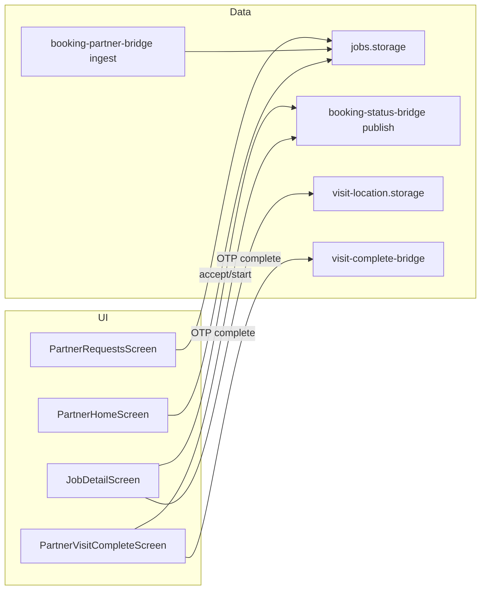
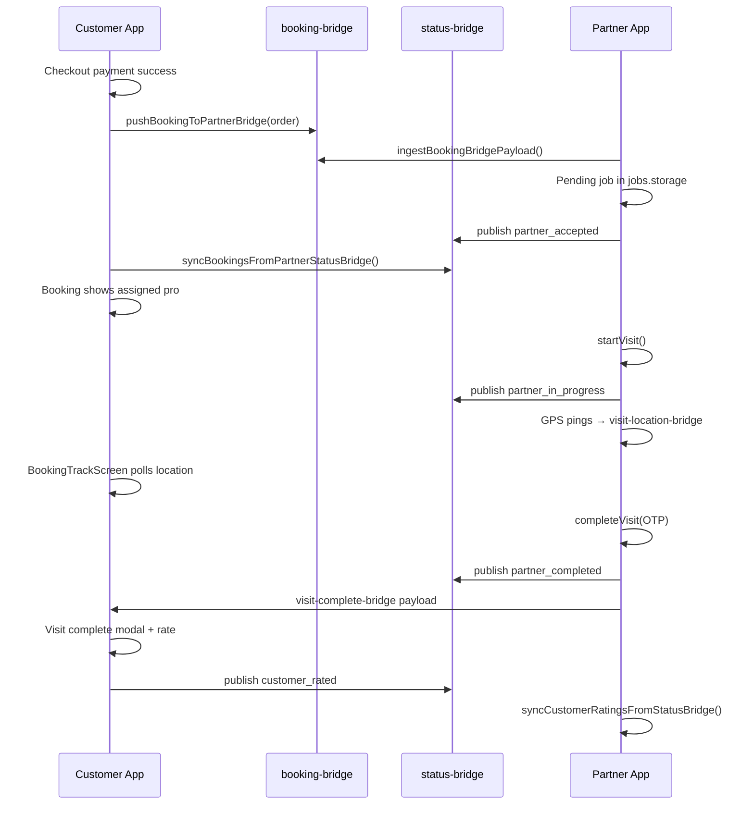
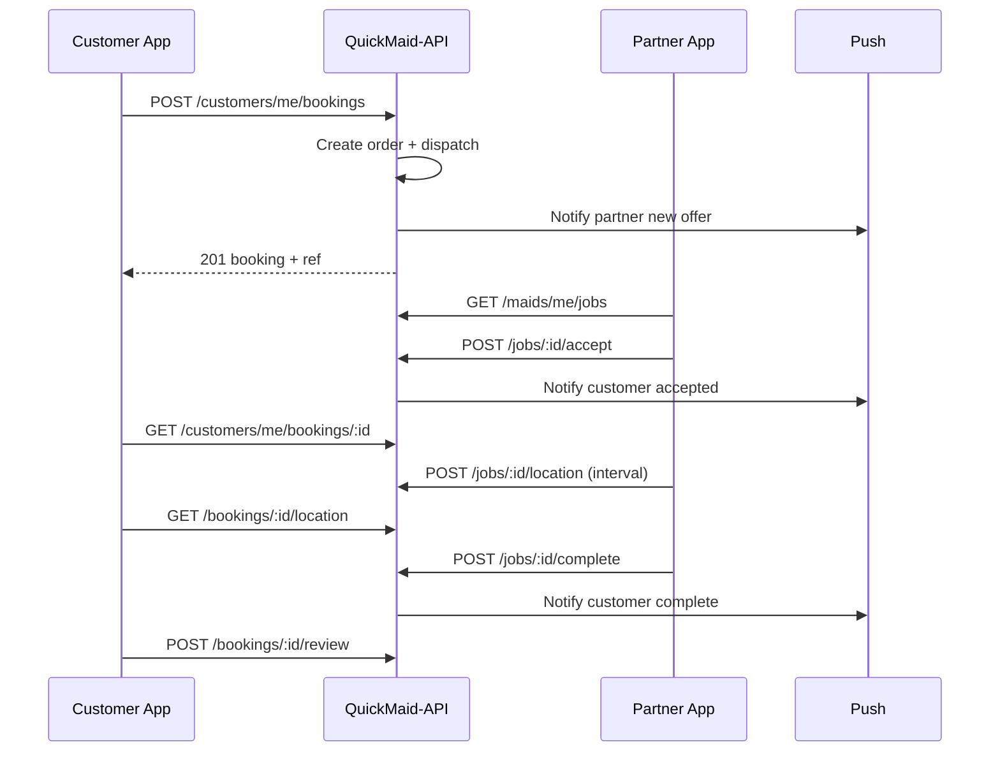
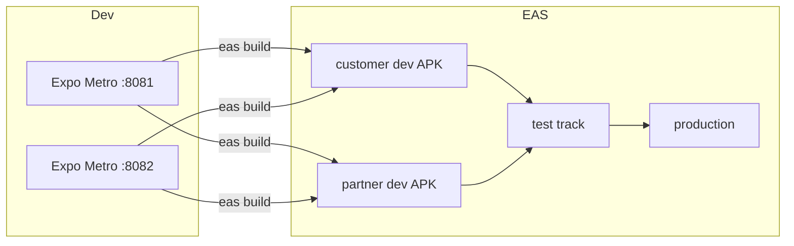
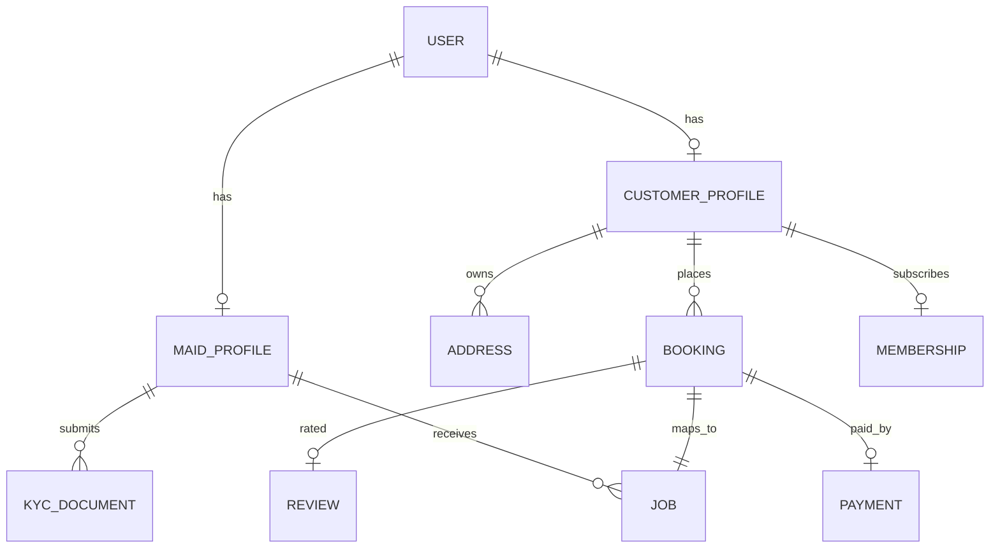

# System Design — Client Side

**Scope:** QuickMaid Customer + Partner mobile apps (React Native / Expo)  
**Companion docs:** [SRS](./SRS.md) · [TDD](./TDD.md) · [API-CONTRACT](./API-CONTRACT.md)

---

## 1. Context diagram (C4 Level 1)

**Today:** Dotted bridge line is active on same-device demo. **Phase 4:** Solid API lines replace bridge.

---

## 2. Container diagram (C4 Level 2)

---

## 3. Component diagram — Customer booking flow

---

## 4. Component diagram — Partner job flow

---

## 5. Storage & bridge keys

### 5.1 Customer (`@qm/`)

| Key | Entity |
|-----|--------|
| `@qm/onboarding_done` | Onboarding flag |
| `@qm/auth_complete` | Session flag |
| `@qm/user_profile` | Profile identity |
| `@qm/profile_account` | Full account (addresses, wallet, prefs) |
| `@qm/user_bookings` | Booking list |
| `@qm/checkout_draft` | Active checkout |
| `@qm/payment_history` | Transactions |
| `@qm/notifications_inbox` | Notifications |
| `@qm/plus_last_subscription` | Membership |
| `@qm/referral_ledger` | Referrals |
| `@qm/support_tickets` | Support threads |
| `@qm/wallet_transactions` | Wallet ledger |
| `@qm/app_lock_settings` | App lock prefs |
| `@qm/push_device_token_v1` | FCM token (local) |

### 5.2 Partner (`@qmp/`)

| Key | Entity |
|-----|--------|
| `@qmp/partner_profile` | Maid profile |
| `@qmp/partner_state` | Online, earnings snapshot |
| `@qmp/partner_jobs_v4` | Job store |
| `@qmp/partner_kyc_draft` | KYC wizard |
| `@qmp/partner_preferences` | Auto-assign, alerts |
| `@qmp/partner_notifications_inbox` | Inbox |
| `@qmp/partner_customer_reviews_v1` | Ratings from bridge |
| `@qmp/visit_location_pings_v1` | GPS log |

### 5.3 Cross-app bridge (`@qm/booking_*`)

| Key | Module |
|-----|--------|
| `@qm/booking_partner_bridge_v1` | New orders queue |
| `@qm/booking_status_bridge_v1` | Lifecycle events |
| `@qm/booking_status_applied_v1` | Idempotency |
| `@qm/visit_location_bridge_v1` | Live GPS |
| `@qm/pending_visit_complete` | Visit complete modal |

---

## 6. Sequence — Happy path booking (demo)

---

## 7. Sequence — Phase 4 booking (target)

---

## 8. Dual-role model (same phone)

One physical device may install **both** apps and use the **same phone number**:

| Aspect | Design |
|--------|--------|
| JWT | Separate tokens per `app_client` |
| Header | `X-App-Client: customer` or `maid` |
| Storage | Isolated prefixes `@qm/` vs `@qmp/` |
| Handoff | Partner `book-home` → deep link to customer app |
| API | Backend links both roles to same `user_id` |

---

## 9. Context providers

### Customer

| Context | Scope | Persists |
|---------|-------|----------|
| `AuthFlowContext` | Pre-auth signup fields | Until registration |
| `CheckoutContext` | Active checkout draft | `checkout_draft` key |
| `LanguageProvider` | i18n locale | Profile pref |
| `AppLockGate` | PIN overlay | SecureStore |

### Partner

| Context | Scope | Persists |
|---------|-------|----------|
| `PartnerContext` | Profile, online, slots | `@qmp/partner_*` |
| `PartnerJobsContext` | Job list cache | jobs.storage |
| `PartnerAlertContext` | Toast / error banner | Ephemeral |
| `AuthFlowContext` | Pre-auth apply flow | Until registration |

---

## 10. Feature domain map

### Customer (17 domains)

`home` · `checkout` · `bookings` · `service` · `plus` · `profile` · `help` · `support` · `notifications` · `payment` · `pro` · `referral` · `security` · `legal` · `wallet` · `coupons` · `saved-services`

### Partner (16 domains)

`home` · `jobs` · `schedule` · `earnings` · `payout` · `kyc` · `profile` · `settings` · `slots` · `notifications` · `support` · `help` · `referral` · `legal` · `account` · `book-home`

Dispatch logic spans `jobs` + `settings` (FSD 18).

---

## 11. Phase 4 migration map

| Demo component | Replace with |
|----------------|--------------|
| `*.storage.ts` reads/writes | `*.api.ts` + cache optional |
| `pushBookingToPartnerBridge` | `POST /bookings` + dispatch webhook |
| `syncBookingsFromPartnerStatusBridge` | Push notification + `GET /bookings/:id` |
| `visit-location-bridge` | `GET/POST /jobs/:id/location` |
| `visit-complete-bridge` | Webhook `visit.completed` |
| `DEMO_OTP` check | `POST /auth/otp/verify` |
| `simulatePayment` | Razorpay + `POST /payments/verify` |
| `mock KYC verify` | Real KYC endpoints |

Full deferral list: [DEMO_STATUS](./DEMO_STATUS.md).

---

## 12. Deployment topology (mobile)

Package ID suffixes per env: [ENVIRONMENTS](./ENVIRONMENTS.md).

---

## 13. Data entity relationships (logical)

Field shapes: [CUSTOMER_DATA](../apps/customer/docs/CUSTOMER_DATA.md) · [PARTNER_DATA](../apps/partner/docs/PARTNER_DATA.md).

---

## 14. Failure modes

| Scenario | Client behaviour |
|----------|------------------|
| Bridge out of sync | Manual "Pull sync" in partner demo tools |
| Partner declines | Customer notification + reassignment copy |
| OTP wrong on visit | Inline error, retry |
| Payment fails | Stay on payment step, draft preserved |
| API 401 (Phase 4) | Refresh token → retry once → logout |
| No network (Phase 4) | Cached list + offline banner |

---

## 15. Further reading

| Topic | Document |
|-------|----------|
| Bridge detail | [CROSS-APP-BRIDGE](./FSD/CROSS-APP-BRIDGE.md) |
| All endpoints | [API-CONTRACT](./API-CONTRACT.md) |
| Per-screen flows | Customer/Partner FSD 01–18 |
| API call matrix | `apps/*/docs/FSD/API_CALL_SITES.md` |

---

*Diagrams use Mermaid — render in GitHub, VS Code, or Cursor preview.*
